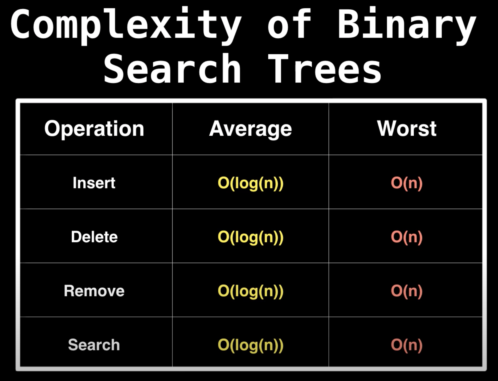
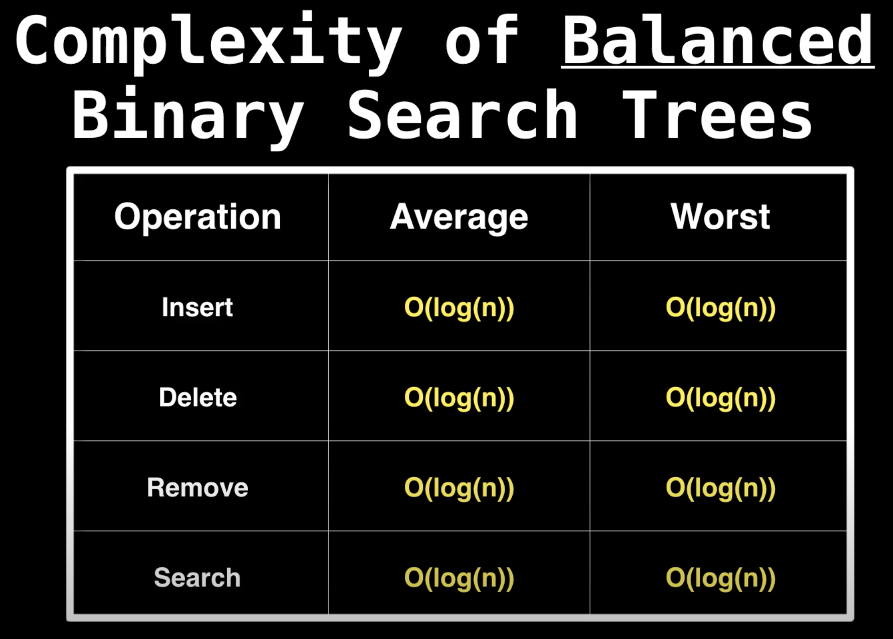
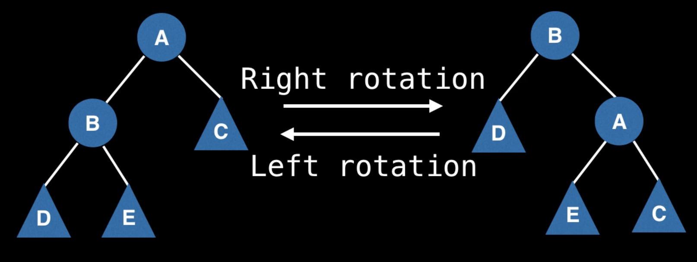

# AVL tree (Balanced binary search tree)  
**Balanced Binary Search Tree (BBST)** - это бинарное дерево поиска, которое самобалансируется.  
Такой тип деревьев будет сам себя регулировать, чтобы поддерживать низкую (логарифмическую) высоту, что позволит 
быстрее производить операции поиска, вставки и удаления.   

  

  

## Tree rotations  
Практически все BBST поддерживают баланс при помощи Tree rotations.  
  

// TODO: конспект не доделал:

### Норм источники:  
* [Youtube \[WilliamFiset\] Balanced binary search tree rotations](https://www.youtube.com/watch?v=q4fnJZr8ztY&list=PLDV1Zeh2NRsD06x59fxczdWLhDDszUHKt&index=3)
* [Github \[raywenderlich\] AVL Tree](https://github.com/raywenderlich/swift-algorithm-club/tree/master/AVL%20Tree)  