# Geometric Applications of BSTs  
Здесь мы рассмотрим как можно использовать структуры данных, в основе которых лежит структура Binary Search Tree, при 
помощи которых можно решать геометрические задачи. То есть такие задачи как поиск пересечений прямых (ортогональных), 
поиск точек внутри пределённого прямоугольника, поиск ближайшей точки и т.д.  
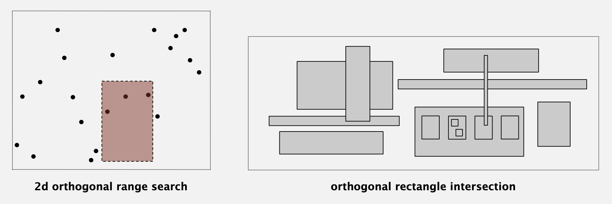  

## 1d Range Search  
Используется когда у нас на одной прямой есть ряд точек и нам надо найти список всех точек, которы лежат в данном 
интервале.  
  
На структура данных должна поддерживать следующие функции:  
- Insert key-value
- Search for key
- Delete by key
- Range-search: find all keys between _k1_ and _k2_
- Range-count: number of keys between _k1_ and _k2_  

Такая структура данных может часто использоваться в БД, где мы делаем запрос на какой-то интервал.  

Если мы будем использовать неотсортированный массив, то у нас будет быстрая вставка, но медленный поиск.
Если отсортированный массив - медленная вставка (все элементы надо будет двигать), но быстрый поиск.  
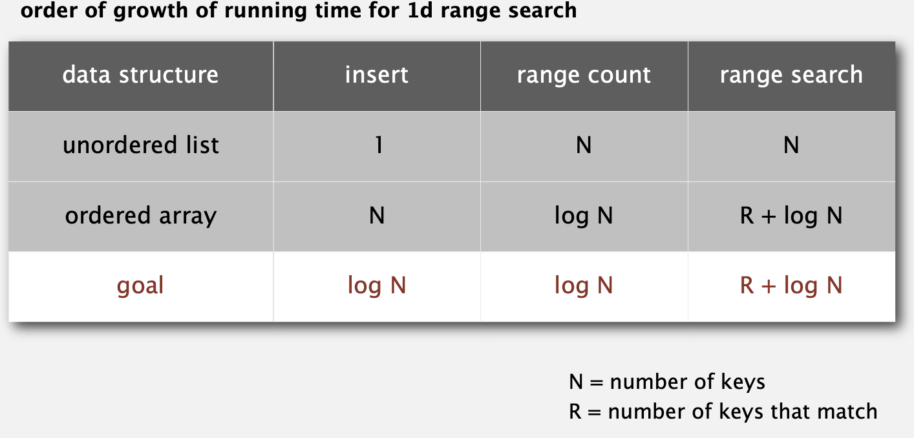  
Добавиться результатов из строки _goal_ нам поможет бинарное дерево поиска.  

#### 1d range count  
Составим бинарное дерево поиска по элементам, где пронумеруем наши элементы по мере проходов по in-order DFS.  
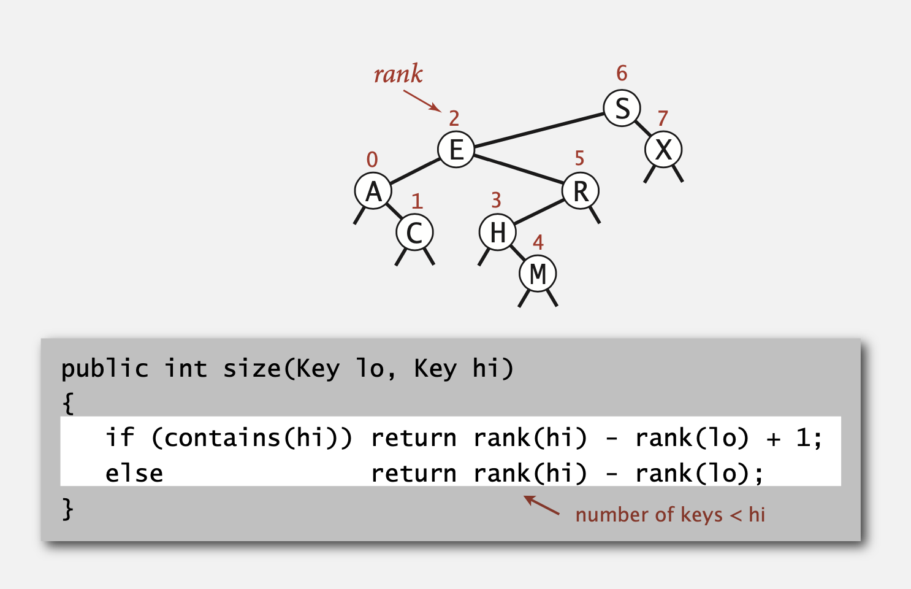  
Допустим нам надо найти кол-во элементов в интервале [E:S].  
Мы ищем элемент E (или если его нет, то элемент, который чуть больше).  
Затем ищем элемент S (если нет, то чуть меньше).  
Затем вычитаем номер (rank) меньшего элемента из большего. Если больший присутствует (в нашем случае S), то прибавляем 1.  

Time complexity: **O(logN)**.  

#### 1d range search  
Допустим нам надо найти все элементы между *lo* и *hi*.  
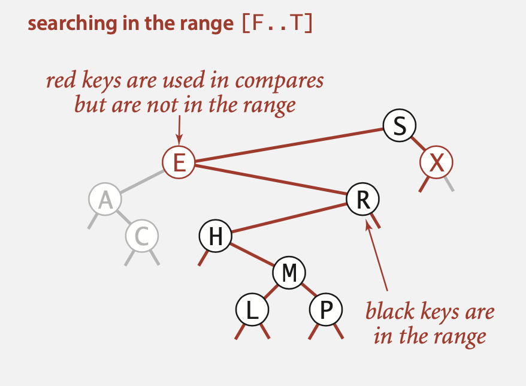  
Проверяем, входит ли текущий узел в искомый интервал, если да, то делаем рекурсивный поиск по левым и правым дочерним 
узлам.  
Если текущий узел меньше искомого, то делаем рекурсивный поиск только по правому; если больше, то только по левому.  
Таким образом мы откинем все элементы меньше и больше интервала и пройдёмся по всем элементам внутри интервала.  

Time complexity: **O(R + logN)**, где R - кол-во элементов внутри интервала.  

## Orthogonal line segment intersection  
Задача, которую решает данный алгоритм: дано N горизонтальных и вертикальных отрезков, надо найти все их пересечения.  
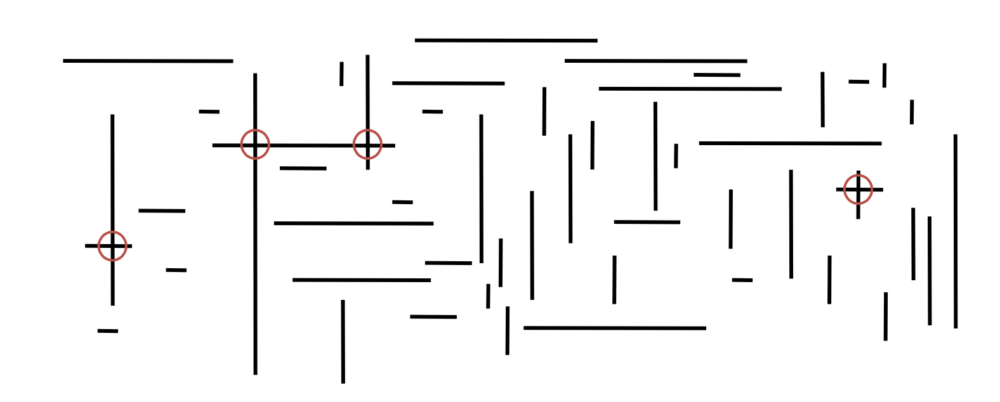   
Наивный подход (brute force) занимает O(n^2) time complexity, где мы каждый отрезок проверяем с остальными. Нужен способ 
быстрее.  

Метод, который мы будем использовать, называется __*Sweep line algorithm*__.  
 
Мы слева направо начинаем идти по плоскости, и как только встречаем левую точку горизонтального отрезка, то добавляем 
его значение в BST (которую надо создать в начале).  Так мы двигаемся дальше и продолжаем заполнять BST.  
Как только наткнёмся на правую точку отрекза, то удаляем соответствующий отрезок из BST.  
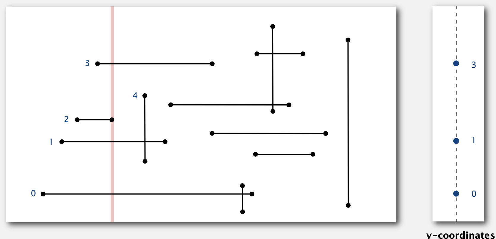  

Если мы наткнёмся на вертикальный отрезок, то делаем *1d range search* в BST в интервале вертикального отрезка.  
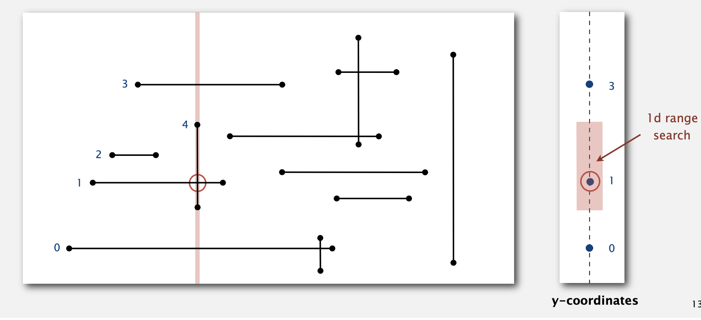  

Sweep-line algorithm занимает **O(N\*logN + R) time complexity**, чтобы найти *R* пересечений среди *N* ортогональных 
отрезков прямых.  
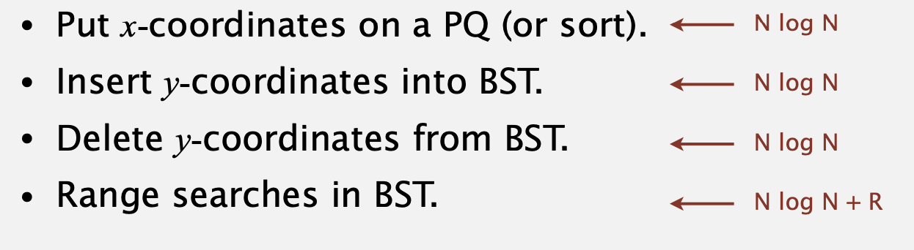  

## Kd-Tree  
TODO: законспектировать
Kd-tree - это модифицированное BST, которое может совершать поиск в многомерном пространстве, оттуда и название 
K-dimensional.  
KD отличается от BST ещё тем, что каждый листовой узел в KD дереве - это точка в K-мерном пространстве.  
K-мерное пространство необязательно означает буквально пространство (длина, ширина, высота). 5-мерная запись может 
выглядеть так: `[EmplID. Age, Salary, Year of Exp, distance from home to office]`.  

### Дискриминатор  
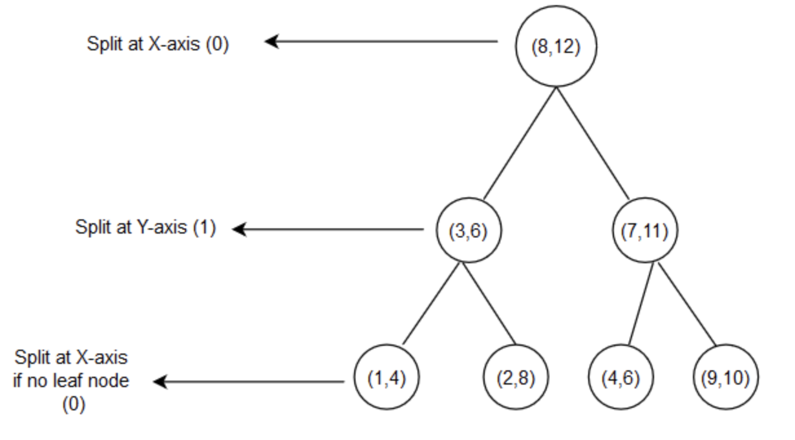  
Для каждого узла существует дискриминатор в диапазоне от 0 до k-1 (включительно), который показываем в каком измерении 
идёт сейчас разделение (по какому ключу массива идёт бинарное разделение).  
На одном уровне у всех узлов одинаковый дискриминатор.  
Если у нас двумерное пространство, то на самом первом уровне дискриминатор будет нулевой (например, ширина), затем 
первый (высота), потом по новой (опять ширина).  

### Как строить KD-tree  
В двухмерном случае каждая точка имеет два значения - координаты x и y.  
Итак, сначала мы разделим координату x, затем координату y, затем снова координату x и так далее.  
Предположим, что у нас есть множество точек `Z = [(2,19),(3,5),(6,8),(7,9)…..]` в двумерной плоскости.  
В корневом узле будет разделение по координате x, поэтому все точки с x <12 будут слева, а точки с x> 12 - справа.  
Назовем подмножество точек слева от линии разделения как Z-left, а подмножество точек справа от линии разделения как 
Z-right.  
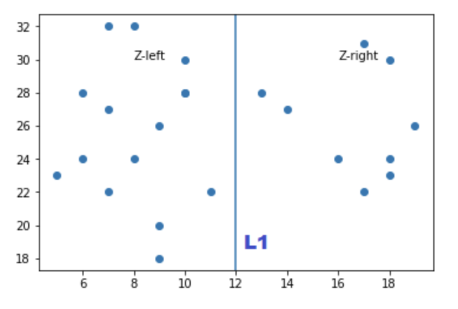  

Теперь возьмём подмножество Z-left и разделим его по горизонтали линией L2.  
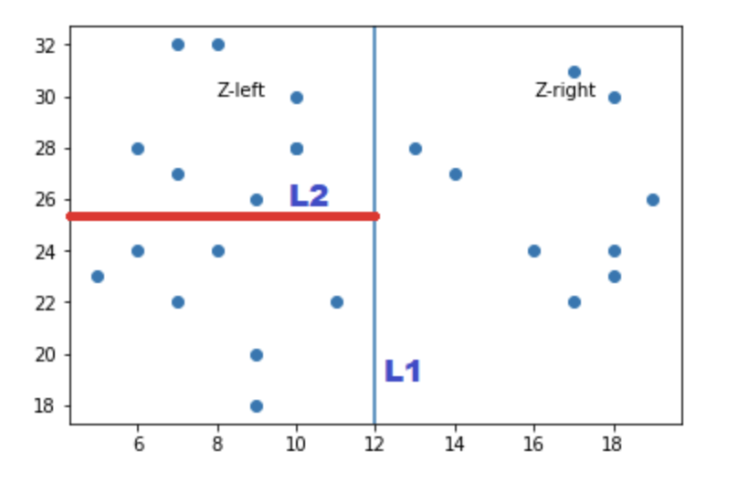  
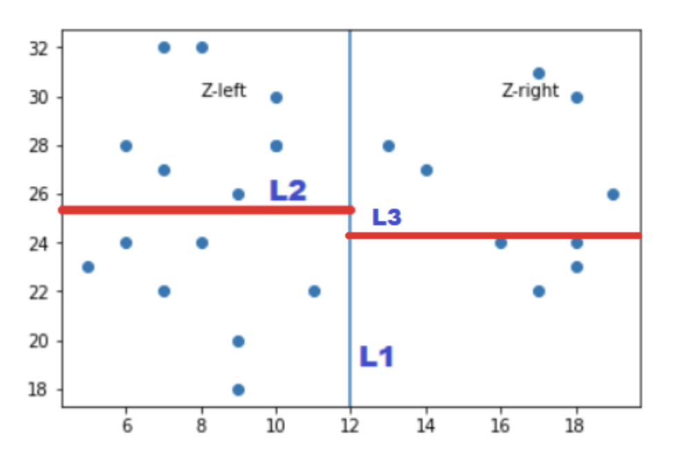  

В общем, разделяем узлы вертикальной линией, чья глубина чётная и горизонтальной, чья глубина нечётная.  
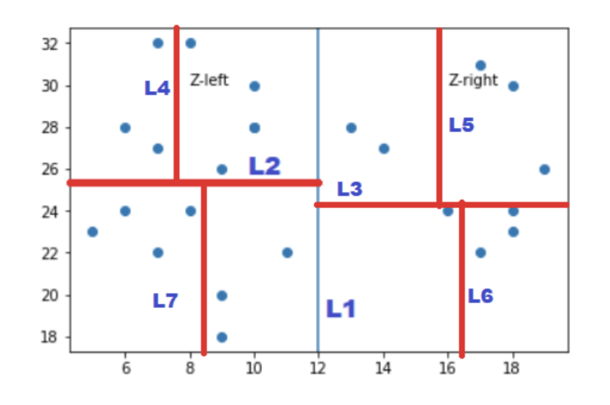  

Можно задать вопрос, если мы используем рекурсивную функцию, как нам определять какое разделение сейчас делать?  
Мы можем просто в параметры передавать глубину Kd дерева, и потом остатком от деления определять дискриминатор.


**Разделяющая черта** - это медиана значений точек в данной плоскости.  

Kd-tree с N точками занимает:  
**O(N) space complexity;**  
**O(N\*logN) time complexity.**

### Атрибуты для построения Kd-дерева  
Вот три основных момента, которые необходимо учитывать при построении K-D Tree:  
- Какое измерение разделять? Лучше сначала выбрать самый широкий диапазон.  
- На какое значение разделять (по какому значению проводить линию разделения)? Лучше использовать медиану всех 
значений в данной плоскости в данном подразделе или можно просто середину.  
- Когда остановить разделение? Если осталось меньше точек, чем определённое значение.  

### Как работает алгоритм Nearest Neighbor Search в K-D tree (поиск ближайшей точки)  
До этого точками из множества у нас были только листья (не листья - найденные медианы среди точек). Здесь каждый узел 
будет являться точкой, то есть дерево будет формировать просто по мере добавления новых точек (минус в том, что 
дерево будет е таким сбалансированным).  

Запросы на нахождение ближайшей точки просты: дана точка `Q`, надо найти точку `P` среди множества точек, которая ближе 
всех к `Q`.  
_Не работает: найти область, в которой лежит точка `Q` и вернуть точку, которая лежит в этом квадрате; не работает, тк 
ближайшая точка может быть в соседнем квадрате._  

Идея алгоритма: обойти всё дерево, НО с двумя оптимизациями:  
- Хранить переменную с ближайшей найденной `C` точкой. Обрезать деревья, если их ограничивающие рамки говорят, что они 
не могут содержать точки, ближе чем `C`.  
- Делать поиск сначала по поддеревьям с большим шансом отброса остальных деревьев.  

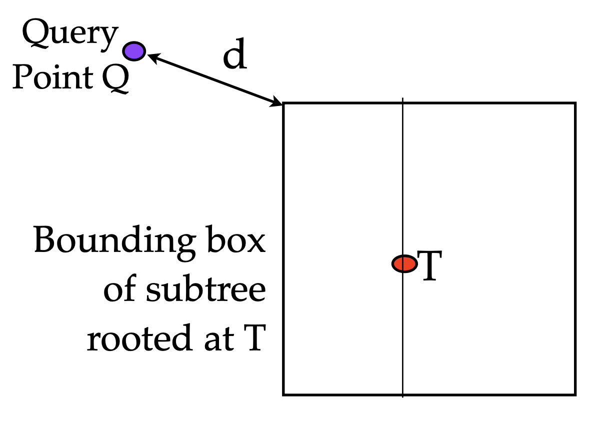  
Если `d > dist(C,Q)`, тогда в `BB(T)` не может быть точек ближе к `Q`, чем к `C`. Соответственно это поддерево 
отбрасываем.  
В противном случае проверяем и обновляем значение:  
```if (dist(C,Q) > dist(T.data,Q)) C := T.data```  

Для лучшей скорости надо начинать поиск с поддерева, в котором может лежать `Q`.  
```
T best // самая близкая точка к Q
int best_dist // дистанция до best

def NN(
   Point Q, // точка, к которйо ищем ближайшую
   kdTree T, // поддерево, в котором делаем сейчас поиск
   int cd, // дескриминатор (по какому измерению сейчас происходит разделение)
   Rect BB): // bounding box (прямоугольник, в котором делаем поиск)
   // если текущее поддерево пустое или расстояние до него больше уже найденного
   // самого короткого, то здесь ответа точно нет
   if T == null or distance(Q, BB) > best_dist: return
   
   dist = distance(Q, t.data)
   if dist < best_dist:
      best = T.data
      best_dist = dist
   
   // посещаем поддеревья в самом многообещающем порядке
   if Q[cd] < T.data[cd]:
      NN(Q, T.left, next_cd, BB.trimLeft(cd, T.data))
      NN(Q, T.right, next_cd, BB.trimRight(cd, T.data))
   else:
      NN(Q, T.right, next_cd, BB.trimRight(cd, T.data))
      NN(Q, T.left, next_cd, BB.trimLeft(cd, T.data))

// фукнции trimLeft и trimRight отсекают правую половну или левую соотвественно.
```

**Time complexity:** в худшем случае **_O(n)_**. По факту на практике время поиска часто будет занимать близкое к
**_O(2<sup>d</sup> + logn)_** (logn - поиск ближайших ячеек к Q, 2<sup>d</sup> - поиск по точкам в ближайших 
ячейках).  
**Space complexity:**  **_O(n)_**.  

## Interval Search Tree  
1d interval search tree - структура данных, которые позволяет хранить множество (пересекающихся) интервалов.  
Поддерживаемые операции:  
- Insert an interval (lo, hi);
- Search for an interval (lo, hi);
- Delete an interval (lo, hi);
- _Interval intersection query_: дан интервал (lo,hi), найти все интервалы (или только один), которые как-то 
пересекаются с (lo,hi).  
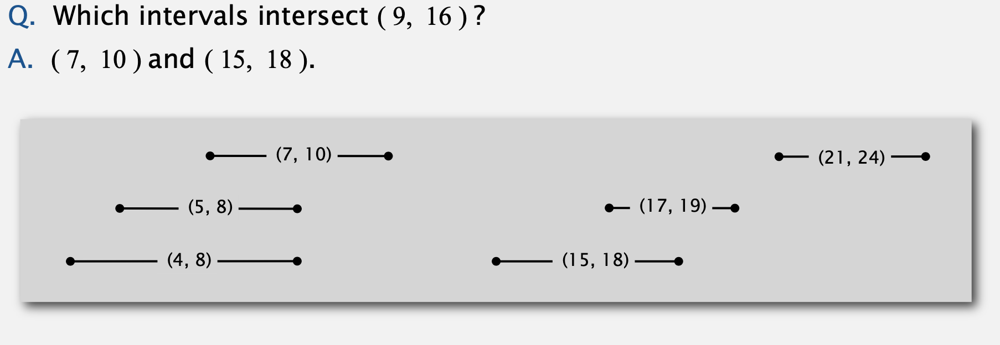  

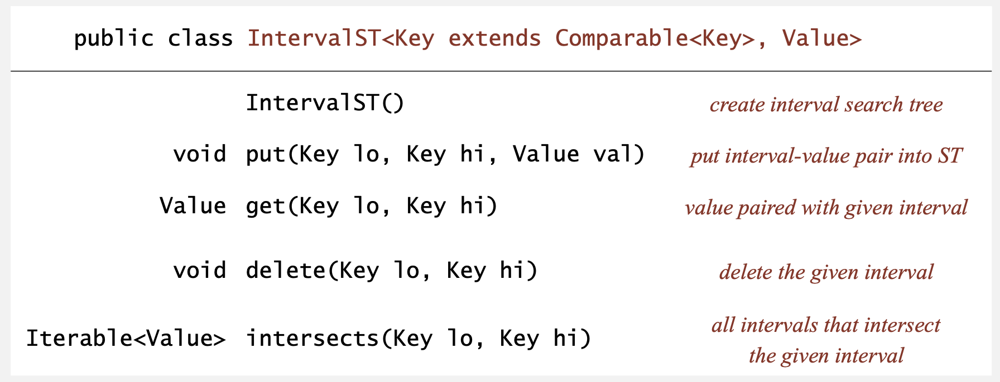  

В основе Interval Search Tree лежит BST.  
Здесь каждый узел хранит информацию об интервале (lo, hi) и максимальное hi значение данного поддерева.  
В качестве ключа (сортировки) BST используем lo значение.  
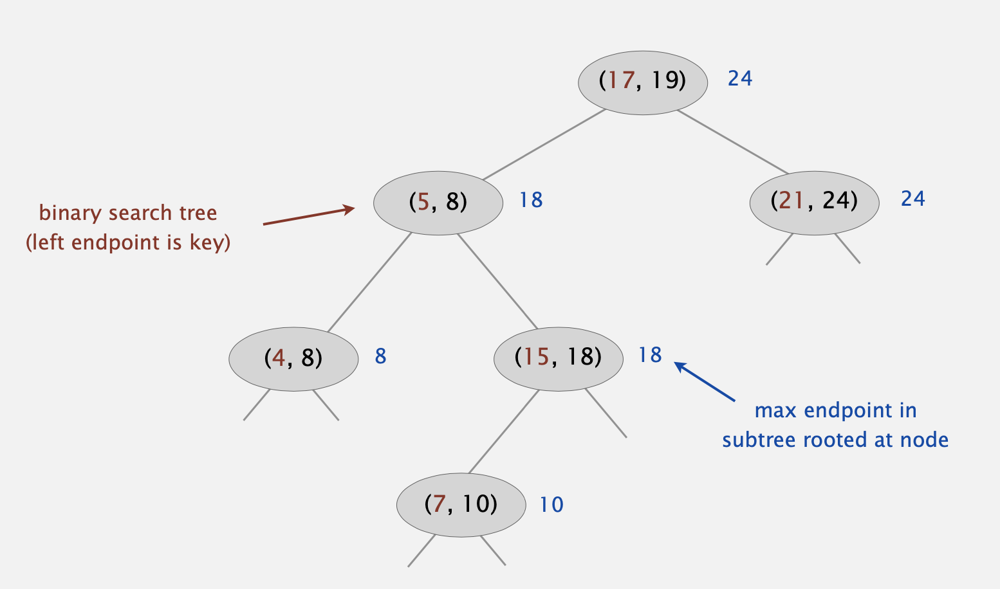  
При вставке нового элемента надо не забыть обновлять максимальное hi значение у родительских элементов.
  
Алгоритм поиска одного пересекающегося интервала:  
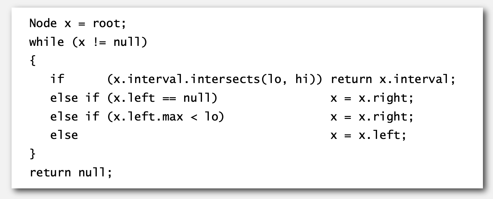  
Так, если гипотетически интервал может быть слева, то мы идём налево. Если его в итоге там не оказалось, то справа 
его уже тоже не будет.  
То есть мы переходим всегда только на одну сторону и уже не проверяем вторую (тк там искомого интервала не будет).  
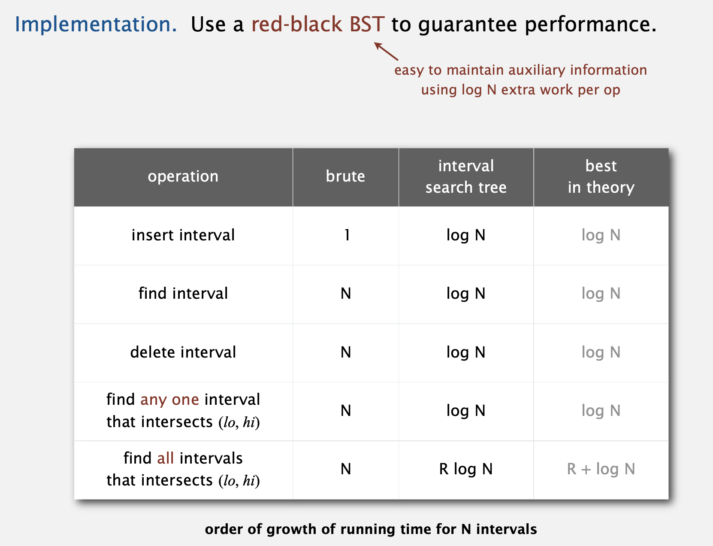  

## Orthogonal rectangle intersection  
Задача: найти все пересечения среди ортогональных прямоугольников.  
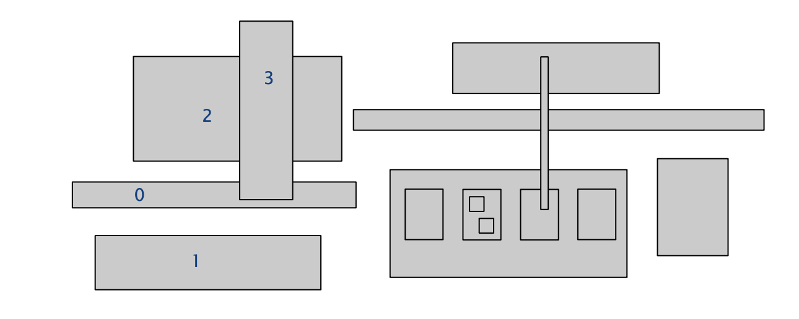  

Для оптимального решения такой задачи мы используем аналогию вышеупомянутого Sweep-line алгоритма, только здесь мы будем 
работать не точками, а с отрезками. И вместо поиска в BST точек в интервале, будем делать поиск по Interval Search Tree.  
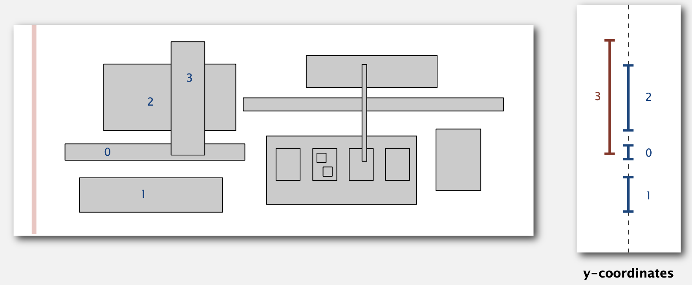  
Так, чтобы найти R пересечений среди N ортогональных прямоугольников, потребуется **O(N\*logN + R\*logN)** time 
complexity.  
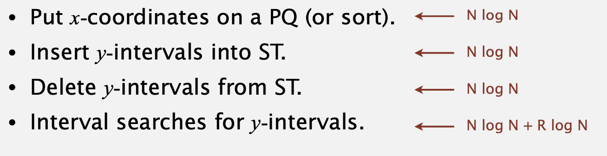  

Sweep line алгоритм преобразует двухмерный поиск пересечений ортогональных прямоугольников в одномерный поиск 
интервалов.  

### Geometric applications of BSTs  
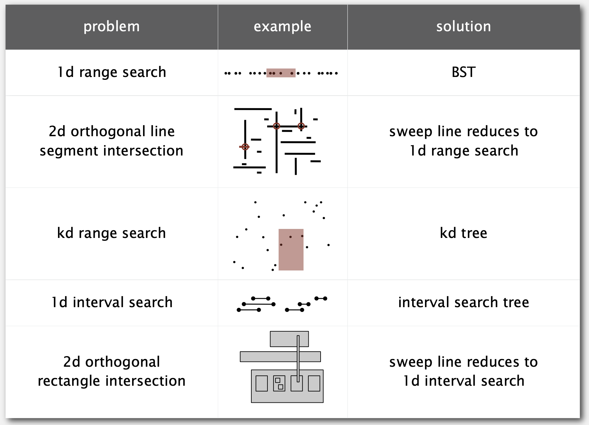  

## Список источников  
Конспект составлял по:
* [Сoursera | Geometric applications of BSTs](https://www.coursera.org/learn/algorithms-part1/lecture/ot9vw/)
* [PDF Slides | Geometric applications of BSTs](cursera-abstract.pdf)
* [PDF Slides | Interval Trees](interval_trees.pdf)
* [(норм) kd-Trees (CMSC 420)](https://www.cs.cmu.edu/~ckingsf/bioinfo-lectures/kdtrees.pdf)
* [(чуть хуже) Find nearest neighbor using KD Tree](https://kanoki.org/2020/08/05/find-nearest-neighbor-using-kd-tree/)