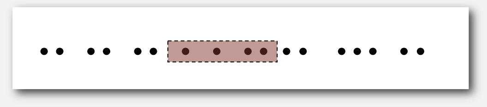

# Geometric Applications of BSTs  
Здесь мы рассмотрим как можно использовать структуры данных, в основе которых лежит структура Binary Search Tree, при 
помощи которых можно решать геометрические задачи. То есть такие задачи как поиск пересечений прямых (ортогональных), 
поиск точек внутри пределённого прямоугольника, поиск ближайшей точки и т.д.  
  

## 1d Range Search  
Используется когда у нас на одной прямой есть ряд точек и нам надо найти список всех точек, которы лежат в данном 
интервале.  
  
На структура данных должна поддерживать следующие функции:  
- Insert key-value
- Search for key
- Delete by key
- Range-search: find all keys between _k1_ and _k2_
- Range-count: number of keys between _k1_ and _k2_  

Такая структура данных может часто использоваться в БД, где мы делаем запрос на какой-то интервал.  

Если мы будем использовать неотсортированный массив, то у нас будет быстрая вставка, но медленный поиск.
Если отсортированный массив - медленная вставка (все элементы надо будет двигать), но быстрый поиск.  
  
Добавиться результатов из строки _goal_ нам поможет бинарное дерево поиска.  

#### 1d range count  
Составим бинарное дерево поиска по элементам, где пронумеруем наши элементы по мере проходов по in-order DFS.  
  
Допустим нам надо найти кол-во элементов в интервале [E:S].  
Мы ищем элемент E (или если его нет, то элемент, который чуть больше).  
Затем ищем элемент S (если нет, то чуть меньше).  
Затем вычитаем номер (rank) меньшего элемента из большего. Если больший присутствует (в нашем случае S), то прибавляем 1.  

Time complexity: **O(logN)**.  

#### 1d range search  
Допустим нам надо найти все элементы между *lo* и *hi*.  
  
Проверяем, входит ли текущий узел в искомый интервал, если да, то делаем рекурсивный поиск по левым и правым дочерним 
узлам.  
Если текущий узел меньше искомого, то делаем рекурсивный поиск только по правому; если больше, то только по левому.  
Таким образом мы откинем все элементы меньше и больше интервала и пройдёмся по всем элементам внутри интервала.  

Time complexity: **O(R + logN)**, где R - кол-во элементов внутри интервала.  
