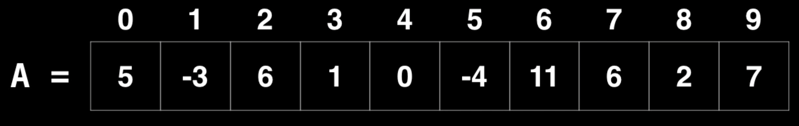
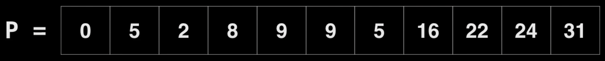
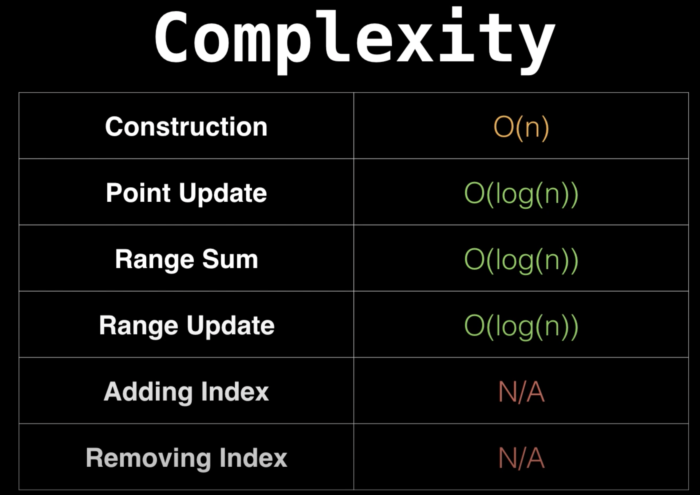
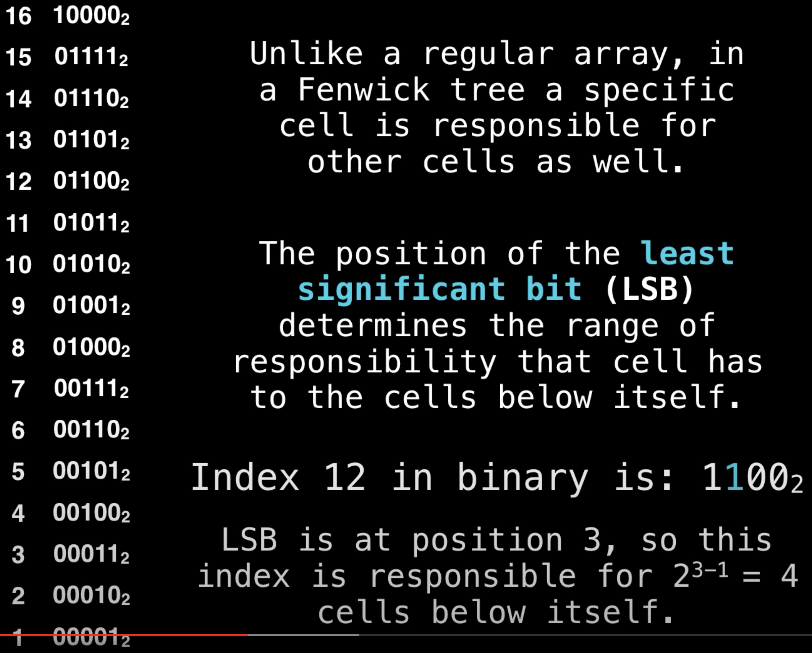
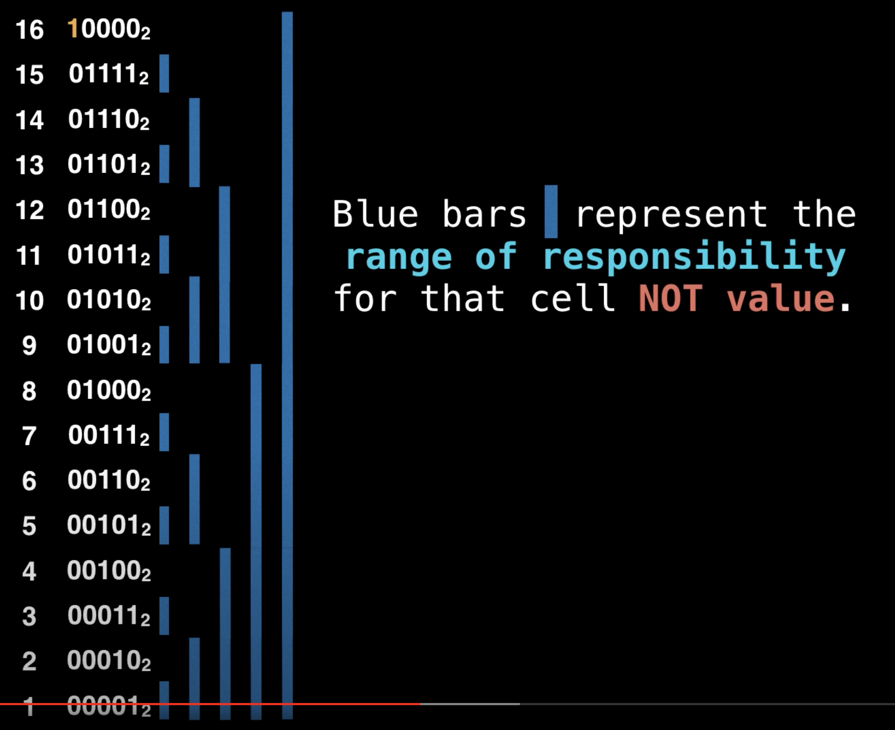
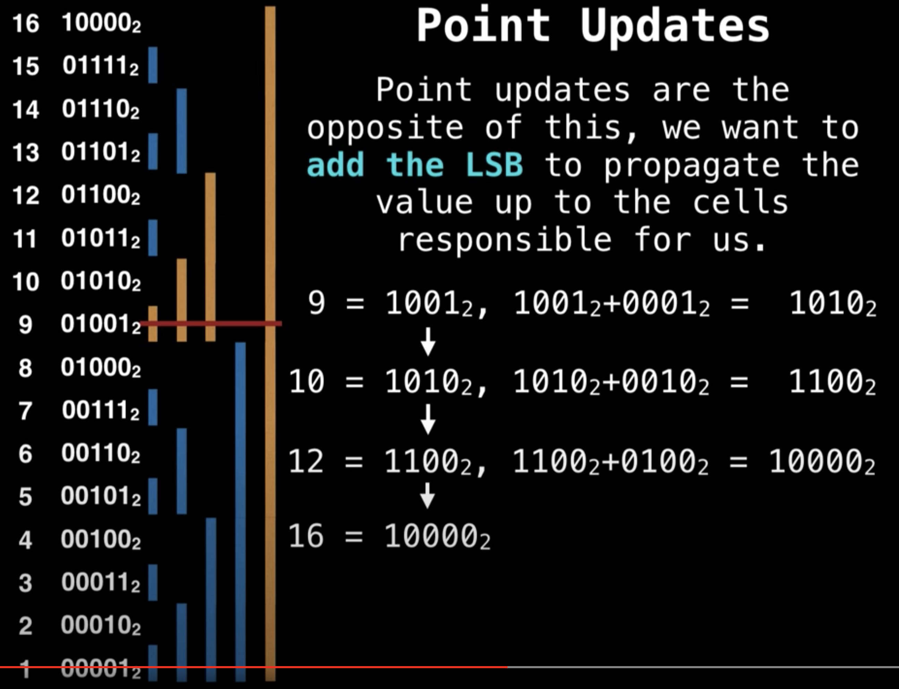

# Fenwick Tree (Binary Indexed Tree)  
Допустим у нас есть массив чисел и нам надо вычислять сумму чисел в интервале `[i, j)`.  
  
```
Sum [2,7) = 6 + 1 + 0 + -4 + 11 = 14  
Sum [0,4) = 5 + -3 + 6 + 1 = 9
```  
Просто считать каждый раз сумму заново вариант рабочий, но медленный (_time complexity O(n)_).  

Мы могли бы создать массив `P` длинной `len(A)+1`, в котором будем хранить сумму всех предшествующих элементов.  
  
В таком случае, если нам потребуется сумма какого-то интервала, то достаточно будет вычесть из значения правого 
элемента интервала значение левого:  
```
Sum [2,7) = P[7] - P[2] = 16 - 2 = 14
```
Такой поход напоминает dynamic programming, он уже высчитывает сумму за контекстное время _O(1)_.  

**Вопрос:** но что если мы захотим изменить значение какого-это элемента массива `A` (изменить, не добавить!)?  
Например, сделать A[4] = 3.  
В таком случае нам надо будет пересчитать все значения в массиве `P` правее этого элемента: `P[4+1:]`.  
Получается что операция обновления будет занимать O(n) time, что медленно.  

Получается, что **_prefix sum array_** (метод, описанный выше) отлично подходит для **_статических массивов_**, но 
требует **_O(n)_ для обновления какого-то значения**.  

**Fenwick Tree** (также называемый _Binary Indexed Tree_) - структура данных, которая позволяет быстро производить 
запросы на сумму (и вообще на все обратимые операции: +, -, /, * и т.д.) интервала (range queries) с возможностью 
изменения значений оригинального массива (но без добавления или удаления новых элементов).  

  

## Fenwick Tree Range Queries  
В отличие от обычного массива, в Fenwick tree элемент массива может отвечать не только за своё значение, но и за 
другие элементы.  
Позиция _**least significant bit (LSB)**_ (последнего значимого бита) определяет интервал, за который отвечает текущая 
ячейка.  
То есть допустим массив Fenwick Tree состоит из 16 элементов (ключ начинается с 1). Если значения ключей перевести 
в двоичное представление и взять значение самой правой единички (12<sub>10</sub>=1**1**00<sub>2</sub> -> 
100<sub>2</sub> = 4), то получим кол-во элементов, за которое отвечает текущая ячейка под собой (включая себя).  
  

  
На рисунке выше синяя линия показывает интервал, за который отвечает каждая ячейка (сверху вниз). То есть, например, 
ячейка 12 отвечает за 4 элемента: 12, 11, 10 и 9.  
Ка мы можем заметить, LSB у всех нечётных чисел стоит на первом месте, поэтому они отвечают только за себя.  
Числа с LSB на втором месте хранят значения (сумму) двух элементов (себя и предыдущего).  
Если LSB на третьем месте, то отвечает за 4 элемента.  
Если LSB на 4-ом месте, то отвечает за 8 элементов.

**Идея алгоритма:** предположим, что нам надо найти сумму интервала `[1:i]`, тогда мы, начиная от элемента `i`, 
каскадно спускаемся вниз, каждый раз вычитая из номера индекса LSB, пока не дойдём до нулевого элемента, суммируя 
значения всех пройденных элементов.  
Пример:  
```
sum [1:7] = A[7] + A[6] + A[4]
sum [1:4] = A[4]
```

Теперь предположим, что нам надо найти сумму в интервале `[i, j]`, например: `[11, 15]`.  
В таком случае мы можем посчитать сначала сумму для `[1, 15]`, затем для `[1, 11)` и вычислить разницу. Это и будет 
ответ.  
**Обратим внимание**, что в интервале `[1, 11)` 11 не включено, тк в искомую сумму должен входить 11-ый элемент.  
```
sum [1:15] = A[15] + A[14] + A[12] + A[8]
sum [1:11) = A[10] + A[8]
sum [11:15] = sum [1:15] - sum [1:11)
```

В худшем случае ячейка, к которой мы обращаемся, в бинарном виде имеет все единицы (2<sup>n</sup>-1), например 15. 
Тогда запрос потребует log<sub>2</sub>(n) операций, и таких может быть 2.  

Следовательно, Fenwick Tree имеет:  
Preprocessing time complexity: **_O(n)_**;  
Range query time complexity: **_O(log(n))_**;  
Space complexity: **_O(n)_**.  

## Point Update  
Иногда нам может потребоваться изменять некоторые занчения массива, для этого надо обновлять и Fenwick Tree.  
Вспомним, что при range queries мы каскадно спускаемся по массиву дерева из текущего индекса каждый раз удаляя LSB.  
Обновление элемента противоположно query range: здесь мы добавляем LSB, чтобы посетить все элементы, которые отвечают 
за изменяемый элемент.  
То есть, если мы захоим изменить элемент под индексом 9, то надо будет обновить и следующие элементы:  
  
То есть все элементы, которые пересекаются с горизонтальной линией из 9.  
Соответственно, если мы хотим прибавить к 9-ому элементу число 5, то нам надо будет прибавить 5 и к 10, 12 и 16 
элементам.  

## Fenwick Tree Construction  
Допустим у нас есть массив значений `A` и нам надо сформировать массив `P` с Fenwick Tree.  
Мы можем для каждого элемента в массиве `P` сделать point update на начение `A[i]`.  
Тк в `A` n элементов, а обновление каждого требует O(logn), то в итоге мы сможем сфорировать дерево за O(nlog(n)).  
Но мы можем сформировать его за линейное время!  

**Алгоритм формирования Fenwick Tree:** добавлять начение текущего элемента в ближайшую ячейку, которая ответственна за 
текущую ячейку. Это аналогично тому что мы делаем при point update, но обновляем не все ячейки, которые отвечают за 
текущую, а только ближайшую.  
Тк таким образом мы пройдёмся по всем элементам начиная с начала массива, то дерево сформируется корректно.  
Таким образом мы добиваемся **_O(n)_ time complexity**.  

### Псевдокод  
```
function prefixSum(i): 
    sum := 0
    while i != 0:
        sum += tree[i]
        i -= LSB(i)
    return sum

function add(i, x):
    while i < N:
        tree[i] += x
        i += LSB(i)

function rangeQuery(i, j):
    return prefixSum(j) - prefixSum(i-1)

# Make sure values is 1-based!
function construct(values):
    N = length(values)
    # Clone the values array since we're 
    # doing in place operations
    tree = deepCopy(values)
    for i = 1,2,3,...,N:
        j = i + LSB(i)
        if j < N:
            tree[j] += tree[i]
    return tree

# LSB возвращает least significant bit значение. 
```
