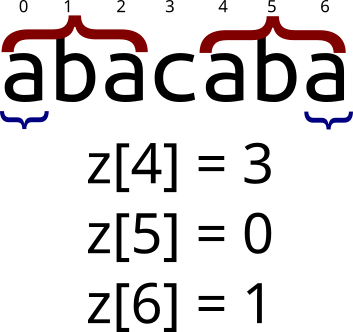
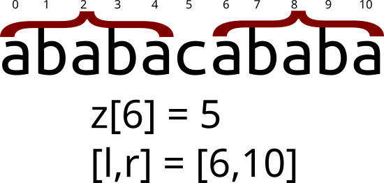

# Алгоритм Кнута-Морриса-Пратта

## Префикс-функция  
Префикс-функция от строки `s` равна массиву `p`, где `p[i]` обозначает длину максимального префикса строки `s[0..i]`,
совпадающего с её суффиксом. Тривиальные случаи (префикс равен суффиксу и равен всей строке) не учитываются.  

  

На изображении обозначены равные подстроки, длина которых равна значению префикс-функции в данной позиции. 
Префикс-функция от всей строки “abacaba” равна {0,0,1,0,1,2,3}. `p[0] = p[1] = 0` тк строки "a" и "ab" являются 
тривиальными, и поэтому не учитываются.  

В определённых случаях префикс и суффикс могут перекрываться:  

  

Наивный алгоритм нахождения префикс-функции имеет сложность **O(N3)**, что неприемлемо для большинства случаев.  
Существует гораздо более эффективный алгоритм, работающий за **O(N)**.  

## Алгоритм Кнута-Морриса-Пратта  
Алгоритм Кнута-Морриса-Пратта (КМП) позволяет находить префикс-функцию от строки за линейное время, и имеет достаточно 
лаконичную реализацию, по длине не превышающую наивный алгоритм.  

Для начала заметим важное свойство:  
> `p[i] <= p[i-1] + 1`  

То есть префикс-функция от следующего элемента не более чем на 1 превосходит префикс-функцию от текущего.  
Случай `p[i] = p[i-1] + 1` легко изобразить:  

  

То есть верно следующее утверждение (в 0-индексации):  
> `s[i] = s[p[i-1]]` => `p[i] = p[i-1] + 1`  

Этот случай достаточно тривиален.  
Но что если `s[i] != s[p[i-1]]`? Хотелось бы найти такую длину `j`, что `s[0..j-1] = s[i-j..i-1]`, но при этом 
`j < p[i-1]`. Если `s[i] = s[j]`, то `p[i] = j + 1`. На самом деле, длина `j` уже была найдена в процессе нахождения 
префикс-функции. А именно, `j = p[p[i-1]-1]`. Графически это выглядит так:  

  

Если же длина `j` также не подходит (`s[i] != s[j]`), просто ещё раз уменьшим её по такой же формуле: `j = p[j-1]`. 
Таким образом буде пытаться продолжить префикс длины `j`, пока `j` не станет равно 0. В таком случае просто сравним 
`s[i]` с `s[0]`, и в зависимости от результата присвоим `p[i] = 0 или 1`.  

### Реализация  
```java
public static int[] prefixFunction(String s) {
    int[] p = new int[s.length()];
    for (int i = 1; i < s.length(); i++) {
        int j = p[i-1];
        while (j > 0 && s.charAt(i) != s.charAt(j)) {
            j = p[j-1];
        }

        if (s.charAt(i) == s.charAt(j)) {
            p[i] = j + 1;
        } else {
            p[i] = j;
        }
    }
    return p;
}
```

### Пример применения префикс-функции  
Префикс-функция - необычайно мощная структура, с помощью которой решается значительная часть задач про строки. 
Классической задачей на префикс-функцию является задача на поиск подстроки в строке (алгоритм КМП был изначально 
разработан именно для решения этой задачи). Разберём её в качестве примера.  

Пусть нам нужно найти подстроку `t` в строке `s`. С помощью префикс-функции это делается тривиально: найдём 
префикс-функцию от строки `t+#+s` (решётка обозначает символ, гарантированно не встречающийся ни в одной из строк).  
Если эта префикс-функция содержит значения равные длине `t`, значит `t` входит в `s`. А именно, пусть `p[i]=|t|`. 
Значит `s[i−|t|−1]` - последний символ вхождения `t` в `s`.  
```
// T - строка
// P - искомая подстрока
int[] kmp(string P, string T):
   int pl = P.length
   int tl = T.length
   int[] answer // содержит индексы начала подстроки P в T
   int[] p = prefixFunction(P + "#" + T)
   int count = 0
   for i = 0 .. tl - 1
      if p[pl + i + 1] == pl
         answer[count++] = i
   return answer
```

Time complexity: **O(P+T)**
Space complexity: **O(P+T)**  

Вместо префикс-функции в алгоритме Кнута-Морриса-Пратта можно использовать Z-функцию. Оценки времени работы и памяти 
при этом не изменятся.

## Z-функция  
Z-функция от строки `s` равна массиву `z`, где `z[i]` - максимальная длина `j`, такая что s[0..j−1]=s[i..i+j−1].  
Другими словами, `z[i]` - длина максимального префикса строки `s`, совпадающего с префиксом её i-го суффикса.

  

Значение `z[0]` традиционно принимается равным `0`, поэтому Z-функция от всей строки “abacaba” равна {0,0,1,0,3,0,1}.  

В определённых случаях префиксы могут перекрываться. Например, Z-функция от строки “aaaa” равна {0,3,2,1}.  

### Тривиальный алгоритм вычисления  
Тривиальный алгоритм для вычисления Z-функции имеет сложность _O(N^2)_ и реализуется следующим образом:  
```
vector<int> z_function(const string& s) {
    vector<int> z(s.length(), 0);

    for (int i = 1; i < s.length(); i++) {
        for (int j = i; j < s.length(); j++) {
            if (s[j] == s[j - i]) {
                z[i]++;
            } else {
                break;
            }
        }
    }

    return z;
}
```

### Эффективный алгоритм вычисления  
Тривиальный алгоритм можно значительно оптимизировать, избавившись от повторных сравнений строк.  

Давайте в процессе вычисления Z-функции поддерживать последнее ненулевое найденное значение в виде границ отрезка 
`[l;r]`, равного соответствующему префиксу. Под “последним” значением понимается отрезок с наибольшим `r`.  

Допустим, мы вычисляем Z-функцию от строки “ababacababa” и находимся на восьмом символе (0-индексация). Тогда последний 
найденный отрезок будет равен `[6;10]`:  

  

Вместо наивной проверки строки “aba” на равенство префиксу, используем уже рассчитаные значения Z-функции: мы знаем, 
что `s[0..5]=s[6..10]`. Значит, `s[2..5]=s[8..10]`. Но ведь значение `z[2]` уже посчитано. Используем его для 
вычисления `z[8]`: можно с уверенностью сказать, что `z[8]≥min(z[2],10−8+1)`.  
Заметьте, что мы ограничиваем правую границу отрезка совпадения (i+z[i]−1) текущим значением `r`. Это необходимо, так 
как мы ничего не знаем о символах правее `r`.  

Таким образом, в качестве начального значения `z[i]` можно использовать:  
> `z[i]=min(z[i−l],r−i+1)`  

После чего запускаем наивный алгоритм, пытаясь увеличить `z[i]`. Это возможно, если правая граница текущего отрезка 
совпадения превышает `r`, или если `i` не входит в `[l;r]`, и вычислять `z[i]` необходимо с нуля.  

Если в результате правая граница текущего отрезка (i+z[i]−1) превысила `r`, обновляем значения `l` и `r`.  

Сложность такого алгоритма равна **O(N)**.  

#### Реализация  
```
vector<int> z_function(const string& s) {
    vector<int> z(s.length(), 0);

    //начальные значения l и r непринципиальны
    for (int i = 1, l = 0, r = 0; i < s.length(); i++) {
        if (i <= r) {                            //если i входит в уже обработанный отрезок
            z[i] = min(z[i - l], r - i + 1);     //используем предыдущие вычисления
        }

        //иначе начальным значением z[i] остаётся 0

        //пытаемся увеличить z[i] наивным алгоритмом
        while (i + z[i] < s.length()) {
            if (s[i + z[i]] == s[z[i]]) {
                z[i]++;
            } else {
                break;
            }
        }

        //если мы можем увеличить r, делаем это
        if (z[i] > 0 && i + z[i] - 1 > r) {
            l = i;
            r = i + z[i] - 1;
        }
    }

    return z;
}
```

TODO: дописать пример применения z-function.

Конспект составлял по:
* [Префикс-функция. Алгоритм Кнута-Морриса-Пратта](https://brestprog.by/topics/prefixfunction/)  
* [Z-функция](https://brestprog.by/topics/zfunction/)  

Норм статьи:
* [ИТМО | Алгоритм Кнута-Морриса-Пратта](https://neerc.ifmo.ru/wiki/index.php?title=%D0%90%D0%BB%D0%B3%D0%BE%D1%80%D0%B8%D1%82%D0%BC_%D0%9A%D0%BD%D1%83%D1%82%D0%B0-%D0%9C%D0%BE%D1%80%D1%80%D0%B8%D1%81%D0%B0-%D0%9F%D1%80%D0%B0%D1%82%D1%82%D0%B0)
* [ИТМО | Z-функция](https://neerc.ifmo.ru/wiki/index.php?title=Z-%D1%84%D1%83%D0%BD%D0%BA%D1%86%D0%B8%D1%8F)
* [ИТМО | Период и бордер, их связь](https://neerc.ifmo.ru/wiki/index.php?title=%D0%9F%D0%B5%D1%80%D0%B8%D0%BE%D0%B4_%D0%B8_%D0%B1%D0%BE%D1%80%D0%B4%D0%B5%D1%80,_%D0%B8%D1%85_%D1%81%D0%B2%D1%8F%D0%B7%D1%8C#.D0.9E.D0.BF.D1.80.D0.B5.D0.B4.D0.B5.D0.BB.D0.B5.D0.BD.D0.B8.D1.8F)
* [E-maxx | Префикс-функция. Алгоритм Кнута-Морриса-Пратта](https://e-maxx.ru/algo/prefix_function)