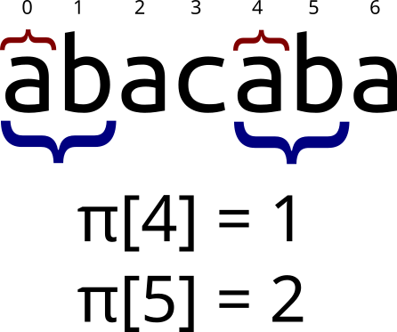
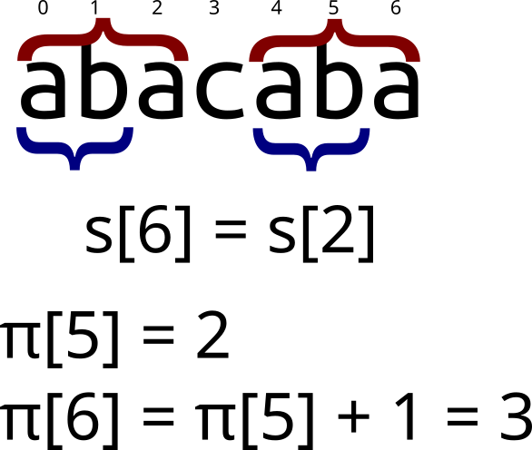
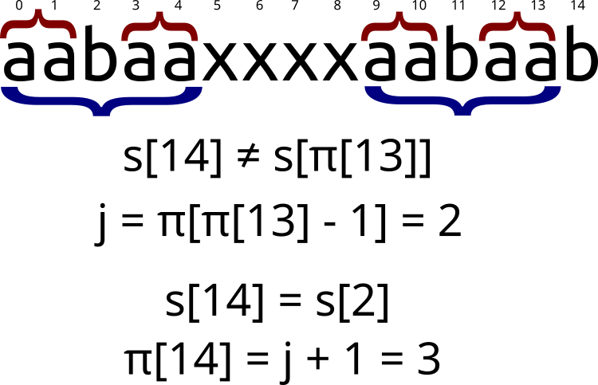

# Алгоритм Кнута-Морриса-Пратта

## Префикс-функция  
Префикс-функция от строки `s` равна массиву `p`, где `p[i]` обозначает длину максимального префикса строки `s[0..i]`,
совпадающего с её суффиксом. Тривиальные случаи (префикс равен суффиксу и равен всей строке) не учитываются.  
  

На изображении обозначены равные подстроки, длина которых равна значению префикс-функции в данной позиции. 
Префикс-функция от всей строки “abacaba” равна {0,0,1,0,1,2,3}. `p[0] = p[1] = 0` тк строки "a" и "ab" являются 
тривиальными, и поэтому не учитываются.  

В определённых случаях префикс и суффикс могут перекрываться:
  

Наивный алгоритм нахождения префикс-функции имеет сложность **O(N3)**, что неприемлемо для большинства случаев.  
Существует гораздо более эффективный алгоритм, работающий за **O(N)**.  

## Алгоритм Кнута-Морриса-Пратта  
Алгоритм Кнута-Морриса-Пратта (КМП) позволяет находить префикс-функцию от строки за линейное время, и имеет достаточно 
лаконичную реализацию, по длине не превышающую наивный алгоритм.  

Для начала заметим важное свойство:  
> `p[i] <= p[i-1] + 1`  

То есть префикс-функция от следующего элемента не более чем на 1 превосходит префикс-функцию от текущего.  
Случай `p[i] = p[i-1] + 1` легко изобразить:  
  

То есть верно следующее утверждение (в 0-индексации):  
> `s[i] = s[p[i-1]]` => `p[i] = p[i-1] + 1`  

Этот случай достаточно тривиален.  
Но что если `s[i] != s[p[i-1]]`? Хотелось бы найти такую длину `j`, что `s[0..j-1] = s[i-j..i-1]`, но при этом 
`j < p[i-1]`. Если `s[i] = s[j]`, то `p[i] = j + 1`. На самом деле, длина `j` уже была найдена в процессе нахождения 
префикс-функции. А именно, `j = p[p[i-1]-1]`. Графически это выглядит так:  
  

Если же длина `j` также не подходит (`s[i] != s[j]`), просто ещё раз уменьшим её по такой же формуле: `j = p[j-1]`. 
Таким образом буде пытаться продолжить префикс длины `j`, пока `j` не станет равно 0. В таком случае просто сравним 
`s[i]` с `s[0]`, и в зависимости от результата присвоим `p[i] = 0 или 1`.  

### Реализация  
```java
public static int[] prefixFunction(String s) {
    int[] p = new int[s.length()];
    for (int i = 1; i < s.length(); i++) {
        int j = p[i-1];
        while (j > 0 && s.charAt(i) != s.charAt(j)) {
            j = p[j-1];
        }

        if (s.charAt(i) == s.charAt(j)) {
            p[i] = j + 1;
        } else {
            p[i] = j;
        }
    }
    return p;
}
```

Конспект составлял по:
* [Префикс-функция. Алгоритм Кнута-Морриса-Пратта](https://brestprog.by/topics/prefixfunction/)  