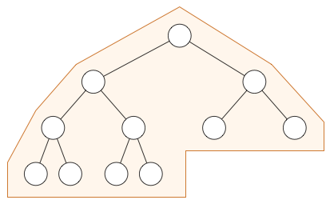
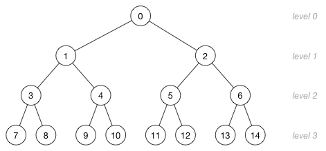

# Priority Queue data structure (!not completed!)  

## Heap  
**Куча (heap)** - это бинарное дерево, представленное в виде массива. Куча сортируется на основе "свойства кучи", 
которое определяет порядок узлов в дереве.  
Распространённое применение кучи:  
- Построение Priority Queue
- Для heap sort
- Быстрого вычисления минимального (или максимального) элемента из коллекции

### Свойства кучи  
Существует _max-heap_ и _min-heap_.  
В _max-heap_ родительский элемент принимает большее значение, чем дочерние.  
В _min-heap_ родительский элемент принимает меньшее значение, чем дочерние.  
Это называется "heap property" и оно верно для каждого элемента кучи.  

> **Внимание:** Корневой элемент кучи принимает максимальное или минимальное значение всей коллекции, но порядок 
>остальных элементов не гарантирован. Например, в max-heap самый большой элемент будет корневым, но самый маленький 
>необязательно самым последний; гарантировано только то, что он будет одним из листовых узлов.  
 
Особенность этой структуры данных в том, что когда мы храним узлы в массиве, то тратим меньше памяти. Тк традиционные 
деревья обычно занимают больше памяти, чем сами значения, которые они хранят. Там нам надо выделять место для объектов 
узлов и указателей для левых и правых дочерних узлов.  

### Tree inside array  
Если у нас есть, например, такой массив: `[ 10, 7, 2, 5, 1 ]`, то как мы узнаем какие узлы родительские, а какие 
дочерние?  
Для этого существует четко определенная связь между индексом массива узла дерева и индексами массива его родителя и 
потомков.  
Если `i` - индекс узла, тогда следующие формулы дают индексы его родительского и дочерних элементов:  
```
parent(i) = floor((i - 1)/2)
left(i)   = 2i + 1
right(i)  = 2i + 2
```

> **Внимание:** мы не можем начать новый уровень, если текущий самый низкий уровень не заполнен полностью, поэтому кучи 
>всегда имеют такую форму:  


> **Внимание:** мы могли бы эмулировать обычное бинарное дерево с помощью кучи, но это будет пустой тратой места, и нам 
>нужно будет помечать некоторые индексы массива как пустые.  

### Немного математики  
Высота дерева определяется как количество, которое требуется пройти от корня дерева до самого низкого листа.  
Куча высотой `h` имеет `h+1` уровень:


Куча с `n` узлами имеет высоту `h = floor(log2(n))`. Это потому что мы всегда сначала сначала заполняем до конца 
последний уровень, прежде чем перейти к новому.  
Если куча имеет 15 элементов, то её высота равна `floor(log2(15)) = floor(3.91) = 3`.  

**TODO: тут остановился**

## Indexed Priority Queue  
Indexed Priority Queue отличается от обычной Priority Queue тем, что мы делаем маппинг элемента на его индекс в очереди 
(в массиве, который является binary heap). Таким образом мы можем изменять приоритет элементов в очереди.  

Конспект составлял по:
* [Github \[raywenderlich\] Heap](https://github.com/raywenderlich/swift-algorithm-club/tree/master/Heap)  

Хорошие источники:
* [Youtube \[raywenderlich\] Indexed Priority Queue (UPDATED) | Data Structures](https://www.youtube.com/watch?v=jND_WJ8r7FE&list=PLDV1Zeh2NRsB6SWUrDFW2RmDotAfPbeHu&index=52)
* [Github \[raywenderlich\] Priority Queue](https://github.com/raywenderlich/swift-algorithm-club/tree/master/Priority%20Queue)  
* [Binary heap](https://www.growingwiththeweb.com/data-structures/binary-heap/overview/)  
* [Priority Queues](https://algs4.cs.princeton.edu/24pq/)  
* [IndexMinPQ.java](https://algs4.cs.princeton.edu/24pq/IndexMinPQ.java.html)

Задачи, которые можно решить с помощью Indexed Priority Queue:  
* [460. LFU Cache (hard)](https://leetcode.com/problems/lfu-cache/)  