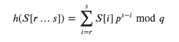

# Rabin-Karp Algorithm  
Алгоритм Рабина-Карпа - это алгоритм, используемый для поиска подстроки (pattern) в строке использую хеш-функции.  
> Хеш-функция - это инструмент для маппинга больших данных на маленькие данные. Эти маленькие данные называются 
> хеш-значением.  

Допустим нам на вход дана символьная последовательность `ABCCDDAEFG` и какой-то паттерн, например, `CDD`. Нам надо найти 
все вхождения этого паттерна в исходной последовательности.  
Мы могли бы просто сравнивать всевозможные подстроки с паттерном, но скорость такого алгоритма будет очень низкой.  

Мы будем использовать rolling hash. С его помощью мы сможем добиться скорости O(m+n).  
Идея rolling hash заключается в том, что мы будем высчитывать хеш подстроки, и перемещать это окно правее не 
пересчитывая хеш этого окна заново, а будем использовать его предыдущее значение.  

Формула rolling hash:  
  
Здесь:  
* h - хеш-функция;
* S - исходная строка;  
* r - левая граница подстроки;  
* s - правая граница подстроки;  
* p - простое число примерно того же размера (но больше), что и кол-во символов в используемом алфавите;
* q - простое число, показывающее диапазон хеш-функции. Обычно берётся 10<sup>9</sup>+7 или 10<sup>9</sup>+9.

В некоторых местах для упрощения в качестве q используют 2^64 (то есть не указывают его вовсе, в качестве ограничителя 
работает вместимость int).  

### Есть 2 способа:  
**Общая часть:**
```
const int P = 239017; // Если брать простой модуль, здесь стоит писать rand()!
// s - строка, n - её длина
```

**Первый способ (я пишу так):**
```
// deg[] = {1, P, P^2, P^3, ...}
// h[] = {0, s[0], s[0]*P + s[1], s[0]*P^2 + s[1]*P + s[2], ...}
unsigned long long h[n + 1], deg[n + 1];
h[0] = 0, deg[0] = 1;
for (int i = 0; i < n; i++) {
  h[i + 1] = h[i] * P + s[i];
  deg[i + 1] = deg[i] * P;
}
auto get_hash = [&]( int l, int r ) { // [l..r]
  return h[r + 1] - h[l] * deg[r - l + 1];
};
```

**Второй способ:**  
```
// deg[] = {1, P, P^2, P^3, ...}
// h[] = {s[0], s[0] + s[1]*P, s[0] + s[1]*P + s[2]*P^2, ...}
unsigned long long h[n], deg[n];
h[0] = s[0], deg[0] = 1;
for (int i = 1; i < n; i++) {
  deg[i] = deg[i - 1] * P;
  h[i] = h[i - 1] + s[i] * deg[i];
}
auto get_hash = [&]( int l, int r ) { // [l..r]
  if (l == 0)
    return h[r];
  return h[r] - h[l - 1];
};
```

TODO: конспект не готов (лучше смотреть по ссылкам ниже)

Есть задача и решение для неё на Leetcode с помощью rolling-hash [здесь](https://leetcode.com/problems/shortest-palindrome/discuss/60153/8-line-O(n)-method-using-Rabin-Karp-rolling-hash). 

## Хорошие источники (по приоритету сверху вниз)  
* [codeforces | Полиномиальные хеши](https://codeforces.com/blog/entry/17507)
* [stackexchange | Why is the base used to compute hashes in Rabin–Karp always primes?](https://cs.stackexchange.com/questions/28019/why-is-the-base-used-to-compute-hashes-in-rabin-karp-always-primes/28024#28024)
* [proglib | Полиномиальное хеширование](https://proglib.io/p/must-have-algoritmy-dlya-raboty-so-strokami-na-c-2020-03-30)
* [proglib | Полиномиальное хеширование](https://proglib.io/p/must-have-algoritmy-dlya-raboty-so-strokami-na-c-2020-03-30)
* [e-maxx | Алгоритм Рабина-Карпа поиска подстроки в строке за O (N)](https://e-maxx.ru/algo/rabin_karp)
* [codeforces | [Tutorial] Полиномиальное хэширование + разбор интересных задач](https://codeforces.com/blog/entry/60445)
* [e-maxx | Алгоритмы хэширования в задачах на строки](http://e-maxx.ru/algo/string_hashes)
* [codeforces | Anti-hash test](https://codeforces.com/blog/entry/4898)
* [codeforces | On the mathematics behind rolling hashes and anti-hash tests](https://codeforces.com/blog/entry/60442)