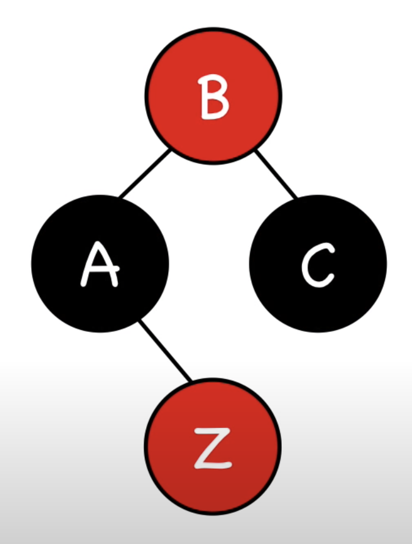

# Red-black tree  
**Red-black tree** - вид сбалансированного дерева.  

Основные свойства красно-чёрного дерева:  
- Каждый узел либо красный, либо чёрный
- Корневой узел и листовые узлы (nil) - чёрные
- Если узел красный, то его дочерние узлы чёрные  
- Все пути от данного узла до его nil потомков содержат одинаковое кол-во чёрных узлов  

Пример красно-чёрного дерева:  
  
Это дерево удовлетворяем всем требованиям:  
- Здесь все узлы либо красные, либо чёрные;
- Корневой узел (8) и листовые узлы (nil) чёрного цвета;
- У красных узлов есть только чёрные дочерние узлы;
- Все пути от любого узла до листового (nil) содержат одинаковое кол-во чёрных.

Здесь в каждом узле нам надо будет хранить дополнительный параметр: цвет узла.  
> Высота дерева (длина самого длинного пути от корня до листового (nil) узла) не должная быть больше двух 
расстояний от корня до самого ближайшего листового (nil) узла.  

Это из-за того, что в самом коротком пути все узлы чёрные, в самом длинном - чередование красных и чёрных узлов.  

## Rotations  
Ротирование изменяет структуру дерева перестановкой поддеревьев.  
Её цель - уменьшить высоту дерева.  

  

  

### Left-rotation pseudocode  
```
class Node:
    int key
    Node parent
    Node left
    Node right
    Bool color // 0 - red, 1 - black

class Tree:
    Node root
    Node nil // просто пустой узел, который используется как листой

func leftRotation(Tree tree, Node x):
    Node y = x.right
    x.right = y.left
    if y.left != tree.nil:
        y.left.parent = x
    y.parent = x.parent
    if x.parent == tree.nil:
        // помечаем узел y как корневой во всём дереве
        tree.root = y
    else if x == x.parent.left:
        x.parent.left = y
    else:
        x.parent.right = y
    y.left = x
    x.parent = y
```
**Time complexity of rotation: _O(1)_**  
**Space complexity of rotation: _O(1)_**  

## Insertion  
  
Алгоритм добавления нового узла `Z`:  
1. Добавляем узел `Z` в дерево и помечаем его красным  
2. Перекрашиваем и делаем ротацию, чтобы исправить нарушения  

Новый узел мы сразу помечаем красным потому что хоть он и может нарушить 2-ое и 3-е правила, но это легко исправить.  

При вставке нового узла `Z`, у нас может быть 4 сценария:  
### 1. Z == root  
Решение: перекрашиваем в чёрный узел.
### 2. Z.uncle = red  
  
Решение: перекрашиваем parent, grandparent и uncle.  
  
Здесь `B` на самом деле не является корнем дерева (мы видим поддерево), поэтому допустимо, что оно красное.  
В том случае, если родитель `B` тоже красный, то нам надо подниматьс якаждый раз выше и проверять, что все 4 правила 
срабатывают. В таком случае нам надо будет также поднимать и `Z` (теперь в качестве `Z` будет выступать `B`).  
### 3. Z.uncle = black (triangle)  
  
Случаи выше называем треугольными (тк образуют форму угловую).  
Решение: rotate Z.parent (в левом случае делаем rightRotation(A), в правом leftRotation(C)).  
После этого мы получим 2 подяд идущих красных узла `Z` и `A`. В таком случае нам надо сделать проверку правила, где 
узлом `Z` будет выступать `A`, нам придётся применить 4-ое правило.  
### 4. Z.uncle = black (line)  
Вот случае, где образуется линия:  
  
Решение: rotate Z.grandparent (в левом случае leftRotation(B), в правом rightRotation(B)).  
  
После этого надо перекрасить бывших parent и grandparent.  
  

### Insertion pseudocode  
```
// здесь мы просто проивзводим вставку красного узла на своё место,
// после чего вызываем insertFixup, который проивзодит балансировку
func insert(Tree tree, Node z):
    Node y = tree.nil
    Node x = tree.root
    while x != tree.nil:
        y = x
        if z.key < x.key:
            x = x.left
        else:
            x = x.right
    z.p = y
    if y == tree.nil:
        tree.root = z
    else if z.key < y.key:
        y.left = z
    else:
        y.right = z
    z.left = tree.nil
    z.right = tree.nil
    z.color = RED
    insertFixup(tree, z)

func insertFixup(Tree tree, Node z):
    while z.parent.color == RED:
        if z.parent == z.parent.parent.left:
            Node y = z.parent.parent.right
            if y.color == RED:
                z.parent.color = BLACK     // case 2
                y.color = BLACK            // case 2
                z.parent.parent.color  RED // case 2
                z = z.parent.parent        // case 2
            else if z == z.parent.right:
                z = z.parent           // case 3
                leftRotation(z)        // case 3
            z.parent.color = BLACK         // case 4
            z.parent.parent.color = RED    // case 4
            rightRotation(z.parent.parent) // case 4
        else:
            (same as then clause with "right" and "left" exchanged)
    tree.root.color = BLACK   // case 0
```

**Time complexity: _O(logn)_**, где logn - это высота дерева.  

Конспект составлял по:
* [Youtube | Red-Black Trees](https://www.youtube.com/playlist?list=PL9xmBV_5YoZNqDI8qfOZgzbqahCUmUEin)  
* [Здесь он же приводит большой пример: Youtube | Red-black trees in 5 minutes — Insertions (examples)](https://www.youtube.com/watch?v=A3JZinzkMpk&list=PL9xmBV_5YoZNqDI8qfOZgzbqahCUmUEin&index=4)
### Дополнительные источники:
* [Github \[raywenderlich\] Red-Black Tree](https://github.com/raywenderlich/swift-algorithm-club/tree/master/Red-Black%20Tree)
