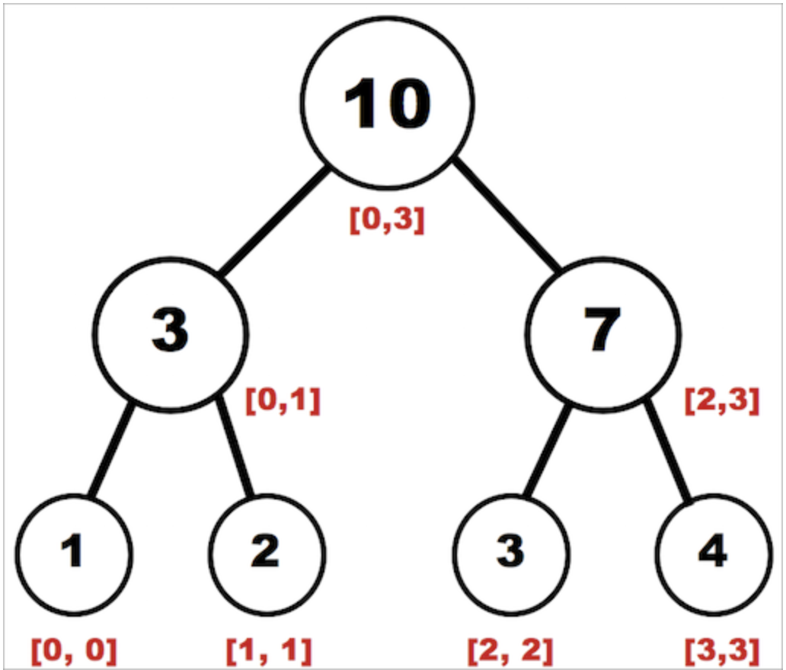
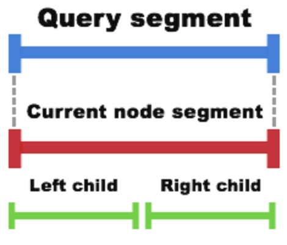
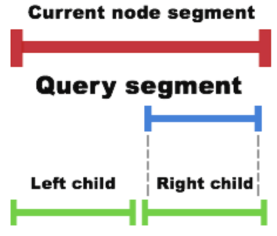
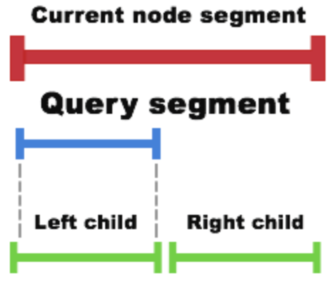
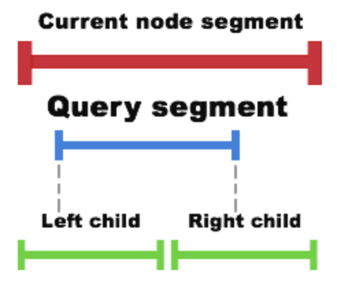

# Segment tree data structure  
Структура данных, которая выполняет схожую задачу, что и Sparse Table. 
Она позволяет после некоторого препроцессинга быстро (за O(logN) time) выдавать ответ на запрос интервала массива, 
когда используется ассоциативная функция.  
То есть проедполоижм, что у нас есть массив **a** какого-то типа и ассоциативная функция **f**. Например, функция 
**f** может быть sum, multiplication, min, max, gcd и т.д.  

Наша задача:  
- Ответь на запрос интервала с левой границей **l** и правой границей **r**, то есть выполнить 
`f(a[l], a[l+1], ..., a[r-1], a[r])`.  
- Поддержать возможность замены элемента под каким-то индексом `a[index] = newItem`.  

Например, если у нас есть массив:  
`var a = [ 20, 3, -1, 101, 14, 29, 5, 61, 99 ]`  
И мы делаем запрос на интервал [3,7] с функцией суммы, то мы делаем следующее:  
`101 + 14 + 29 + 5 + 61 = 210`  
Такая прямой подход занимаем линейное **O(n)** время. Чтобы это можно было ускорить, можно использовать структуру 
данных Segment tree.  

## Структура Segment tree  
Segment tree - это просто бинарное дерево, где каждый узел является экземпляром класса `SegmentTree`:  
```
public class SegmentTree<T> {
  private var value: T
  private var function: (T, T) -> T
  private var leftBound: Int
  private var rightBound: Int
  private var leftChild: SegmentTree<T>?
  private var rightChild: SegmentTree<T>?
}
``` 
Каждый узел хранит в себе:  
- Индекс левой и правой границы интервала (leftBound и rightBound)  
- Указатели на дочерние узлы  (leftChild и rightChild) 
- Результат применения функции **f** для данного участка (value)  

Если у нас массив `[1, 2, 3, 4]` и функция `f = a + b`, то сегментное дерево будет выглядеть так:  
  
Здесь красным помечены границы интервалов для данного узла.  

## Построение Segment tree  
Вот как мы создаём узел дерева сегментов:  
```swift
public init(array: [T], leftBound: Int, rightBound: Int, function: @escaping (T, T) -> T) {
    self.leftBound = leftBound
    self.rightBound = rightBound
    self.function = function

    if leftBound == rightBound {
      value = array[leftBound]
    } else {
      let middle = (leftBound + rightBound) / 2

      leftChild = SegmentTree<T>(array: array, leftBound: leftBound, rightBound: middle, function: function)
      rightChild = SegmentTree<T>(array: array, leftBound: middle+1, rightBound: rightBound, function: function)

      value = function(leftChild!.value, rightChild!.value)
    }
}
```
Здесь корневому узлу мы даём полный массив с полным интервалом, после чего эта функция рекурсивно строит дерево.  

Операция построения дерева занимает **O(n)** time complexity.  

## Запрос на интервал массива  
```swift
public func query(withLeftBound: leftBound: Int, rightBound: Int) -> T {
    // 1
    if self.leftBound == leftBound && self.rightBound == rightBound {
      return self.value
    }

    guard let leftChild = leftChild else { fatalError("leftChild should not be nil") }
    guard let rightChild = rightChild else { fatalError("rightChild should not be nil") }

    // 2
    if leftChild.rightBound < leftBound {
      return rightChild.query(withLeftBound: leftBound, rightBound: rightBound)

    // 3
    } else if rightChild.leftBound > rightBound {
      return leftChild.query(withLeftBound: leftBound, rightBound: rightBound)

    // 4
    } else {
      let leftResult = leftChild.query(withLeftBound: leftBound, rightBound: leftChild.rightBound)
      let rightResult = rightChild.query(withLeftBound: rightChild.leftBound, rightBound: rightBound)
      return function(leftResult, rightResult)
    }
}
```
1. Сначала мы проверяем соответствует ли интервал данного узла запрошенному. Если да, то возвращаем значение данного 
узла.  

2. Проверяем лежит ли запрошенный интервал полностью внутри правого узла.  
  
3.Проверяем лежит ли запрошенный интервал полностью внутри левого узла.  
  
4. Если ничего из вышеперечисленного, значит он лежит частично в интервале левого узла и в интервале правого узла.  
  

Запрос на интервал занимает *O(logN) time complexity*.  

## Замена элемента  
Значение узла Segment Tree зависит от значений его дочерних узлов. Поэтому если мы хотим изменить значение листового 
узла, то нам надо обновить все его родительские узлы.  
```swift
public func replaceItem(at index: Int, withItem item: T) {
    if leftBound == rightBound {
      value = item
    } else if let leftChild = leftChild, rightChild = rightChild {
      if leftChild.rightBound >= index {
        leftChild.replaceItem(at: index, withItem: item)
      } else {
        rightChild.replaceItem(at: index, withItem: item)
      }
      value = function(leftChild.value, rightChild.value)
    }
}
```
Замена элемента занимает **O(logN)** time complexity.  

## Compact array based tree implementation  
Описанный выше способ использует рекурсию, которая выполняется медленно, и в качестве основной структуры использует 
дерево, которое занимает много памяти.  
Есть более короткое и эффективное решение. В его основе лежит массив (heap) и в нём мы не будем использовать рекурсию.  
В массиве с деревом будет `2*N` элементов, где `N` - кол-во элементов в изначальном массиве.  
`2*N` элементов нам хватит, тк в дереве будет всего `2*N-1` элементов. Элемент под нулевым индексом будет пустым.  
Здес расчёт на то, что если родительский элемент находится под индексом `i`, то его дочерние элементы под индексами 
`i>>1` и `(i>>1)|1` (или `i*2` и `i*2+1`).  
```java
class Main {
    public static void main(String[] args) {
        int[] arr = {4,1,2,5,6,3,7};
        SumSegmentTree tree = new SumSegmentTree(arr);
        System.out.println(tree.query(2,5));
    }

    public static class SumSegmentTree {
        int N; // кол-во элементов в исходном массиве
        long[] tree; // массив с деревом (heap)
        public SumSegmentTree(int[] arr) {
            this.N = arr.length;

            // build tree
            this.tree = new long[N * 2];
            for (int i = 0; i < N; i++) {
                tree[i + N] = arr[i];
            }
            for (int i = N-1; i > 0; i--) {
                tree[i] = function(tree[i<<1], tree[(i<<1)|1]);
            }
        }

        // комбинаторная функция
        private long function(long i, long j) {
            return i + j;
        }

        // изменяет значение конкретного элемента и все его родительские в том числе
        public void modify(int idx, int val) {
            tree[idx+N] = val;
            for (int i = N + idx; i > 1; i >>= 1) {
                tree[i>>1] = tree[i] + tree[i^1];
            }
        }

        // делает запрос на интервал [left:right)
        public long query(int left, int right) {
            long res = 0;
            for (left += N, right += N; left < right; left >>= 1, right >>= 1) {
                if ((left & 1) != 0) res = function(res, tree[left++]);
                if ((right & 1) != 0) res = function(res, tree[--right]);
            }
            return res;
        }
    }
}
```
По сути, если нам потребуется изменить наше дерево на минимальное сегментное дерево, или максимальное, то по сути надо 
будет исправить только функцию `function`, потому мы и вынести эту операцию в отдельную функцию.  

В запросе `query` обратим внимание, что правая граница не включена в результат, а лева включена.  

**Как работает функция query?**  
Общая идея следующая: если левая граница интервала `left` нечётная (то есть `left&1`), тогда left - это правый ребёнок 
родителя. Это значит, что наш интервал включает left, но не включает родительский элемент. Так мы добавляем к 
результату tree[left] и переводим left на правого соседа родительского элемента путём `left = (left + 1) / 2`. Если же 
`left` чётная, то это левый ребёнок родителя и соответственно родитель включён (если правая граница не противоречит), 
поэтому мы left просто перемещаем к родителю.  
Аналогичные правила (немного изменённые) применимы к правой границе.  

Никакой рекурсии и никаких дополнительных вычислений, таких как поиск середины интервала, не требуется, мы просто 
просматриваем все необходимые нам узлы, так что это очень эффективно.

Time и Space complexity такие же какие и были, но алгоритм работает быстрее.  

### Некоммутативные комбинаторные функции  
Пока мы рассмотрели только простую комбинаторную функцию (роль которой выполняет `function`) - сложение. Она является 
коммутативной, что означает что последовательность операндов не играет значения (`a + b = b + a`). Аналогичными являются 
`min` и `max`.  
Однако существуют сценарии, когда комбинаторная функция не коммутативная, например, в [задаче C. Sereja and Brackets](https://codeforces.com/contest/380/problem/C).  
Наш алгоритм может решить эту задачу. Мы создадим структуру `Node` и комбинаторную функцию для неё. Также в функции 
`query` обратим внимание, что узлы, соответствующие левой границе, обрабатываются слева направо, а относящиеся к правой 
границе - справа налево.  
Вот интересующие части из решения:  
```java
public static class Node {
    int subseq;
    int open;
    int close;
    public Node(int subseq, int open, int close) {
        this.subseq = subseq;
        this.open = open;
        this.close = close;
    }
}

public Node function(Node i, Node j) {
    int seq = i.subseq + j.subseq + Math.min(i.open, j.close)*2;
    int open = i.open + j.open - Math.min(i.open, j.close);
    int close = i.close + j.close - Math.min(i.open, j.close);
    return new Node(seq, open, close);
}

public Node query(int left, int right) {
    Node resl = new Node(0,0,0);
    Node resr = new Node(0,0,0);
    for (left += N, right += N; left < right; left >>= 1, right >>= 1) {
        if ((left&1) > 0) resl = function(resl, tree[left++]); // tree[left++] исправа
        if ((right&1) > 0) resr = function(tree[--right], resr); // tree[--right] слева
    }
    return function(resl, resr);
}
```


Конспект составлял по:
* [Github \[raywenderlich\] Segment Tree](https://github.com/raywenderlich/swift-algorithm-club/tree/master/Segment%20Tree)
* [Codeforces | Efficient and easy segment trees (array based)](https://codeforces.com/blog/entry/18051)
* [E-maxx.ru | Дерево отрезков](http://e-maxx.ru/algo/segment_tree)
