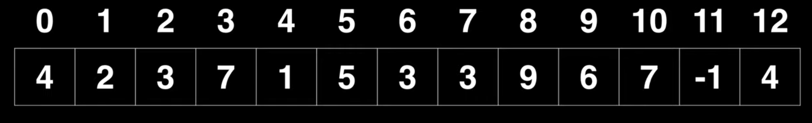
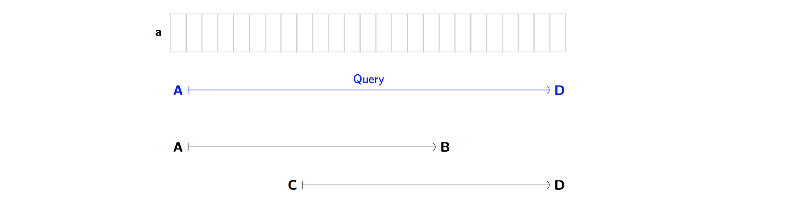
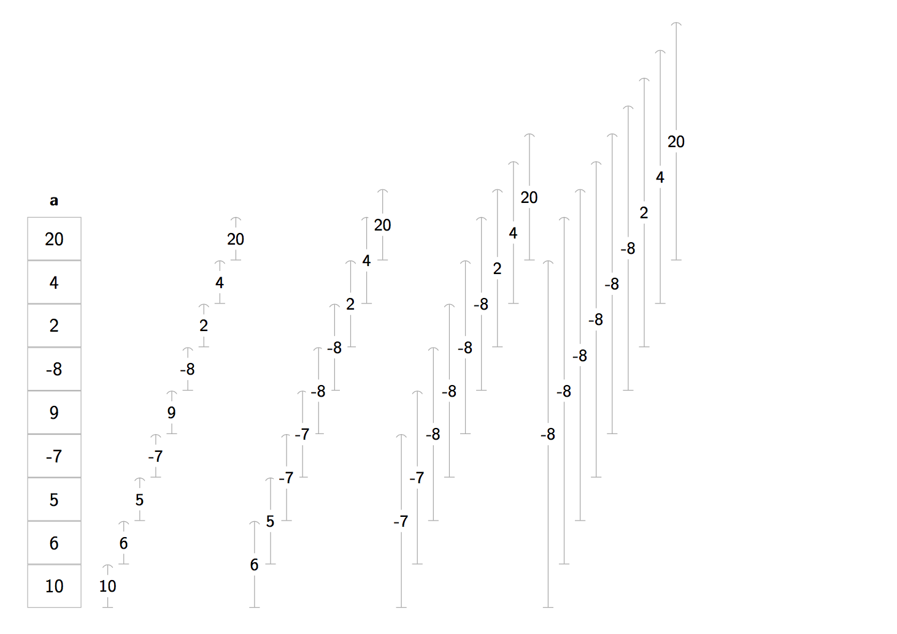
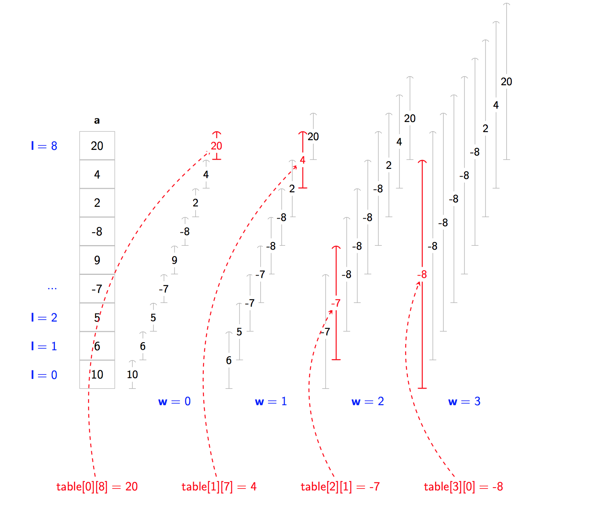
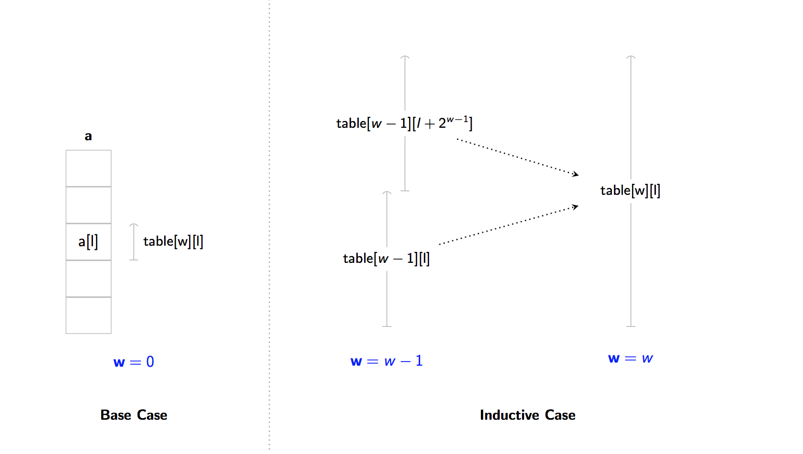
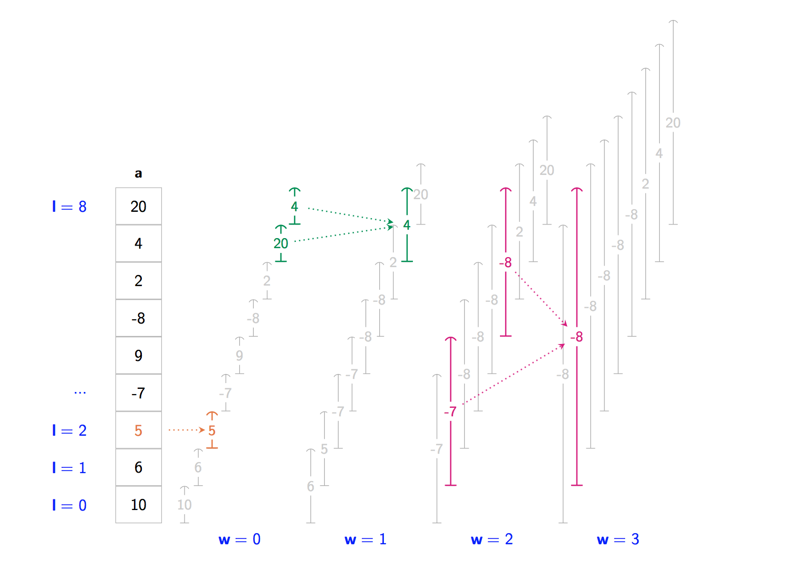
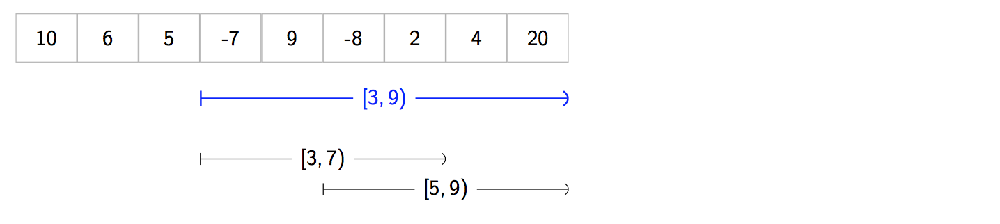
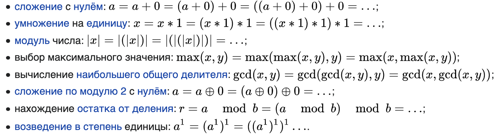
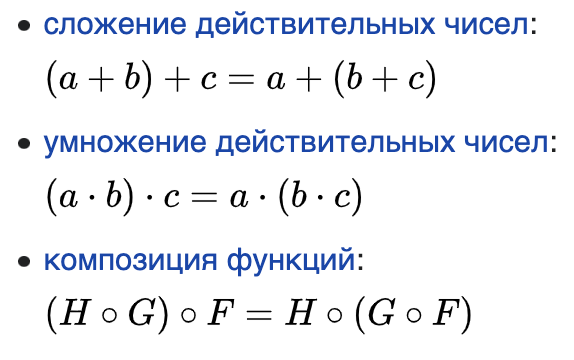

# Sparse table data structure (разреженная таблица)
Sparse table используются для эффективного выполнения запросов на какой-то диапазон.
Диапазон запросов (range queries) может быть с разными операциями, но самые популярные:
min, max, sum и gcd диапазонные запросы.  

  
Например, что если мы хотим знать максимальное значение в диапазоне [4,12], 
gcd в [6,9] или сумму в диапазоне [2,11].  
И как быть, если мы понимаем, что запросов на диапазон на каждую операцию (min, max и т.д.) 
будет очень много?  
Для этого мы можем потратить время на препроцессинг, чтобы составить разреженную таблицу, и потомы очень быстро 
доставать из неё результат.  

---
### Проблема
Представим, что:  
- у нас есть массив **a** какого-то типа
- у нас есть ассоциативная бинарная функция **f** <sup>[\*]</sup>. Функция может быть: min, max, gcd, boolean AND, boolean OR ...

*<sup>[\*]</sup> где **f** "идемпотентна". TODO: дать определение идемпотентности*  

Наша задача следующая:  
- Дано 2 индекса **l** и **r**, ответить на запрос об интервале `[l,r)`, 
выполнив `f(a[l], a[l + 1], a[l + 2], ..., a[r - 1])`;  
- Количество запросов **Q** на интервалы к этому массиву будет огромное, и нам надо будет очень быстро на них отвечать.  

Например, у нас есть массив чисел:  
```
var a = [ 20, 3, -1, 101, 14, 29, 5, 61, 99 ]
```
И наша функция **f** это *min* функция.  
Если нам будет запрос на интервале `[3,8)`, то мы должны искать среди чисел:  
`101, 14, 29, 5, 61`  
Затем все эти числа мы подставляем в функцию min, а результате получаем 5.  

Но давайте представим, что у нас есть миллион подобных запросов.
> - *Query 1*: Find minimum of all elements between 2 and 5
> - *Query 2*: Find minimum of all elements between 3 and 9
> - ...
> - *Query 1000000*: Find minimum of all elements between 1 and 4  

И наш массив очень большой. Допустим Q = 1000000 and N = 500000. Мы хотим быть уверенными,
что отвечаем ка каждый запрос очень быстро.  

_Sparse table решают эту проблему._  

Мы могли бы просто сделать цикл for чтобы посчитать ответ для каждого запроса. Однако это будет работать медленно.  
Мы можем ускорить время подсчёта использую структуру данных **Sparse table**.  

Можно заметить, что пока наша проблема в точности такая же, как и у Segment Tree . Однако! ... 
есть одно важное различие между деревьями сегментов и разреженными таблицами ... и оно касается нашего выбора f.  

### Идемпотентность  
Предположим, мы хотим найти ответ для диапазона **`[A, D)`**.
И мы уже знаем ответ для диапазонов **`[A, B)`** и **`[C, D)`**.
И внимание, *эти диапазоны пересекаются*! То есть **C** < **B**.  
  

Когда **f** - функция минимума, мы можем взять результаты отрезка **`[A, B)`** и **`[C, D)`** 
и подставить их в функцию **f**. И не важно что эти интервалы пересекаются, мы всё равно смогли найти правильный ответ.  
Но теперь что **f** - это операция сложения `+`. Если мы возбмём результаты пересекающихся интервалов и поставим
в функцию, то ответ будет неправильным (тк мы 2 раза сложим пересекающийся отрезок).  
Получается, чтобы использовать эту технику, **f** не должна использовать некоторые бинарные операции, включая `+`, `*`, 
`XOR`, ... потому что они не работают с данной техникой. То есть данная техника работает с идемпотентными 
бинарными операторами.   
_Примеры идемпотентных операций: min, max, gcd, boolean AND, boolean OR, bitwise AND и bitwise OR._  
Обратим внимание, что для Segment Trees функция **f** не должна быть идемпотентной. Это ключевое отличие между 
Segment Trees и Sparse Tables.  

Тк операция сложения, которая приводилась выше, не является идемпотентной, то для неё надо использовать 
немного другую технику, которая будет описана позже.  

## Структура разреженной таблицы  

Пусть функция f = min и задан массив:  
```
var a = [ 10, 6, 5, -7, 9, -8, 2, 4, 20 ]
```

В этом случае Sparse Table будет выглядеть так:
  

Так как в нашей таблице мы не можем хранить результаты сразу всех возможных интервалов (тк это заняло слишком 
много места и долго высчитывалось), то наша Sparse Table должна быть разреженной. То есть мы выберем только "лучшие" 
интервалы, для которых будем хранить ответ. **И как оказывается, "лучшие" интервалы те, которые имеют длину равную 
степени двойки (2<sup>0</sup>, 2<sup>1</sup>, 2<sup>2</sup>, 2<sup>3</sup> ...).**  

Например, ответ для интервала `[10,18)` хранится в нашей таблице, тк ширина интервала `18 - 10 = 8 = 2**3`, то есть 
является степенью двойки. Так же ответ для `[15, 31)` также в нашей таблице `31 - 15 = 16 = 2**4`.  
Однако явного ответа для интервала `[1, 6)` нет в нашей таблице (`6 - 1 = 5`). Следовательно, мы не храним ответы 
для всех возможных интервалов, а только для интервалов с длинной степени 2, независимо от того где лежит начало 
интервала. 

При помощи такой таблицы, когда к нам поступает запрос на какой-то интервал с шириной не степени двойки, то мы можем 
разбить этот интервал на несколько более маленьких интервалов с шириной степени 2, и потом просто вызвать функцию 
**f** с результатами этих интервалов.  
Если функция **f** является идемпотентной, то мы можем использовать пересекающиеся интервалы; если не является 
идемпотентной (например, sum), то нам надо будет использовать непересекающиеся интервалы, но это займёт чуть больше 
времени. 

**Sparse Table** это таблица где `table[w][l]` содержит ответ для интервала `[l, l + 2**w]`.  
Здесь:  
- **w** сообщает нам **ширину** (кол-во элементов в интервале будет 2**w)  
- **l** сообщает нам о левой границе интервала (индекс старта)  

Примеры:  
- `table[3][0] = -8`: ширина `2**3`, интервал начинается с `l = 0`, то есть границы интервала `[0, 0 + 2**3) = [0, 8)`.  
Ответ для данного интервала будет `min(10, 6, 5, -7, 9, -8, 2, 4, 20) = -8`.  
- `table[2][1] = -7`: ширина: `2**2`, начало `l=1`, интервал `[1, 1 + 2**2) = [1, 5)`  
- `table[0][8] = 20`, ширина: `2**0`, начало `l=8`, интервал `[8, 8 + 2**0) = [8, 9)`  

  

Sparse Table может быть реализована при помощи двумерного массива.  

## Построение Sparse Table  
Получается что нам надо заполнить двумерный массив (который представляет собой Sparse Table) `table[w][l]`, 
где `w` - показывает ширину интверала (ширина = 2**w), а `l` - индекс начала интервала.  

Сначала заполняем массив где `w = 0`. Там значения будут равны просто значениям массива без каких-либо вычислений.  

В случае когда `w > 0`: нам надо найти ответ для интервала `[l, l +2**w)`. Длинна этого интервала будет равна степени 
двойки (2, 4, 8, 16...), поэтому мы можем разделить этот интервал на 2 разных (w-1) и их значения подсатвить по ф-ию 
**f**. 
`table[w][l] = f(table[w - 1][l], table[w - 1][l + 2 ** (w - 1)])`  
  
  

### Псевдокод
```
# кол-во элементов в массиве
N = ...
# P - сокращённо от power (степень). Наибольшее 2**P, которопе помещается в N
P = ...
# Для быстрого определния floor(log2(i)), 1 <= i <= N
log2 = ... # size N+1, index 0 unused
# Разреженная таблица будет содержать числовые значения
dp = ... # P+1 строк и N колонок
# Index Table (IT) связана с значениями в разреженной таблице.
# Эта таблица полезна когда мы хотим поулчать в результате 
# запроса индекс минимального (или максимального) элемента 
# в интервале [l, r], а не само значение. 
# Index table не несёт какого-то смысла в большинстве других 
# запросах на интервалы таких как gcd или sum.
it = ... # P+1 строк и N колонок

function BuildMinSparseTable(values):
    N = length(values)
    P = floor(log(N) / log(2))
    
    log2 = [0,0,...,0,0] # size N+1
    for (i = 0; i <= N; i++):
        log2[i] = log2[i/2] + 1

    # Заполняем первую строку
    for (i = 0; i < N; i++):
        dp[0][i] = values[i]
        it[0][i] = i

    for (p = 1; p <= P; p++):
        for (i = 0; i + (1 << p) <= N; i++):
            left = dp[p-1][i]
            right = dp[p-1][i+(1<<(p-1))]
            dp[p][i] = min(left, right)

            # Save/propagate the index of smallest element
            if left <= right:
                if[p][i] = it[p-1][i]
            else:
                it[p][i] = it[p-1][i+(1<<(p-1))]

# Запрос на получение самого маленького элемента в интервале [l, r], O(1)
func MinQuery(l, r):
    len = r - l + 1
    p = log2[len]
    left = dp[p][l]
    right = dp[p][r - (1 << p) + 1]
    return min(left, right)

# Запрос на получение самого маленького элемента в интервале [l, r]
# делая каскадный min запрос, O(logN)
func CascadingMinQuery(l, r):
    min_val = +INF
    for (p = log2[r-l+1]; l <= r; p = log2[r-l+1]):
        min_val = min(min_val, dp[p][l])
        l += (1 << p)
    return min_val

# Возвращает индекс самого маленького элемента в диапазоне [l, r]
# Если присуствует несколько самых маленьких значений, то вернётся 
# индекс самого левого значения
function MinIndexQuery(l, r):
    len = r - l + 1
    p = log2[len]
    left = dp[p][l]
    right = dp[p][r - (1 << p) + 1]
    if left <= right:
        return it[p][l]
    return it[p][r - (1<<p) + 1]
```

## Получение ответов на запросы  
Предположим что мы уже построили нашу Sparse Table и сейчас мы готов обработать **Q** запросов.  
Предположим что ф-ия **f** = min:  
`var a = [ 10, 6, 5, -7, 9, -8, 2, 4, 20 ]`  
И у нас есть запрос на интервал `[3, 9)`.  
1. Найдём наибольшую степень двойки, так чтобы ширина умещалась в интервал `[3, 9)`, то есть `9 - 3 = 6`. 
Наибольшая степень двойки, которая умещается внутри, равна 4.  
2. Создаём 2 новых запроса `[3, 7)` и `[5, 9)`, которые имею ширину 4. И мы располагаем их так, чтобы они покрывали 
весь интервал и не оставляли зазоров.  
  
3. Так как 2 выбранных интервала имеют степень двойки, то мы можем найти овтеты для них в нашей разреженной таблице, 
используя w = 2. Ответ для `[3, 7)` лежит в `table[2][3]`, ответ для `[5, 9)` лежит в `table[2][5]`. 
В ответ возвращаем `min(table[2][3], table[2][5])`.  
Хотя наши интервалы накладываются друг на друга, это не имеет значения, тк изначально выбранная ф-ия **f** = min 
является идемпотентной.  

## Анализ Sparse Table  
**Time complexity** - построение Sparse Table занимаем **_O(N\*logN)_**. Запрос к этой таблице занимает **_O(1)_**.  
**Space complexity** - кол-во возможных **w** - **logN**, кол-во возможных **l** - **N**, поэтому таблица занимает 
**_O(N*logN)_** дополнительного пространства.  

### Сравнение с Segment Trees  
- **Pre-processing** - Segment Trees составляет **O(N)** time complexity и **O(N)** space complexity. 
Sparse Table составляет **O(N\*logN)** time complexity и **O(N)** space complexity.  
- **Запросы** - запрос к Segment Tree занимает **O(logN)** time для любого **f** (идемпотентного или не идемпотентного). 
Запрос к Sparse Table занимает **O(1)** time если **f** идемпотентный, и не поддерживает не идемпотентный **f**. 
<sup>[†]</sup>  
- Замена элементов - Segment Trees позволяет эффективно изменять элементы в **a** и обновлять Segment Tree за 
**O(logN)** time. Sparse Tables не позволяет изменять элементы эффективно, для обновления надо заново полностью 
пересчитать таблицу за **O(N\*logN)**.  

<sup>[†]</sup> *Технически возможно переписать `query` метод, чтобы он поддерживал не идемпотентные функции. Но таким 
образом мы повысим временную сложность с O(1) до O(logN), полностью нарушая изначальную цель Sparse Tables - 
поддержку быстрых запросов.  
В таком случае лучше использовать Segment Tree (или Fenwick Tree)*  

## Определения  
- **Разреженный массив** - абстрактное представление обычного массива, в котором данные представлены не непрерывно, 
а фрагментарно; большинство элементов его принимают одно и то же значение (значение по умолчанию, обычно 0 или null). 
Причём хранение большого числа нулей в массиве неэффективно как для хранения, так и для обработки массива.
[Источник](https://ru.wikipedia.org/wiki/%D0%A0%D0%B0%D0%B7%D1%80%D0%B5%D0%B6%D0%B5%D0%BD%D0%BD%D1%8B%D0%B9_%D0%BC%D0%B0%D1%81%D1%81%D0%B8%D0%B2)  
- **Идемпоте́нтность** — свойство объекта или операции при повторном применении операции к объекту давать тот же результат, 
что и при первом. [Источник](https://ru.wikipedia.org/wiki/%D0%98%D0%B4%D0%B5%D0%BC%D0%BF%D0%BE%D1%82%D0%B5%D0%BD%D1%82%D0%BD%D0%BE%D1%81%D1%82%D1%8C)  
*Примеры идемпотентных операций:*  
  
- **Ассоциативность (математика)** — сочетательность, свойство бинарной операции, при котором результат последовательного 
применения операции не зависит от расстановки скобок. [Источник](https://ru.wikipedia.org/wiki/%D0%90%D1%81%D1%81%D0%BE%D1%86%D0%B8%D0%B0%D1%82%D0%B8%D0%B2%D0%BD%D0%B0%D1%8F_%D0%BE%D0%BF%D0%B5%D1%80%D0%B0%D1%86%D0%B8%D1%8F)  
*Примерами ассоциативных операций являются:*  
  
- **RMQ (Range minimum query)** - проблема нахождения минимального значения в подмассиве.  
RMQ имеет несколько применений в computer science, например, в lowest common ancestor problem (LCA) или longest 
common prefix problem (LCP). [Источник](https://en.wikipedia.org/wiki/Range_minimum_query)  

## Список источников  
Конспект составлял по:
* [Github \[raywenderlich\] Sparse Table](https://github.com/raywenderlich/swift-algorithm-club/blob/master/Sparse%20Table/README.markdown)
* [Youtube \[WilliamFiset\] Sparse Table Data Structure](https://github.com/raywenderlich/swift-algorithm-club/blob/master/Sparse%20Table/README.markdown)