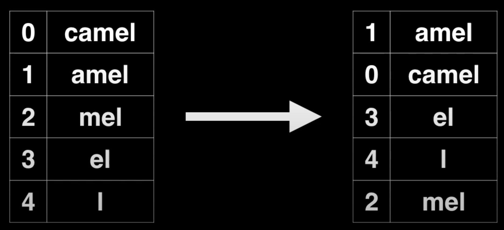
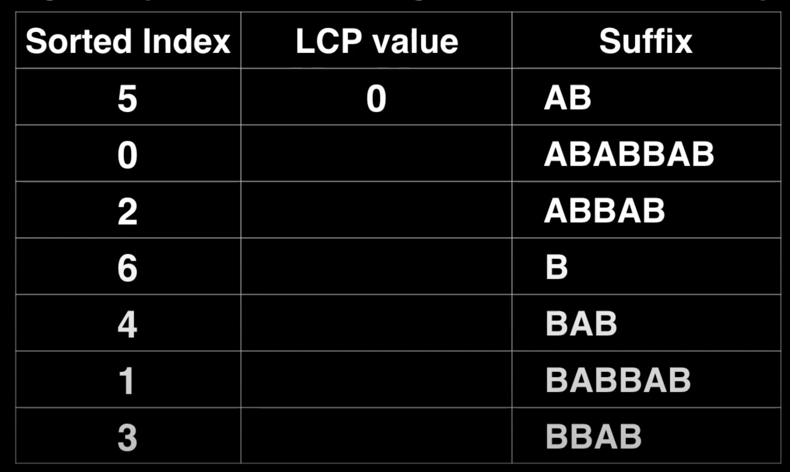
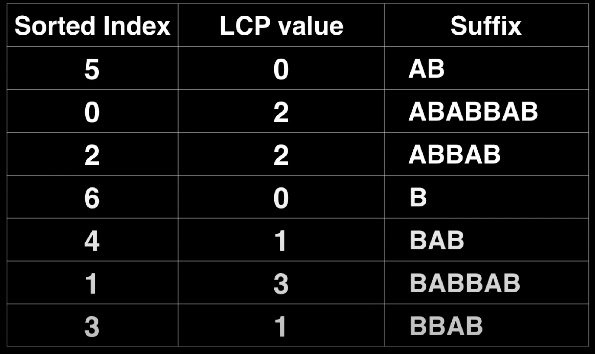
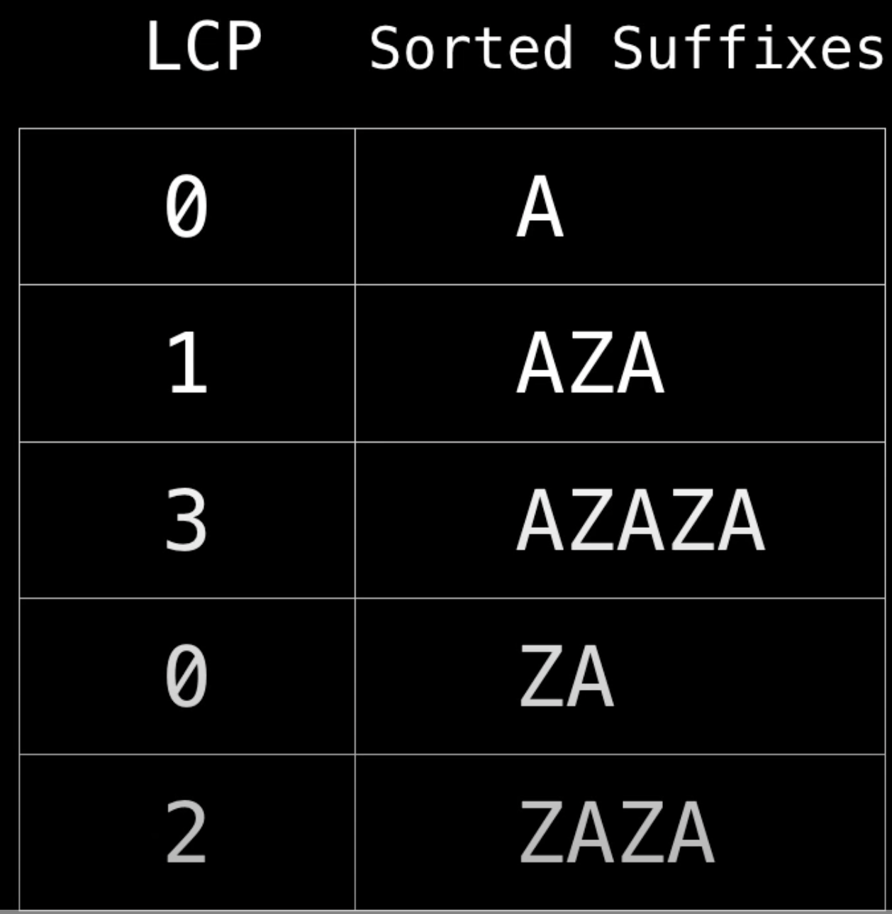
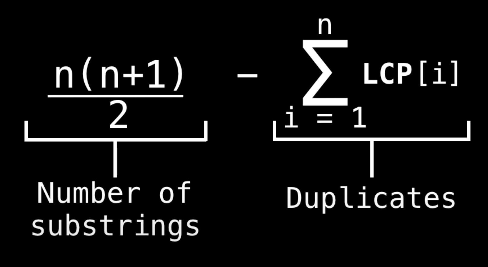

# Suffix arrays  
Suffix - это подстрока в конце строки символов. Для нашего удобства будем считать, что суффик не может быть пустым.  
Например, перечислим всевозможные суффиксы слова `HOURSE`: `E, SE, RSE, URSE, OURSE, HOURSE`.  

**Suffix Array (SA)** - массив, который содержит суффиксы строки в отсортированном порядке (по алфавиту).  
Например, *массив суффиксов* слова `camel` будет выглядеть так:  
  
В левой табличке в первой колонке указан индекс, откуда начинается подстрока с суффкисом (идёт до конца строки, 
очевидно).  
В правой табличке представлен массив этих суффиксов в отсортированном (по правилам лексикографии) порядке.  
По факту мы можем не хранить правую колонку в правой таблице, нам достаточно знать где только начинается подстрока, 
поэтому левой колонки правой таблицы будет достаточно.  
Поэтому по факту, **_sorted array_** - массив упорядоченных индексов. Так мы эконом место, тк нам не надо хранить сами 
подстроки.  

_Suffix array_ - это альтернатива _suffix tree_, но требующая меньше памяти.  

## Алгоритмы построения Suffix Array  
Существует несколько способ построения суффиксного массива. Некоторые проще, но медленнее, а некоторые быстрее.  
### Наивный алгоритм с O(n^2*logn) time complexity
```java
public static Integer[] naiveBuildSuffixArray(String str) {
    char[] charArr = str.toCharArray();
    int n = charArr.length;
    Integer[] sa = new Integer[n];
    for (int i = 0; i < n; i++) {
        sa[i] = i;
    }
    // здесь параметры компоратора: char[] a, int aFromIndex, int aToIndex,
    //                              char[] b, int bFromIndex, int bToIndex
    Arrays.sort(sa, (i,j)->Arrays.compare(charArr, i, n, charArr, j ,n));
    return sa;
}
```  
Здесь мы в начале строку переводим в массив символов, чтобы можно быстрее сравнивать подстроки (без создания новой 
подстроки).  
То есть мы просто создаём массив с индексами начала суффиксов `sa` и затем сортируем эти суффиксы. Стоит учитывать, что 
сравнивая строки, нам приходится сравнивать каждый символ в ней. Поэтому операция сортировки массива подстрок занимает 
__O(n^2*logn)__, как и сам этот алгоритм.  

### Алгоритм с O(n*(logn)^2) time complexity  
Когда мы строим массив суффиксов, нам стоит учитывать, что мы сравниваем подстроки одной строки.  
В данном алгоритме мы создаём класс `Suffix`, в котором храним информацию о индексе начала суффикса (idx), значении 
текущего суффикса (rank) и значении суффикса, который идёт сразу после текущего (next).  
```
class Suffix {
    int idx;
    int rank;
    int next;
}
```
На самом деле здесь класс Suffix по факту хранит информацию просто о подстроке (которая не факт что идёт до самого 
конца). То есть изначально все подстроки состоят из одного символа. Так `rank` - это `значение_текущего_символа -'a'` 
(просто символ к числу приводим). Значение `next` - это rank подстроки такого же размера (или меньше, если в конце 
строки), но которая идёт сразу после текущей подстроки. Если текущая подстркоа находится в конце строки, то в `next` 
подставляется -1.  

Попробуем построиться Suffix array для слова `banana`.
Сначала в Suffix будет хранить значение с подстроками длинны 1.  
Выглядеть массив с `Suffix` следующим образом:  
```
{idx, rank, next_rank}
-------–----
{0, 1, 0}
{1, 0, 13}
{2, 13, 0}
{3, 0, 13}
{4, 13, 0}
{5, 0, -1}
```
Если буква последняя, то в `next` ставим значение `-1`, тк дальше букв нет.  
Далее нам надо отсортировать этот массив так, чтобы сначала шёл самый маленький `rank`. Если `rank` одинаковый, то 
сравниваем по `next`.  
После сортировки у нас будет следующий результат:  
```
{5, 0, -1}
{1, 0, 13}
{3, 0, 13}
{0, 1, 0}
{2, 13, 0}
{4, 13, 0}
```
Если бы была явная определённой в порядке всех суффиксов, то мы могли бы закончить. Но в данном случае у нас есть 
элементы с одинаковыми `rank` и `next`, например у `{1, 0, 13}` и `{3, 0, 13}` и мы не знаем в каком порядке 
относительно друг друга они действительно должны идти. Поэтому продолжаем алгоритм и расширяем длину подстрок в 2 раза.  
Для этого делаем следующую операцию: первому элементу массива назначим `rank` = 0, тк мы точно знаем что он может быть 
одним из первых элементов, при этом запомним его предыдущие значения `rank`.  
Перейдём к следующему элементу (`{1, 0, 13}`), если у этого элемента значения `rank` и `next` такие же как были у 
предыдущего Suffix, то назначим `rank` такой же как и прошлому (0). В противном случае назначим rank на один больше.  
Заметим что `next` значения мы не меняли.  
В итоге массив будет выглядеть так:  
```
{5, 0, -1}
{1, 1, 13}
{3, 1, 13}
{0, 2, 0}
{2, 3, 0}
{4, 3, 0}
```
Теперь изменим `next` элементы. Тк теперь в Suffix хранятся значения подстрок с длинной 2, то следующая подстрока 
начинается через 2 элемента после начала текущей. Поэтому в `next` кладём значение `rank` следующей смежной 
подстроки (к `idx` прибавляем 2 и ищем Suffix, у которого idx = idx+2).  
Резултат будет выглядеть так:  
```
{5, 0, -1}
{1, 1, 1}
{3, 1, 0}
{0, 2, 3}
{2, 3, 3}
{4, 3, -1}
```
Снова делаем сортировку.
```
{5, 0, -1}
{3, 1, 0}
{1, 1, 1}
{0, 2, 3}
{4, 3, -1}
{2, 3, 3}
```
Теперь у нас все значения разные и мы можем быть точно уерены в последовательности всех суффиксов.  
В итоге suffix array будет принимать такое значение: `[5,3,1,0,4,2]`.  
А вообще увеличивать длину подстроки можно пока length < n*2 (при этом length каждый раз увеличивать в 2 раза).

Time complexity: __O(n*(logn)^2)__ 

```java
class Main {
    public static class Suffix implements Comparable<Suffix> {
        int idx;
        int rank;
        int next;

        public Suffix(int idx, int rank, int next) {
            this.idx = idx;
            this.rank = rank;
            this.next = next;
        }

        public int compareTo(Suffix s) {
            if (rank != s.rank) return Integer.compare(rank, s.rank);
            return Integer.compare(next, s.next);
        }
    }

    public static int[] buildSuffixArray(String str) {
        if (str == null || str.isEmpty()) return new int[]{};
        int n = str.length();
        Suffix[] sa = new Suffix[n];
        for (int i = n-1; i >= 0; i--) {
            Suffix s = new Suffix(i, str.charAt(i)-'a', i < (n-1) ? sa[i+1].rank : -1);
            sa[i] = s;
        }
        Arrays.sort(sa);

        // здесь будем хранить маппинг: ключ - индекс начала суффикса; значение - его индекс в sa.
        int[] idx = new int[n];
        for (int length = 4; length < n*2; length <<= 1) {
            int prev = sa[0].rank;
            sa[0].rank = 0;
            idx[sa[0].idx] = 0;
            for (int i = 1; i < n; i++) {
                if (sa[i].rank == prev && sa[i].next == sa[i-1].next) {
                    sa[i].rank = sa[i-1].rank;
                } else {
                    prev = sa[i].rank;
                    sa[i].rank = sa[i-1].rank+1;
                }
                idx[sa[i].idx] = i;
            }
            for (int i = 0; i < n; i++) {
                int nextIdx = sa[i].idx + length/2;
                if (nextIdx < n) {
                    sa[i].next = sa[idx[nextIdx]].rank;
                } else {
                    sa[i].next = -1;
                }
            }
            Arrays.sort(sa);
        }

        int[] res = new int[n];
        for (int i = 0; i < n; i++) {
            res[i] = sa[i].idx;
        }
        return res;
    }
}
```

Поскольку здесь мы использовали классический алгоритм сортировки, то time complexity получилось __O(n*(logn)^2)__.  
Мы можем использовать _**[Radix Sort](https://www.geeksforgeeks.org/radix-sort/)**_, чтобы уменьшить time complexity до 
__O(n*logn)__.  

Подробнее рекомендуется почитать эти источники:  
- [Suffix arrays – a programming contest approach](https://web.stanford.edu/class/cs97si/suffix-array.pdf)
- [Suffix Arrays (CMSC 423)](http://www.cbcb.umd.edu/confcour/Fall2012/lec14b.pdf)  

Текущий раздел делал этой статье: [Suffix Array | Set 2 (nLogn Algorithm)](https://www.geeksforgeeks.org/suffix-array-s
et-2-a-nlognlogn-algorithm/)

Также существует способ построить Suffix array за O(n) time complexity: [Suffix Tree Application 4 – Build Linear Time 
Suffix Array](https://www.geeksforgeeks.org/suffix-tree-application-4-build-linear-time-suffix-array/?ref=rp)  

[Здесь приводится на java алгоритмы построения SU за O(n<sup>2</sup>logn), O(nlog<sup>2</sup>(n)) и O(nlogn)](https://github.com/williamfiset/algorithms/tree/master/src/main/java/com/williamfiset/algorithms/datastructures/suffixarray)

## The longest common prefix (LCP) array  
LCP array - это массив, в котором каждый индекс указывает на значение, сколько общих первых символов имеют 2 
последовательно идущих суффикса в SA.  

Пример: найдём LCP array для строки `ABABBAAB`.  
Начнём с построения Suffix array (возьмём все подстроки с суффиксами и отсортируем их в орфографическом порядке):  
  
Обратим внимание, что первый суффикс имеет LCP значение 0, это из-за того, что он самый первый и не имеет общих 
символов с предыдущим суффиксом (тк его нет).  
Дальше перейдём к следующему суффиксу и будем искать префикс максимальной длины, который совпадает с предыдущих 
суффиксов. `ABABBAB` и `AB` имеют общий префикс `AB`, поэтому запишем значение 2.  
Далее опаять значение 2 и т.д.  
В итоге мы ищем у текущей подстроки и предыдущей максимальный префикс и подставляем его длину.  
В итоге получим следующий результат:  
  

В итоге LCP префикс можно получить из SA наивным способом: просто перебирая символы в двух соседним строках до тех пор,
пока не наткнёмся на разные символы. Но такой алгоритм медленный, его time complexity __O(n^2)__.  
Существует менее очевидный, но более быстрый способ - _Алгоритм Касаи_.  

### Алгоритм Kasai  
Алгоритм Kasai - алгоритм, позволяющий за линейное время вычислить длину наибольших общих префиксов (LCP) для всех 
соседних суффиксов строки, отсортированных в лексикографическом порядке (SA).  

Хорошо объясняется в этой статье: [ИТМО | Алгоритм Касаи и др.](https://neerc.ifmo.ru/wiki/index.php?title=%D0%90%D0%BB%D0%B3%D0%BE%D1%80%D0%B8%D1%82%D0%BC_%D0%9A%D0%B0%D1%81%D0%B0%D0%B8_%D0%B8_%D0%B4%D1%80.#fact2)

Есть у нас, например, слово `ABABBAB`.  
Идея заключается в том, что мы проходимся по индексам сроки слева направо (не по SA).
То есть сначала мы обрабатываем суффикс, который начинается с нулевого индекса.  
Мы ищем элемент в SA, значение которого = 0. Если у этого элемента индекс = 0, то его LCP будет тоже равен 0 (тк нет 
предыдущих суффиксов). В противном случае считаем LCP этого суффикса и предыдущего (из SA): LCP(`AB`, `ABABBAB`) = 2.  
Запоминаем в отдельную переменную `k` значение 2, и каждый шаг будем уменьшать её (но чтобы она не была < 0). То есть 
сейчас она будет равна 1.  
В следующем суффиксе мы будем уже сверять префиксы начиная не с первого элемента, а с k-ого (первого). Это и будет 
нашей оптимизацией.  
#### Kasai pseudocode  
```java
void kasai(String str, int[] sa) {
    int N = str.length;
    int[] lcp = new int[N];
    int[] inv = new int[N]; // обратный маппинг lcp (ключ - индекс в str, значение - индекс в SA)
    for (int i = 0; i < N; i++) inv[sa[i]] = i;
    int k = 0;
    for (int i = 0; i < N; i++) {
        if (inv[i] > 0) {
            int k = sa[inv[i] - 1];
            while ((i + k < N) && (k + k < N) && T[i + k] == T[k + k]) k++;
            lcp[inv[i] - 1] = k;
            if (len > 0) k--;
        }
    }
}
```
Таким образом, начиная проверять LCP для текущего суффикса не с первого символа, а с указанного, можно за линейное 
время построить LCP. Покажем, что построение LCP таким образом действительно требует O(n) времени. Действительно, на 
каждой итерации текущее значение LCP может быть не более чем на единицу меньше предыдущего. Таким образом, значения LCP 
в сумме могут увеличиться не более, чем на 2n (с точностью до константы). Следовательно, алгоритм построит LCP за O(n).  

Time complexity: SA занимает __O(nlogn)__, сам LCP занимает __O(n)__.  

## Using SA/LCP array to find unique substrings  
Проблема нахождения/подсчёта количества всех уникальных подстрок в строке достаточно популярная проблема.  
Наивный алгоритм генерирует все подстроки и помещает их в set, что занимает O(n^2) time complexity (и space 
complexity?).  
Лучшее решение - использовать LCP массив. Он обеспечивает не только быстрое, но и эффективное по памяти решение.  

Допустим нам надо найти все уникальные подстроки строки `AZAZA`.  
Всего эта строка содержит `n*(n+1)/2` подстрок: A, AZ, AZA, AZAZ, AZAZA, Z, ZA, ZAZ, ZAZA, A, AZ, AZA, Z, ZA, A.  
То есть 5*(5+1)/2 = 15.  
Создадим LCP массив:  
  
Здесь мы видим, что общий префикс у `A` и `AZA` состоит из одного символа. Это значит, что в тех 15 подстроках есть 
как минимум 2 подстроки `A` (то есть одна лишняя).  
В общем, количество неуникальных подстрок из тех 15 - это сумма всех элементов LCP (0+1+3+0+2=6).  

Количество уникальных подстрок в строке можно посчитать при помощи следующей формулы:  


## Список источников
Конспект составлял по:
* [Youtube \[WilliamFiset\] Suffix array playlist](https://www.youtube.com/playlist?list=PLDV1Zeh2NRsCQ_Educ7GCNs3mvzpXhHW5)
* [Geeksforgeeks.org | Suffix Array | Set 1 (Introduction)](https://www.geeksforgeeks.org/suffix-array-set-1-introduction/?ref=lbp)
* [Geeksforgeeks.org | Suffix Array | Set 2 (nLogn Algorithm)](https://www.geeksforgeeks.org/suffix-array-set-2-a-nlognlogn-algorithm/)

Дополнительные источники:  
* [Codeforces.com | Suffix Arrays](https://codeforces.com/blog/entry/4025?locale=ru)