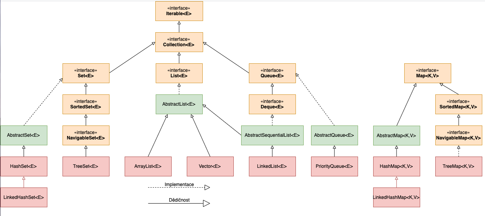

### Treemap in Java  
В Java Collections одна из реализацией интерфейса Map - это **TreeMap**.  
На рисунке ниже мы можем видеть схема с коллекцией (не совсем полной) структур в Java Collections.  
  
Как мы видим интерфейс _Map_ расширяет _SortedMap_, а его расширяет _NavigableMap_. **_TreeMap_** реализует последний 
интерфейс (а соотвественно и все предыдущие).  

_TreeMap_ создает коллекцию, которая для хранения элементов применяет **дерево**.  
Объекты сохраняются в отсортированном порядке по возрастанию.  
Время доступа и извлечения элементов достаточно мало, что делает класс TreeMap блестящим выбором для хранения больших 
объемов отсортированной информации, которая должна быть быстро найдена.  
_TreeMap_ основан на **_Красно-Черном дереве_**, вследствие чего _TreeMap_ сортирует элементы по ключу в естественном 
порядке или на основе заданного вами компаратора._TreeMap_ гарантирует **скорость доступа log(n)** для операций 
**containsKey, get, put и remove**.  

### SortedMap  
Интерфейс _SortedMap_ расширяет _Map_ и создает отображение, в котором все элементы отсортированы в порядке возрастания 
их ключей. То есть он хранит все элементы отсортированными, и если мы через `for` сделаем перебор этих 
элементов, то мы они будут в порядке возрастания (по умолчанию), или зависит от компоратора, который мы туда передадим.  
SortedMap добавляет ряд методов:  
- `K firstKey()`: возвращает ключ первого элемента отображения (самого маленького). **Time complexity: O(logN)**  
- `K lastKey()`: возвращает ключ последнего элемента отображения (самого большого). **Time complexity: O(logN)**  
- `SortedMap<K, V> headMap(K end)`: возвращает отображение SortedMap, которые содержит все элементы оригинального 
SortedMap вплоть до элемента с ключом end. По факту этот submap будет `slice` в golang, то есть он будет ссылаться на 
кусочек оригинального мап (дублирования данных происходить не будет), и если мы изменим в оригинальном map-е значение, 
то и в submap-е оно изменится. **Time complexity: O(1)** (просто создаётся новый объект с максимальным значением - 
границей).  
- `SortedMap<K, V> tailMap(K start)`: возвращает отображение SortedMap, которые содержит все элементы оригинального 
SortedMap, начиная с элемента с ключом start. Аналогично _headMap_.  
- `SortedMap<K, V> subMap(K start, K end)`: возвращает отображение SortedMap, которые содержит все элементы 
оригинального SortedMap вплоть от элемента с ключом start до элемента с ключом end. Аналогично _headMap_.  

### NavigableMap  
Интерфейс _NavigableMap_ расширяет интерфейс _SortedMap_ и обеспечивает возможность получения элементов отображения 
относительно других элементов.  
_TreeMap_ реализует методы, который возвращают Map, алогично методам что и в _SortedMap_: не создаёт новую структуру 
данных и не переносит данные в новый объект, а ссылается на исходный map, просто ставит некоторые ограничения (как, 
например, в методе `headMap`).  
Его основные методы:  
- `Map.Entry<K, V> ceilingEntry(K obj)`: возвращает элемент с наименьшим ключом k, который больше или равен ключу 
obj (k >=obj). Если такого ключа нет, то возвращается null.  
- `Map.Entry<K, V> floorEntry(K obj)`: возвращает элемент с наибольшим ключом k, который меньше или равен ключу 
obj (k <=obj). Если такого ключа нет, то возвращается null.  
- `Map.Entry<K, V> higherEntry()`: возвращает элемент с наименьшим ключом k, который больше ключа obj (k >obj). 
Если такого ключа нет, то возвращается null.  
- `Map.Entry<K, V> lowerEntry()`: возвращает элемент с наибольшим ключом k, который меньше ключа obj (k <obj). 
Если такого ключа нет, то возвращается null.  
- `Map.Entry<K, V> firstEntry()`: возвращает первый элемент отображения  
- `Map.Entry<K, V> lastEntry()`: возвращает последний элемент отображения  
- `Map.Entry<K, V> pollFirstEntry()`: возвращает и одновременно удаляет первый элемент из отображения  
- `Map.Entry<K, V> pollLastEntry()`: возвращает и одновременно удаляет последний элемент из отображения  
- `K ceilingKey(K obj)`: возвращает наименьший ключ k, который больше или равен ключу obj (k >=obj). Если такого ключа 
нет, то возвращается null.  
- `K floorKey(K obj)`: возвращает наибольший ключ k, который меньше или равен ключу obj (k <=obj). Если такого ключа 
нет, то возвращается null.  
- `K lowerKey(K obj)`: возвращает наибольший ключ k, который меньше ключа obj (k <obj). Если такого ключа нет, то 
возвращается null.  
- `K higherKey(K obj)`: возвращает наименьший ключ k, который больше ключа obj (k >obj). Если такого ключа нет, то 
возвращается null.  
- `NavigableSet<K> descendingKeySet()`: возвращает объект NavigableSet, который содержит все ключи отображения в 
обратном порядке  
- `NavigableMap<K, V> descendingMap()`: возвращает отображение NavigableMap, которое содержит все элементы в обратном 
порядке  
- `NavigableSet<K> navigableKeySet()`: возвращает объект NavigableSet, который содержит все ключи отображения  
- `NavigableMap<K, V> headMap(K upperBound, boolean incl)`: возвращает отображение NavigableMap, которое содержит все 
элементы оригинального NavigableMap вплоть от элемента с ключом upperBound. Параметр incl при значении true указывает, 
что элемент с ключом upperBound также включается в выходной набор.  
- `NavigableMap<K, V> tailMap(K lowerBound, boolean incl)`: возвращает отображение NavigableMap, которое содержит все 
элементы оригинального NavigableMap, начиная с элемента с ключом lowerBound. Параметр incl при значении true указывает, 
что элемент с ключом lowerBound также включается в выходной набор.  
- `NavigableMap<K, V> subMap(K lowerBound, boolean lowIncl, K upperBound, boolean highIncl)`: возвращает отображение 
NavigableMap, которое содержит все элементы оригинального NavigableMap от элемента с ключом lowerBound до элемента с 
ключом upperBound. Параметры lowIncl и highIncl при значении true включают в выходной набор элементы с ключами 
lowerBound и upperBound соответственно.  

### TreeMap  
Класс `TreeMap<K, V>` представляет отображение в виде дерева. Он наследуется от класса `AbstractMap` и реализует 
интерфейс `NavigableMap`, а следовательно, также и интерфейс `SortedMap`. Поэтому в отличие от коллекции HashMap в 
`TreeMap` все объекты автоматически сортируются по возрастанию их ключей.  

Класс TreeMap имеет следующие конструкторы:  
- `TreeMap()`: создает пустое отображение в виде дерева  
-` TreeMap(Map<? extends K,? extends V> map)`: создает дерево, в которое добавляет все элементы из отображения map  
- `TreeMap(SortedMap<K, ? extends V> smap)`: создает дерево, в которое добавляет все элементы из отображения map  
- `TreeMap(Comparator<? super K> comparator)`: создает пустое дерево, где все добавляемые элементы впоследствии будут 
отсортированы компаратором.  

## Список источников  
* [Класс TreeMap, его устройство и способ применения.](http://www.quizful.net/post/Java-TreeMap)  
* [Интерфейсы SortedMap и NavigableMap. Класс TreeMap](https://metanit.com/java/tutorial/5.9.php)
* [JavaRush | Особенности TreeMap](https://javarush.ru/groups/posts/2584-osobennosti-treemap)    
* [Руководство по TreeMap в Java](https://www.codeflow.site/ru/article/java-treemap)  