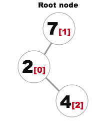
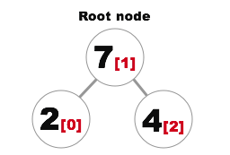
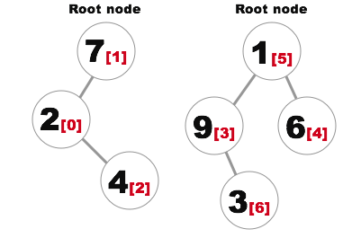
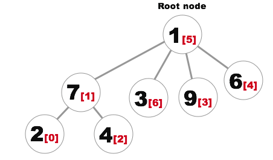

# Union-Find  
**Система непересекающихся множеств** (англ. disjoint-set, или union–find data structure) — структура данных, 
которая позволяет администрировать множество элементов, разбитое на непересекающиеся подмножества.  
При этом каждому подмножеству назначается его представитель — элемент этого подмножества.  
Абстрактная структура данных определяется множеством трёх операций: _Union, Find, AddSet_.  

Например, со структурой данных Union-Find мы можем отслеживать следующие множества:  
```
[ a, b, f, k ]
[ e ]
[ g, d, c ]
[ i, j ]
```
Эти множества непересекающиеся (**_disjoint_**), тк в них нет общих элементов.  

Union-Find поддерживает следующие операции:  
1. **Find(A)**. Определяет в каком подмножестве находится **A**. Например, `find(d)` вернёт подмножество `[ g, d, c ]`.  
2. **Union(A, B)**: Объединяет 2 множества, в которых находятся **A** и **B** в одно. Например, `union(d, j)` объединит 
`[ g, d, c ]` и `[ i, j ]` в одно большое `[ g, d, c, i, j ]`.  
3. **AddSet(A)**: Создаёт новое множество, в котором будет только один элемент **A**. Например, `addSet(h)` создаст 
новое подмножество `[ h ]`.  

Наиболее распространенное применение этой структуры данных - отслеживание связанных компонентов неориентированного 
графа.  
Она также используется для реализации эффективной версии _Kruskal's algorithm_ для поиска минимального остовного дерева 
_(minimum spanning tree)_ графа.  

### Реализация  
Union-Find может быть реализован разными способами, но мы рассмотрим эффективный и лёгкий в понимании способ: 
**_Weighted Quick Union_**.  
```swift
public struct UnionFind<T: Hashable> {
  private var index = [T: Int]()
  private var parent = [Int]()
  private var size = [Int]()
}    
```
По факту наша структура Union-Find - это лес, где каждое подмножество - это дерево.  
Нам надо хранить только родителя каждого узла (не детей). Для этого мы используем массив `parent`, где значение 
`parent[i]` - индекс узла родителя `i`.  

Например, если массив `parent` выглядит так:  

	parent [ 1, 1, 1, 0, 2, 0, 6, 6, 6 ]
	     i   0  1  2  3  4  5  6  7  8

тогда структура дерева выглядит так:  

	      1              6
	    /   \           / \
	  0       2        7   8
	 / \     /
	3   5   4

Здесь 2 дерева, каждый из которых принадлежит одному множеству элементов (здесь изображено бинарное дерево, 
но оно не обязательно должно быть бинарным).  

Чтобы идентифицировать множество, мы должны дать каждому множеству уникальный идентификатор. Это будет индекс корневого 
элемента множества (1 и 6). На самом деле **Find** операция возвращает идентификатор множества, а не всё его 
содержимое.  
Обратим внимание, что корневой узел в `parent` ссылается сам на себя. Так `parent[1] = 1` и `parent[6] = 6`. По этому 
признаку мы можем понять что это корневой узел.  

#### Add set  
```swift
public mutating func addSetWith(_ element: T) {
  index[element] = parent.count  // 1
  parent.append(parent.count)    // 2
  size.append(1)                 // 3
}
```
Когда мы добавляем нвоый элемент, мы просто создаём новое множество, в котором есть только этот элемент.  
1. Сохраняем индекс нового элемента.  
2. В `parent` сохраняем новый элемент, который формирует новое дерево, где он является корнем (и единственным 
элементом).  
3. `size[i]` - кол-во элементов в дереве, в котором корнем является `i`.  

#### Find  
Часто нам надо узнать в каком множестве находится данный элемент.  
```swift
public mutating func setOf(_ element: T) -> Int? {
  if let indexOfElement = index[element] {
    return setByIndex(indexOfElement)
  } else {
    return nil
  }
}

private mutating func setByIndex(_ index: Int) -> Int {
  if parent[index] == index {
    return index
  } else {
    parent[index] = setByIndex(parent[index])
    return parent[index]
  }
}
```
Здесь метод `setByIndex` является вспомогательным.  
В нём мы при помощи рекурсии находим корневой элемент.  
**Помимо этого мы делаем важную вещь:** обновляем значение родительского элемента всех встречающихся узлов на индекс 
корневого узла. Без этой оптимизации метод **Find** (и другие) работал бы за **_O(n)_**, но теперь, в связке с 
оптимизацией размера (size), которую рассмотрим позже в секции Union, выполняется практически за **_O(1)_**.  

Так если у нас есть дерево:  
  
И мы вызовем `setOf(4)`, сначала мы пойдём к узлу 2, и затем к 7 (индексы элементов помечены красным).  
После вызова `setOf(4)` наше дерево перестроится и будет выглдеть так:  
  
Теперь, если нам надо будет ещё раз вызвать `setOf(4)`, нам больше не потребуется идти через 2, мы сразу обратимся 
к корневому элементу. Так, когда мы обращаемся к Union-Find, мы оптимизируем её структуру.  

Есть также вспомогательный метод, который проверяет что 2 элемента относятся к одному множеству:  
```swift
public mutating func inSameSet(_ firstElement: T, and secondElement: T) -> Bool {
  if let firstSet = setOf(firstElement), let secondSet = setOf(secondElement) {
    return firstSet == secondSet
  } else {
    return false
  }
}
```

#### Union (Weighted)  
Операция **Union** объединяет 2 множества в одно большое.  
```swift
public mutating func unionSetsContaining(_ firstElement: T, and secondElement: T) {
    if let firstSet = setOf(firstElement), let secondSet = setOf(secondElement) { // 1
        if firstSet != secondSet {                // 2
            if size[firstSet] < size[secondSet] { // 3
                parent[firstSet] = secondSet      // 4
                size[secondSet] += size[firstSet] // 5
            } else {
                parent[secondSet] = firstSet
                size[firstSet] += size[secondSet]
            }
        }
    }
}
```
1. Определяем к какому множеству относится каждый из элементов.  
2. Если относятся к одному, то ничего не делаем (они уже объединены).  
3. Именно десь на помощь приходит оптимизация размера (size optimization) _(Weighting)_. Мы прикрепляем меньшие деревья 
к бОльшим деревьям, чтобы в дальнейшем надо было делать меньше шагов в `setByIndex`. Чтобы определить размер дерева, мы 
обращаемся к массиву `size`.  
4. Прикрепляем меньшее дерево к бОльшему.  
5. Обновляем размер бОльшего дерева, потому что к нему прибавилось узлов.  

Иллюстрированный пример:  
У нас есть 2 множества.  
  
Теперь объединим эти 2 множества, вызывав метод `unionSetsContaining(4, and: 3)`.  
Получим следующий результат:  
  
Обратим внимание, что тк мы вызвали `setOf` в начале метода, то бОльшее дерево было оптимизировано - непосредственный 
родитель узла 3 теперь 1.  

Union с оптимизацией так же занимаем почти **O(1)** time complexity.  

#### Path Compression  
Функция `setByIndex` и делаем path compression. Она помогает поддерживать дерево плоским, таким образом find операции 
занимают **практически O(1) time complexity**.  

## Complexity Summary

##### To process N objects
| Data Structure | Union | Find |
|---|---|---|
|Quick Find|N|1|
|Quick Union|Tree height|Tree height|
|Weighted Quick Union|lgN|lgN|
|Weighted Quick Union + Path Compression| very close, but not O(1)| very close, but not O(1) |

##### To process M union commands on N objects
| Algorithm | Worst-case time|
|---|---|
|Quick Find| M N |
|Quick Union| M N |
|Weighted Quick Union| N + M lgN |
|Weighted Quick Union + Path Compression| (M + N) lgN |  

## Список источников  
Конспект составлял по:
* [Github \[raywenderlich\] Union-Find](https://github.com/raywenderlich/swift-algorithm-club/tree/master/Union-Find)
---
Также норм источники:  
* [Youtube \[WilliamFiset\] Union Find [Disjoint Set] Playlist](https://www.youtube.com/playlist?list=PLDV1Zeh2NRsBI1C-mR6ZhHTyfoEJWlxvq)