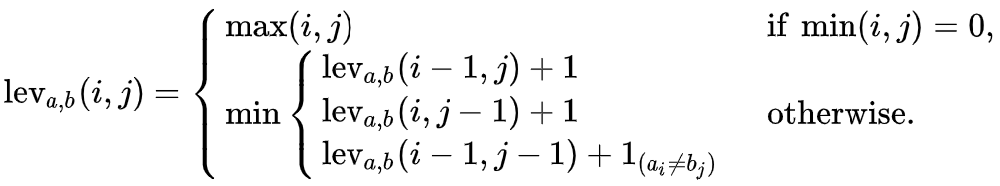
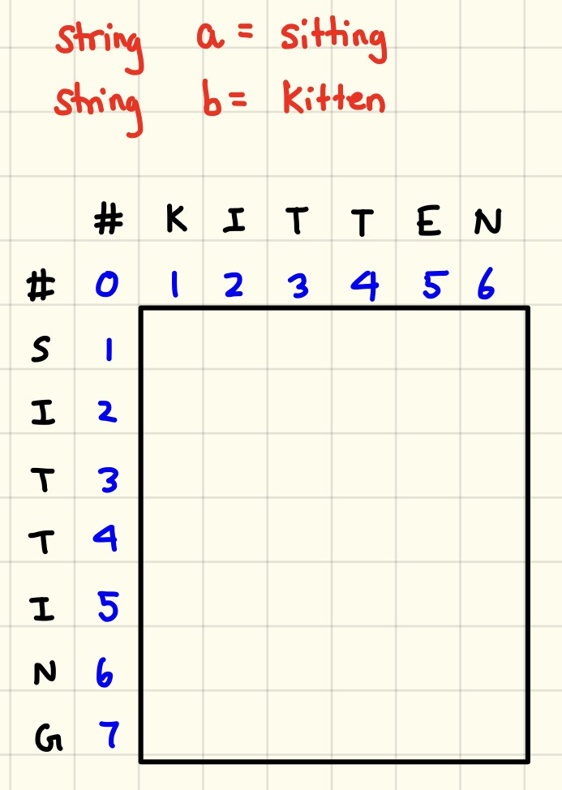
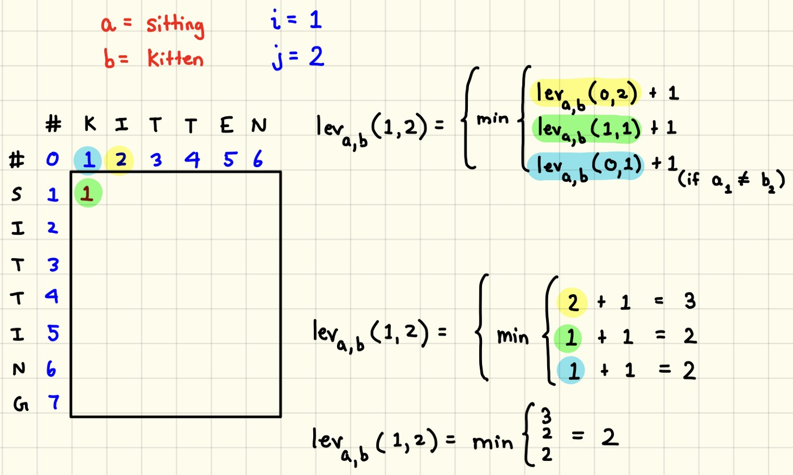
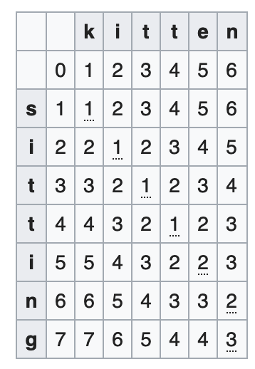
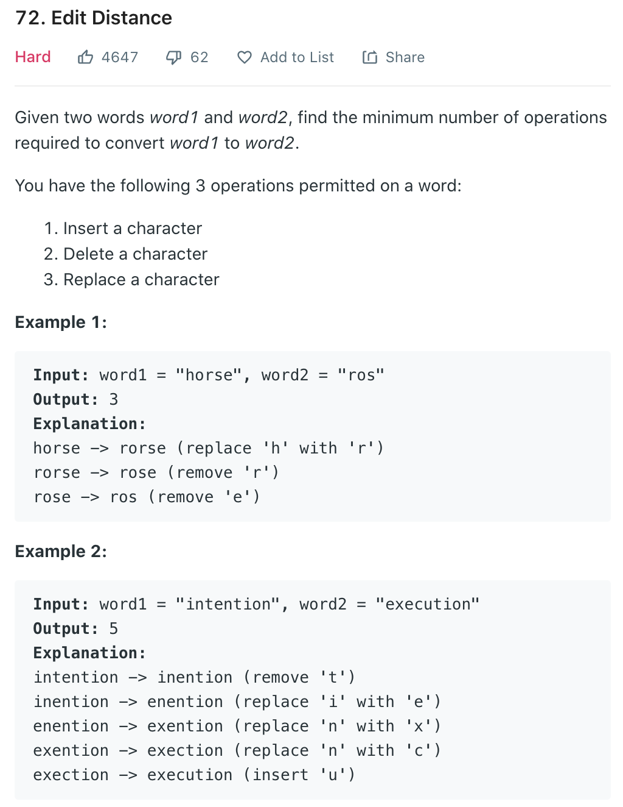

# Расстояние Левенштейна  
**Расстояние Левенштейна** _(редакционное расстояние, дистанция редактирования)_ — метрика, измеряющая разность между 
двумя последовательностями символов. Она определяется как минимальное количество односимвольных операций (а именно 
вставки, удаления, замены), необходимых для превращения одной последовательности символов в другую.  

Расстояние Левенштейна и его обобщения активно применяется:  
- для исправления ошибок в слове (в поисковых системах, базах данных, при вводе текста, при автоматическом 
распознавании отсканированного текста или речи).  
- для сравнения текстовых файлов утилитой diff и ей подобными. Здесь роль «символов» играют строки, а роль «строк» — 
файлы.  
- в биоинформатике для сравнения генов, хромосом и белков.  

**Пример.** Расстояние между `kitten` и `sitting` - 3, тк нам надо сделать 3 изменения, чтобы привести первую 
строку к виду второй.  
 
Суть алгоритма можно увидеть не следующей картинке:  
  

_Замечание: справа внизу мы добавляем 1 только если символ в первой строке под индексом i не равен символу 
второй строки под индексом j._  

**a** = string #1  
**b** = string #2  
**i** = the terminal character position of string #1  
**j** = the terminal character position of string #2.  

### Решение с помощью матрицы  
Подобную проблему удобно решать в виде матрицы:  
  
Здесь наша задача заполнить всю матрицу слева направо верху вниз.  
Конечный ответ будет находиться в правом нижнем углу.  
  
 
В конечном итоге матрица будет выглядеть так:  
  

## Задача №72. Edit Distance  
Решим задачу с leetcode.com [72. Edit Distance](https://leetcode.com/problems/edit-distance/) (hard):


Стартовый код:  
```java
class Solution {
    public int minDistance(String word1, String word2) {
        
    }
}
```  

### Решение  
Мы можем решить эту задачу при помощи вышеописанного алгоритма (и dynamic programming).  
Мы создадим матрицу в виде двумерного массива и начнём заполнять её слева-направо сверху-вниз:  
```java
class Solution {
    public int minDistance(String word1, String word2) {
        // первый ключ - граница word1, второй - граница word2
        int[][] dp = new int[word1.length()+1][word2.length()+1];
        for (int i = 0; i <= word1.length(); i++) {
            dp[i][0] = i;
        }
        for (int i = 0; i <= word2.length(); i++) {
            dp[0][i] = i;
        }
        
        for (int i = 1; i <= word1.length(); i++) {
            for (int j = 1; j <= word2.length(); j++) {
                if (word1.charAt(i-1) == word2.charAt(j-1)) {
                    dp[i][j] = dp[i-1][j-1];
                } else {
                    dp[i][j] = Math.min(dp[i-1][j], Math.min(dp[i][j-1], dp[i-1][j-1])) + 1;
                }
            }
        }
        return dp[word1.length()][word2.length()];
    }
}
```
Но так как мы используем только последние 2 строки, пусть наша матрица будет состоять только из двух строк:  
```java
class Solution {
    public int minDistance(String word1, String word2) {
        // первый ключ - граница word1, второй - граница word2
        int[][] dp = new int[2][word2.length()+1];
        for (int i = 0; i <= word2.length(); i++) {
            dp[0][i] = i;
        }
        
        for (int i = 1; i <= word1.length(); i++) {
            dp[1][0] = i;
            for (int j = 1; j <= word2.length(); j++) {
                if (word1.charAt(i-1) == word2.charAt(j-1)) {
                    dp[1][j] = dp[0][j-1];
                } else {
                    dp[1][j] = Math.min(dp[0][j], Math.min(dp[1][j-1], dp[0][j-1])) + 1;
                }
            }
            dp[0] = dp[1];
            dp[1] = new int[word2.length()+1];
        }
        return dp[0][word2.length()];
    }
}
```
Но можно ещё лучше оптимизировать. Если обратим внимание, то из предыдущей строки мы используем только символ левее 
текущего и текущий, поэтому нам даже полная предыдущая строка не нужна, а только один символ левее выше текущего:  
```java
class Solution {
    public int minDistance(String word1, String word2) {
        // первый ключ - граница word1, второй - граница word2
        int[] dp = new int[word2.length()+1];
        for (int i = 0; i <= word2.length(); i++) {
            dp[i] = i;
        }
        for (int i = 1; i <= word1.length(); i++) {
            int prev = i-1;
            dp[0] = i;
            for (int j = 1; j <= word2.length(); j++) {
                int localPrev = dp[j];
                if (word1.charAt(i-1) == word2.charAt(j-1)) {
                    dp[j] = prev;
                } else {
                    dp[j] = Math.min(dp[j], Math.min(dp[j-1], prev)) + 1;
                }
                prev = localPrev;
            }
        }
        return dp[word2.length()];
    }
}
```
Последний алгоритм имеет следующие показатели:  
**O(n\*m) time complexity**, поскольку нам надо делать цикл по первому слову и в нём цикл по второму слову.    
**O(n) space complexity.**  
_Где **n** - длина первого слова, **m** - длина второго слова._  

# Список источников  
Конспект составлял по:
* [Medium | Understanding the Levenshtein Distance Equation for Beginners](https://medium.com/@ethannam/understanding-the-levenshtein-distance-equation-for-beginners-c4285a5604f0)