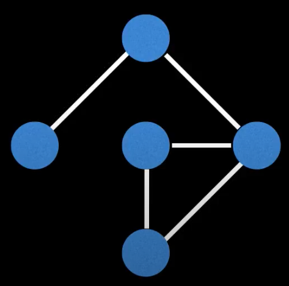
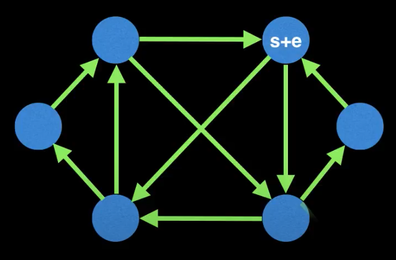
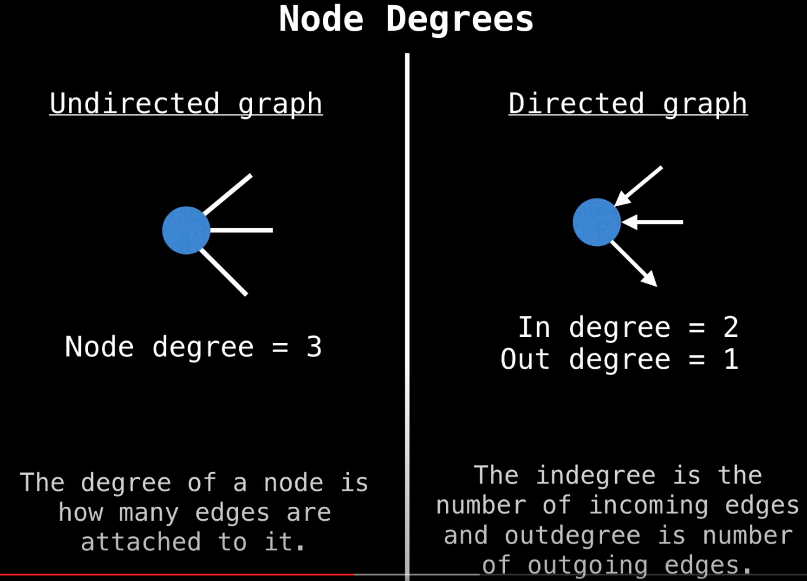
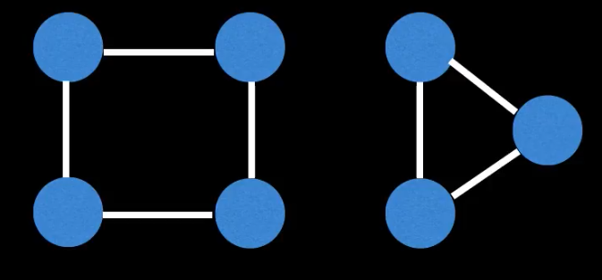
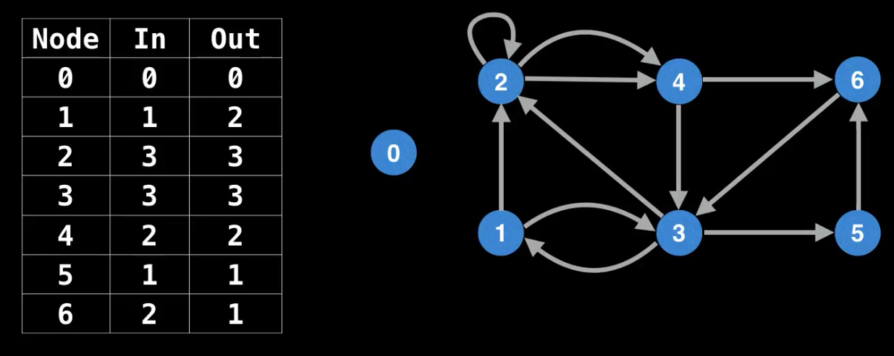
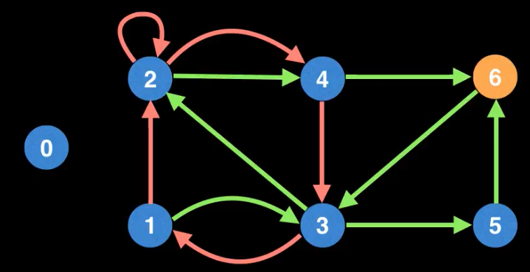
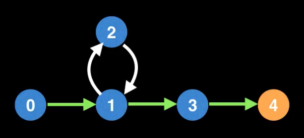
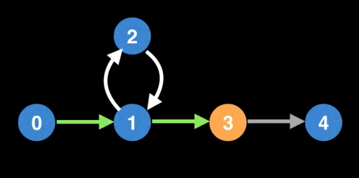

# Eulerian Path  
**Eulerian Path (или Eulerian Trail)** - это путь, проходящий по всем рёбрам графа и притом только по одному разу.  
  
Не каждый граф содержит Эйлеров путь.  
Например, этот граф содержит Эйлеров путь.  
  
Но для этого стоит выбрать правильную вершину (правую).  
Если мы выберем, например, верхнюю вершину как стартовую, то мы не сможем посетить все рёбра ровно по одному разу.  

**Eulerian circuit (или Eulerian cycle)** - это Эуйлеров путь, который начинается и заканчивается в одной вершине.  
Если мы знаем, что граф содержит Эйлеров цикл, то мы можем начать обход из любой вершины.  
Например, этот граф содержит Эйлеров цикл.  
  
Если граф не содержит Eulerian circuit, то мы не сможем вернуться к стартовому узлу или не сможем обойти все рёбра 
графа.  

### Какие условия требуются для валидного Eulerian Path/Circuit  
Этот зависит от того с каким типом графов мы работаем.  
В целом существует 4 критерия для Eulerian Path/Circuit которые нам надо проверить:  
####Undirected Graph  
**Eulerian Circuit:** все вершины имеют чётную степень (чётное кол-во рёбер).  
**Eulerian Path:** либо все вершины имеют чётную степень, либо только 2 вершины имеют нечётную степень.  
####Directied Graph  
**Eulerian Circuit:** все вершины имеют одинаковое количество входных и выходных рёбер  
**Eulerian Path:** не больше одной вершины имеют `(outdegree)-(indegree)=1` и не больше одной вершины имеют `(indegree)-
(outdegree)=1` и все остальные вершины имею равное кол-во входящих и исходящих рёбер.  

  

*Граф ниже не имеет ни Эйлорова цикла, ни Эйлерова пути, тк не выполняется условие, что все вершины, у которых степень 
не равна 0, принадлежат односвязному компоненту (single connected component).*  
  

## Нахождение Eulerian Path (в directed graph)  
**Шаг 1.** Надо понять существует ли вообще в графе Эйлеров путь. (см. Directied Graph Eulerian Path выше)  
Посчитаем кол-во входящих и исходящих рёбер из каждой вершины:  
  
Убедившись, что нет вершин, у которых кол-во входящих и исходящих вершин не превышает допустимого (`out[i]-in[i] > 1 и 
in[i]-out[i] > 1`), мы можем утверждать, что Эйлеров путь существует.  

**Шаг 2.**  Определить валидный стартовый узел.  
Судя по таблицу выше, узел **1** единственный узел с дополнительным исходящим ребром, поэтому он будет единственным 
валдиным стартовым узлом.  
Аналогично узел 6 с дополнительным входящим узлом - он будет конечным узлом.  

Обратим снимание, что если у всех узлов равное кол-во входящих и исходящих рёбер (случай для Эйлерова цикла), тогда 
все узлы с ненулевой степенью будут являться валидными стартовыми узлами.  

### Попробуем найти Eulerinal Path  
Попробуем сделать наивный DFS по вершинам до тех пор, пока не застрянем в тупике:
  
Выбирая случайные вершины, мы можем получить, например, такой путь:  
1 -> 3 -> 5 -> 6 -> 3 -> 2 -> 4 -> 6 - тупик (все рёбра из 6-ой вершины уже посетили)  
Таким образом мы не получили Эйлеров путь, тк не посетили все рёбра, хотя и стартовали из валидной вершины.  

Мы можем изменить наш DFS алгоритм таким образом, чтобы получить проход по всем рёбрам.  

Представим что в графе ниже мы сделали проход с такой последовательностью: `0->1->3->4`, где в конце упёрлись в тупик.  
  
Дойдя до тупика, мы делаем backtrack  добавляем текущий узел в массив `solution`.  
`solution = [4]`  
  
Теперь наша текущая вершина 3 и мы опять оказываемся в тупике (тк нет исходящих непосещённых рёбер).  
Добавляем 3 в начала массива `solution`.  
Теперь когда наш текущий узел 1, он имеет непосещённый исходящие рёбра. Мы делаем DFS по любому из свободных рёбер 
(если их несколько), чтобы дополнить наш Eulerian Path.  
В итоге мы попадаем в вершину 2, потом в 1 и оказываемся в тупике. Делаем backtrack, который уже приведёт нас в самое 
начало.
В итоге массив `solution` оказывается следующим:  
`solution = [0, 1, 2, 1, 3, 4]`  
Это и есть наш Eulerian Path.  
То есть изменение в DFS заключается в том, что, оказавшить в тупике, мы делаем backtrack до тех пор, пока не дойдём 
до вершины, у которой есть непосещённые исходящие рёбра.  

На самом деле по факту после того как мы поняли что Эйлеров путь существует и определили стартовую точку, то массив 
`in`, которые изображён на рисунке выше, нам больше не нужен.  
А массив `out` мы вполне можем использовать в модифицированном DFS.  
Так каждый раз после посещения вершины, мы будем уменьшать её значение в массиве `out` на 1.  
Если это значение равно 0, то у данной вершины больше нет непосещённых исходящих вершин и можно добавлять вершину в 
начало массива solution и делать backtrack.  

**Time complexity:** O(E), где e - кол-во рёбер. Мы делали 2 вычисления: подсчёт in/out степеней и DFS, 
обе операции линейные.  

## Список источников  
Конспект составлял по:
* [Youtube \[WilliamFiset\] Existence of Eulerian Paths and Circuits | Graph Theory](https://www.youtube.com/watch?v=xR4sGgwtR2I&list=PLDV1Zeh2NRsDGO4--qE8yH72HFL1Km93P&index=27)