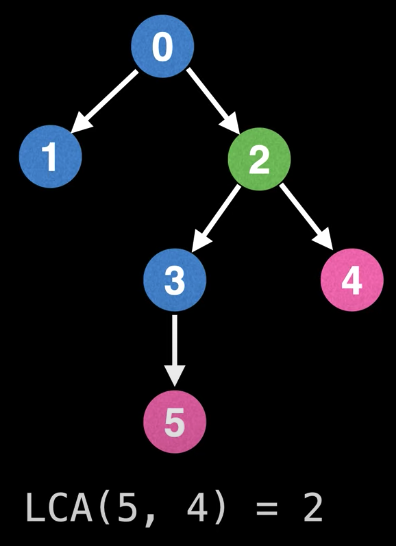
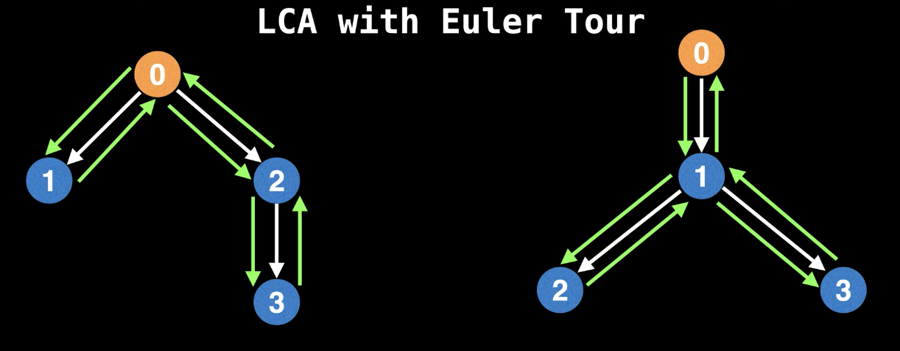
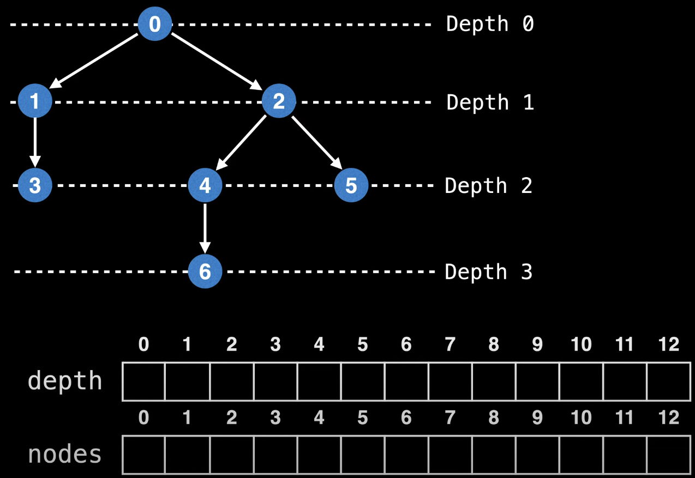
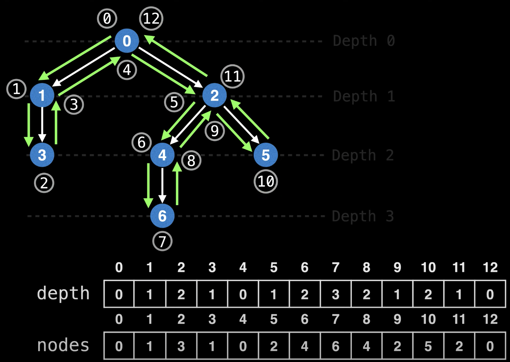
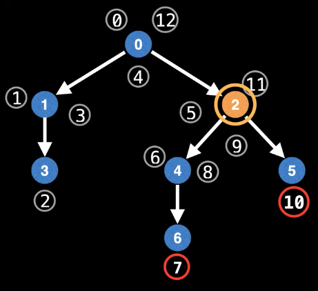
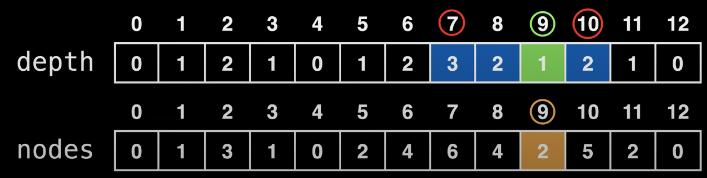
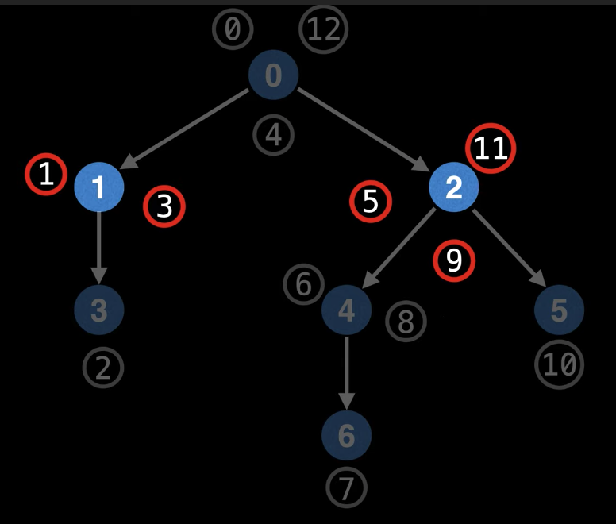
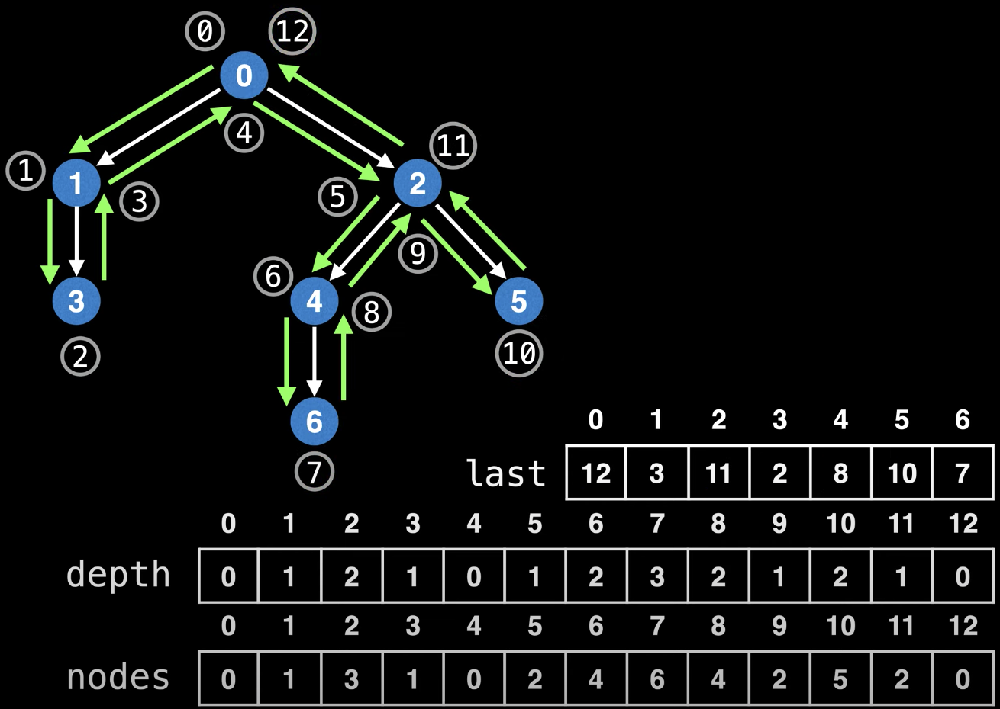

# Lowest Common Ancestor (LCA)  
Lowest Common Ancestor (LCA)  двух узлов **a** и **b** в дереве (у которого есть корень) - это самый глубокий узел 
**c**, который является родителем для **a** и **b**.
  
_Также LCA(2,4) = 2, то есть это нормально что один из узлов будет являться LCA._  

Самый простой и наивный алгоритм для нахождения наименьшего общего предка - вычислить глубину вершин **a** и **b** 
по степенной подниматься из каждой вершины вверх по дереву, пока не будет найдена общая вершина:  
```
function LCA(a, b):
    h1 = depth(a) # depth(x) = глубина вершины x
    h2 = depth(b)
    while (h1 != h2):
        if (h1 > h2):
            a = parent(a) # parent(x) = непосредственный предок вершины x
            h1 -= 1
        else:
            b = parent(b)
            h2 -= 1
    while (a != b):
        a = parent(a)
        b = parent(b)
    return a
```
Время работы этого алгоритма составляет **O(h)**, где h - высота дерева.  
Одна если в дереве для каждой вершины предок не указан, то нам потребуется препроцессинг с **O(n)** time, который 
найдёт для каждой вершины предка.  

Если мы хотим обрабатывать много запросов на одно дерева, то лучше использовать алгоритм нахождение LCA при помощи 
Eulerian path (он описан ниже).  

### Задача с leetcode.com  
На leetcode.com есть задача связанная с LCA: 
[236. Lowest Common Ancestor of a Binary Tree](https://leetcode.com/problems/lowest-common-ancestor-of-a-binary-tree/)  
Сигнатура метода, который надо реализовать:  
```java
/**
 * Definition for a binary tree node.
 * public class TreeNode {
 *     int val;
 *     TreeNode left;
 *     TreeNode right;
 *     TreeNode(int x) { val = x; }
 * }
 */
public TreeNode lowestCommonAncestor(TreeNode root, TreeNode p, TreeNode q)
```
То есть нам на взод приходит корень дерева, и вершины p и q, LCA которых надо вернуть.  

Варианты решений:  

#### Рекурсивный способ  
```java
class Solution {
    public TreeNode lowestCommonAncestor(TreeNode root, TreeNode p, TreeNode q) {
        if (root == null) return null;
        if (root == p || root == q) return root;
        TreeNode left = lowestCommonAncestor(root.left, p, q);
        TreeNode right = lowestCommonAncestor(root.right, p, q);
        if (left != null && right != null) return root;
        else if (left != null) return left;
        else if (right != null) return right;
        return null;
    }
}
```
Time complexity: O(n), где n - кол-во узлов
Space complexity: O(h), где h - высота дерева

#### Итеративный метод  
```java
class Solution {
    public TreeNode lowestCommonAncestor(TreeNode root, TreeNode p, TreeNode q) {
        // ключ - узел, значение - его родительский узел
        Map<TreeNode, TreeNode> parents = new HashMap<>();
        Deque<TreeNode> deque = new ArrayDeque<>(); // для DFS
        deque.addLast(root);
        parents.put(root, null);
        while (!parents.containsKey(p) || !parents.containsKey(q)) {
            TreeNode node = deque.removeFirst();
            if (node.left != null) {
                parents.put(node.left, node);
                deque.addLast(node.left);
            }
            if (node.right != null) {
                parents.put(node.right, node);
                deque.addLast(node.right);
            }
        }
        Set<TreeNode> set = new HashSet<>();
        while (p != null) {
            set.add(p);
            p = parents.get(p);
        }
        while (q != null) {
            if (set.contains(q)) return q;
            q = parents.get(q);
        }
        return null;
    }
}
```
Time complexity: O(n), где n - кол-во узлов  
Space complexity: O(n)


## Нахождение LCA при помощи Eulerian path (Eulerian tour + RMQ)  
Этот метод может отвечать на LCA запросы за **O(1)** time с **O(N*logN)** pre-processing time используя Sparse Table 
для RMQ (Range Minimum query).  
Однако время препроцессинга может быть улучшено до **O(n)** time с Farach-Colton и Bender оптимизацией.  

### Алгоритм  
Нам дано дерево и мы хотим обрабатывать запросы на получение LCA.  
1. Нам надо убедиться, что у дерева есть корень. Иначе нахождение LCA не будет иметь смысла, тк мы не будем знать 
направления.  
2. Пронумеровать все узлы дерева уникальными значения, чтобы мы могли ссылаться на узлы далее.  


Вместо того чтобы пытаться сделать *Eulerian tour* по белым ребрам дерева, мы сделаем проход по зелёным воображённым 
рёбрам, которые просто дублируют оригинальные рёбра, просто в обе стороны. Так мы будем уверены, что посетим все 
вершины графа.  

Начнём *Eulerian route (Eulerian circuit)* с корня дерева, посетим все зелёные вершины и в конечном итоге вернёмся к 
корню. Запомним последовательность пройдённых вершин, это и будет Eulerian tour.  

Далее представим что у нас есть такое дерево:  
  
Создадим 2 массива:  
- **nodes** - в нём индекс будет показывать номер хода (шага), а значение - id узла (которое мы должны были присвоить 
ранее).  
- **depth** - индекс так же номер шага, значение - на какой глубине находится эта вершина.  

В итоге получим такой результат:  
  

**Теперь попробуем получать LCA(6,5).**  
1. Определим с помощью массива `nodes` индексы узлов 5 и 6 (пока перебором, как находить быстрее увидим позже).  
2. Берём диапазон с полученным индексами из массива `depth` и ищем там индекс с самым маленьким элементом. 
Это значение можно находить за **O(1)** с помощью *Sparse Table*. В нашем случае самое маленькое значение будет 1, 
его индекс = 9. Берём из `nodes` значение под 9-ым индексом, оно равно 2. Значит *LCA(6,5) = 2*.  
  
  

Как мы можем заметить, в наших массивах *nodes* и *depth* элементов `2n-1`, в то время как узлов всего n.  
Это из-за того, что мы прошли 2n-1 узлов, когда делали Eulerian tour.  
Но какие индексы в массивах нам выбрать, если мы хотим сделать, например, LCA(1,2)?  
  
Ответ - не важно, какой бы мы не выбрали из индексов, наш алгоритм будет работать. Однако на практике работать будет 
быстрее, если мы будем выбирать последний из возможных индексов.  

Чтобы за константное время находить по id вершины его индекс в массивах нам нужен маппинг. 
Создадим массив, в котором ключём будет id вершины, а значением - последний индекс в массивах `nodes` и `depth`.  
Тк последний индекс, то назовём массив `last`.  
  

## Псевдокод  
```
class TreeNode:
    // уникальный index (id) данного узла
    int index;
    // список дочерних узлов
    TreeNode children[];

function setup(n, root):
    nodes = ... # массив узлов размера 2n-1
    depth = ... # массив чисел размера 2n-1
    last = ... # индекс узла - Euler tour индекс
    
    # делаем Eulerian Tour по дереву
    dfs(root)
    
    # генерируем разреженную таблицу, что делать RMQs запросы к массиву с 
    # глубиной за O(1) time. Генерация таблицы займёт O(n*logn) time.
    sparse_table = CreateMinSparseTable(depth)

# Eulerion tour index position
tour_index = 0

# делаем Eulerion Tour по всем узлам по технике DFS
function dfs(node, node_depth = 0):
    if node == null:
        return
    visit(node, node_depth)
    for (TreeNode child in node.children):
        dfs(child, node_depth + 1)
        visit(node, node_depth)

# заполняем массив nodes, depth, last и увеличиваем tour_index
function visit(node, node_depth):
    nodes[tour_index] = node
    depth[tour_index] = node_depth
    last[node.index] = tour_index
    tour_index = tour_index + 1

# запрашиваем Lowest Common Ancestor двум вершин
function lca(index1, index2):
    l = min(last[index1], last[index2])
    r = max(last[index1], last[index2])

    # делаем RMQ чтобы найти наименьший элемент в диапазоне [l, r]
    i = sparse_table.queryIndex(l, r)
    return nodes[i]
```

## Список источников  
Конспект составлял по:
* [Youtube \[WilliamFiset\] Lowest Common Ancestor (LCA) Problem | Eulerian path method](https://www.youtube.com/watch?v=sD1IoalFomA&list=PLDV1Zeh2NRsDGO4--qE8yH72HFL1Km93P&index=13)