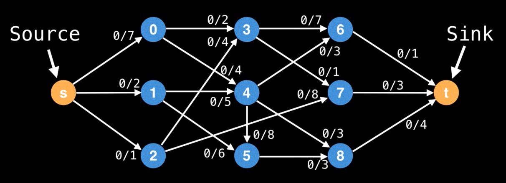
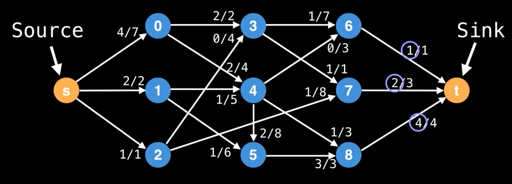
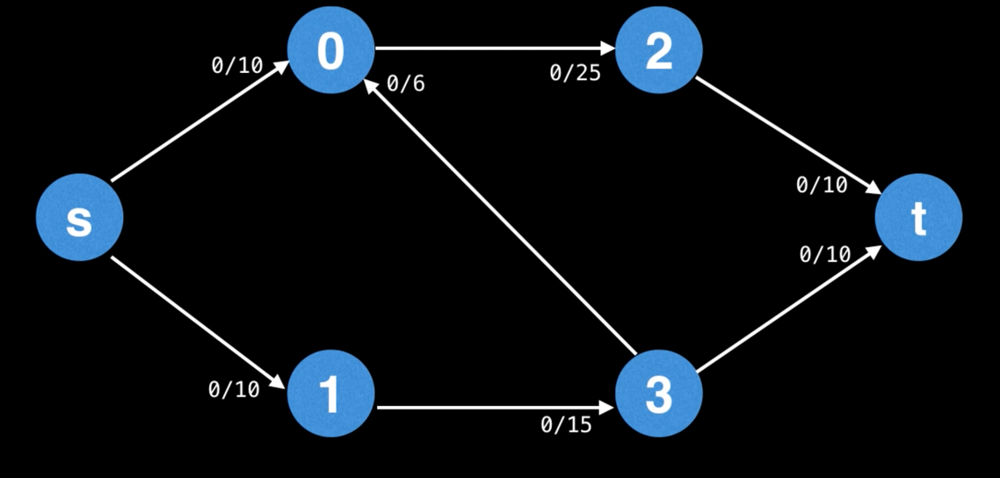
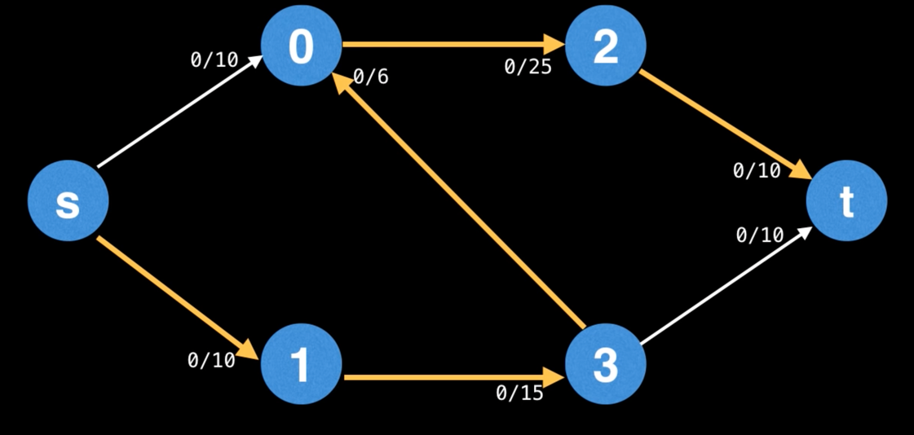
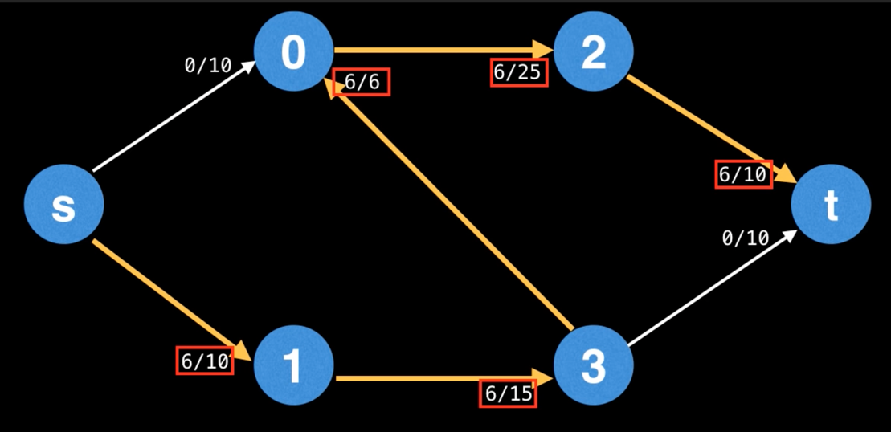
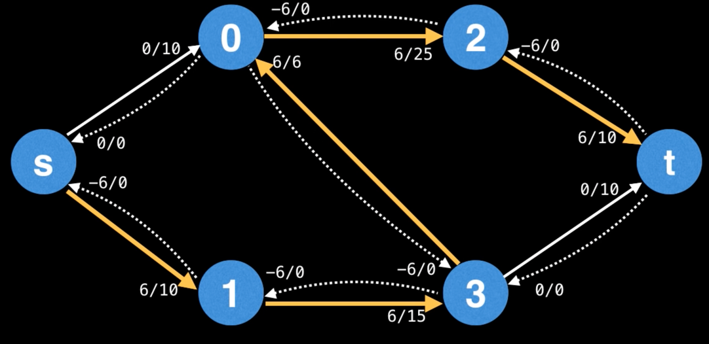
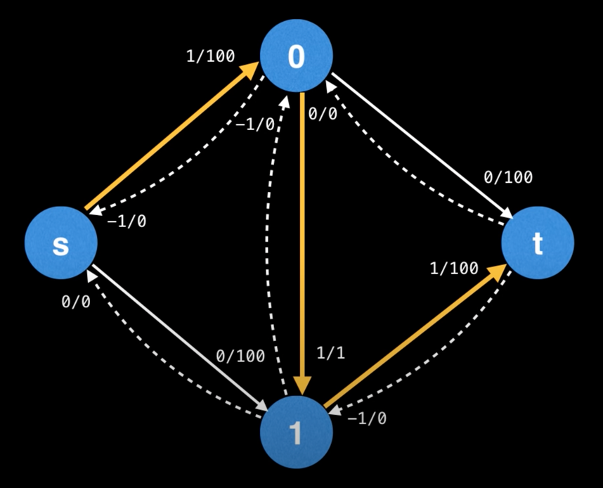
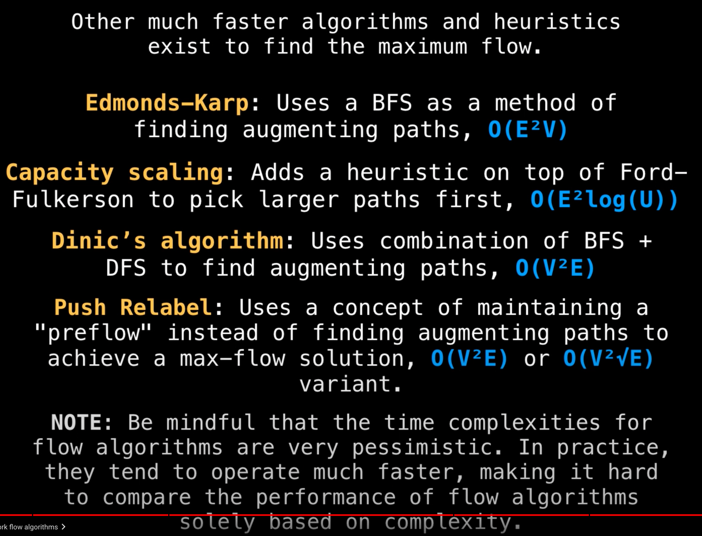

# Max flow  
С бесконечным источником, какой максимальный поток (flow) мы можем передать через сеть (граф) к потребителю (sink) 
учитывая, что каждое ребро имеет ограниченную ёмкость, которую нельзя превышать?  
  

Именно такую проблему решают алгоритмы max flow.  
Для графика выше ответ будет 7:  
  

Здесь ***flow graph (flow network)* - это направленный граф, где каждое ребро (также называемое _arc_) имеет 
определённую ёмкость (пропускную способность), через которое может проходить поток.  

## Ford Fulkerson algorithm (method)  
**Ford–Fulkerson algorithm** - жадный алгоритм по нахождению максимального потока во flow network. Его часто называют 
методом вместо алгоритма, тк в нём описана основная идея, но многие детали реализации опущены. Некоторые другие 
алгоритмы основаны на этой идее, но отличаются деталями реализации (и скоростью выполнения).  

### Идея метода в следующем:  
У нас есть направленный граф с максимальной пропускной способностью на рёбрах (в числителе указано сколько мы уже 
использовали пропускной способности, в знаменателе - изначальное её количество).

  

Мы находим **_augmenting paths_** у **_residual graph_** и повторяем эти шаги, увеличивая поток, пока можем ещё найти 
augmenting paths.  

**Augmenting path** - путь состоящий из рёбер в residual графе с неиспользованной ёмкостью больше нуля от источника *s* 
к потребителю *t*.  
В augmenting path "bottleneck" - это ребро с самым маленьким объёмом на данном пути. То есть в итоге мы увеличим поток 
в графе на значение этого "bottleneck".  

Если в качестве _augmenting path_ мы выберем путь `s->1->3->0->2->t`, то узким горлышком будет ребро `3->0` равное 6.  
  
Это значит, что мы увеличим наш потом (augment the flow) на 6.  

Далее нам надо обновить capacity наших рёбер, тк теперь часть их пропускной способности занята:  
  

**Важный шаг:**  
Мы работаем с направленным графом, но в данном методе мы должны считать, что мы имеем ребра с обратными направлениями, 
пропускная способность которых равна 0.  
Теперь, когда мы применили _augmenting path_ и обновили capacity рёбер, по сути мы можем пустить поток и в обратном 
направлении (по сути просто уменьшая предыдущий поток). Поэтому мы увеличим capacity обратных рёбер на значение, равное 
использованному объёму оригинальных рёбер.  
  

**Residual graph** - это и есть граф с обратными рёбрами, который мы только что сделали выше. Мы будем искать 
_augmenting path_ именно в нём.  

В итоге сумма значений bottle neck в каждом augmenting path и будет равна max-flow.  

Time complexity метода Ford-Fulkerson зависит от реализации нахождения augmenting path, которая остаётся неуказанном 
в данном методе.  

Если мы будем находить augmenting path при помощи DFS, то худшая скорость работы алгоритмы будет **O(fE)**, где `f` - 
максимальный поток, `E` - кол-во рёбер. Тут мы умножаем на `f` из-за того, что теоретически мы можем каждый находить 
такой augmenting path, в котором bottleneck будет равен 1, что очень плохо.  

Тк DFS выбирает рёбра в случайном порядке, то возможно что в графе ниже он каждый раз будет выбирать центральное ребро, 
тем самым каждый раз увеличивая общий поток только на 1.  
  

## Скорость работы различных реализаций метода Ford-Fulkerson
  

