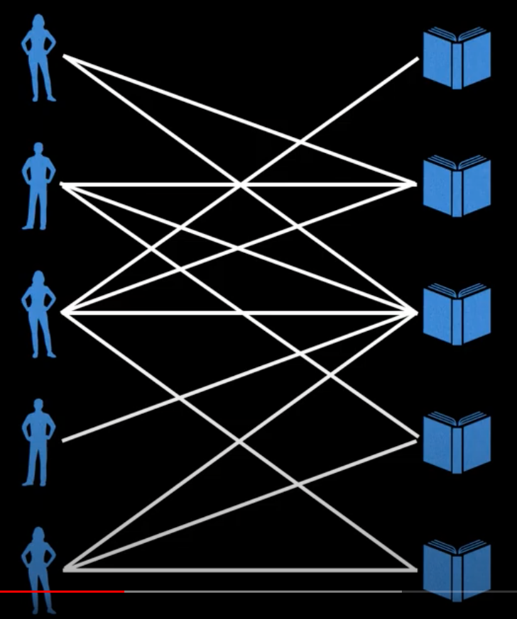
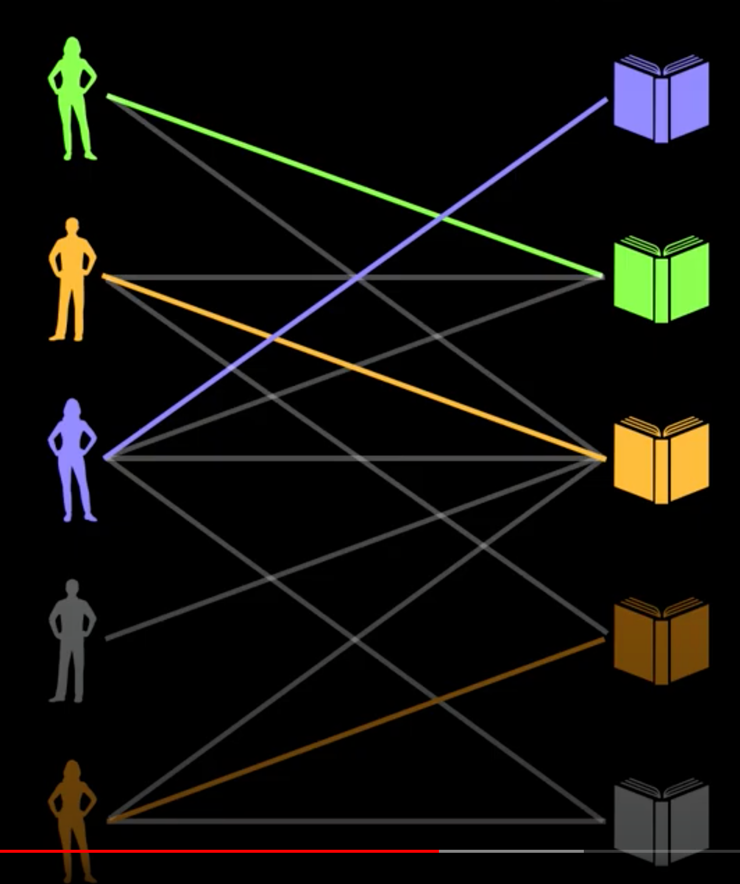

# Max flow  
С бесконечным источником, какой максимальный поток (flow) мы можем передать через сеть (граф) к потребителю (sink) 
учитывая, что каждое ребро имеет ограниченную ёмкость, которую нельзя превышать?  
  

Именно такую проблему решают алгоритмы max flow.  
Для графика выше ответ будет 7:  
  

Здесь ***flow graph (flow network)* - это направленный граф, где каждое ребро (также называемое _arc_) имеет 
определённую ёмкость (пропускную способность), через которое может проходить поток.  

## Ford Fulkerson algorithm (method)  
**Ford–Fulkerson algorithm** - жадный алгоритм по нахождению максимального потока во flow network. Его часто называют 
методом вместо алгоритма, тк в нём описана основная идея, но многие детали реализации опущены. Некоторые другие 
алгоритмы основаны на этой идее, но отличаются деталями реализации (и скоростью выполнения).  

### Идея метода в следующем:  
У нас есть направленный граф с максимальной пропускной способностью на рёбрах (в числителе указано сколько мы уже 
использовали пропускной способности, в знаменателе - изначальное её количество).

  

Мы находим **_augmenting paths_** у **_residual graph_** и повторяем эти шаги, увеличивая поток, пока можем ещё найти 
augmenting paths.  

**Augmenting path** - путь состоящий из рёбер в residual графе с неиспользованной ёмкостью больше нуля от источника *s* 
к потребителю *t*.  
В augmenting path "bottleneck" - это ребро с самым маленьким объёмом на данном пути. То есть в итоге мы увеличим поток 
в графе на значение этого "bottleneck".  

Если в качестве _augmenting path_ мы выберем путь `s->1->3->0->2->t`, то узким горлышком будет ребро `3->0` равное 6.  
  
Это значит, что мы увеличим наш потом (augment the flow) на 6.  

Далее нам надо обновить capacity наших рёбер, тк теперь часть их пропускной способности занята:  
  

**Важный шаг:**  
Мы работаем с направленным графом, но в данном методе мы должны считать, что мы имеем ребра с обратными направлениями, 
пропускная способность которых равна 0.  
Теперь, когда мы применили _augmenting path_ и обновили capacity рёбер, по сути мы можем пустить поток и в обратном 
направлении (по сути просто уменьшая предыдущий поток). Поэтому мы увеличим capacity обратных рёбер на значение, равное 
использованному объёму оригинальных рёбер.  
  

**Residual graph** - это и есть граф с обратными рёбрами, который мы только что сделали выше. Мы будем искать 
_augmenting path_ именно в нём.  

В итоге сумма значений bottle neck в каждом augmenting path и будет равна max-flow.  

Time complexity метода Ford-Fulkerson зависит от реализации нахождения augmenting path, которая остаётся неуказанном 
в данном методе.  

Если мы будем находить augmenting path при помощи DFS, то худшая скорость работы алгоритмы будет **O(fE)**, где `f` - 
максимальный поток, `E` - кол-во рёбер. Тут мы умножаем на `f` из-за того, что теоретически мы можем каждый находить 
такой augmenting path, в котором bottleneck будет равен 1, что очень плохо.  

Тк DFS выбирает рёбра в случайном порядке, то возможно что в графе ниже он каждый раз будет выбирать центральное ребро, 
тем самым каждый раз увеличивая общий поток только на 1.  
  

## Скорость работы различных реализаций метода Ford-Fulkerson
   

> TOOD: здесь привести пример алгоритма с DFS

## Edmonds Karp Algorithm  
Edmonds-Karp algorithm - одна из реализаций метода Ford-Fulkerson.  
Основная идея Edmonds-Karp алгоритма заключается в том, что для поиска _augmenting path_ используется **BFS**, что в 
конечном итоге даёт общую временную сложность **_O(V\*E^2)_**, то есть time complexity больше не зависит от пропускной 
способности рёбер (как от *f* в DFS).  

В данном алгоритме при поиске _augmenting path_ мы каждый раз находим самый короткий путь (с точки зрения кол-ва рёбер), 
состоящий из рёбер, у которых ещё осталось свободное место.  

### Код алгоритма
<details>
<summary>Код алгоритма на java (неэффективный) с O(E*V^3) time</summary>

```java
import java.util.*;

class MaxFlow {
    static final int V = 6; // Number of vertices in graph

    // возвращает true, если смогли дойти от 's' до 't' в residual graph
    // также заполняет parent, чтобы запомнить путь
    // Time O(V^2)
    boolean bfs(int[][] rGraph, int s, int t, int[] parent) {
        boolean[] visited = new boolean[V];
        Queue<Integer> queue = new ArrayDeque<>();
        queue.offer(s);
        visited[s] = true;
        parent[s] = -1;
        while (!queue.isEmpty()) {
            int u = queue.poll();
            for (int v = 0; v < V; v++) {
                if (!visited[v] && rGraph[u][v] > 0) {
                    queue.offer(v);
                    parent[v] = u;
                    visited[v] = true;
                }
            }
        }
        return visited[t];
    }

    // time complexity: O(E*V^3)
    // можно оптимизировать до O(E^2*V),
    // для этого надо Adjacency Matrix заменить на Adjacency List,
    // тогда time complexity bfs будет O(V+E), вместо O(V^2)
    // E*(V+E)*V
    // (V+E)*E = V*E + E^2
    int fordFulkerson(int[][] graph, int s, int t) {
        int u, v;
        int[][] rGraph = new int[V][V];
        for (u = 0; u < V; u++) {
            for (v = 0; v < V; v++) {
                rGraph[u][v] = graph[u][v];
            }
        }
        int[] parent = new int[V];
        int maxFlow = 0;
        // цикл while выполняется примерно E раз
        while (bfs(rGraph, s, t, parent)) {
            int pathFlow = Integer.MAX_VALUE;
            for (v = t; v != s; v = parent[v]) { // выполнится максимум V раз
                u = parent[v];
                pathFlow = Math.min(pathFlow, rGraph[u][v]);
            }
            for (v = t; v != s; v = parent[v]) {
                u = parent[v];
                rGraph[u][v] -= pathFlow;
                rGraph[v][u] += pathFlow;
            }
            maxFlow += pathFlow;
        }
        return maxFlow;
    }

    public static void main(String[] args) {
        int[][] graph = new int[][]{
                {0, 16, 13, 0, 0, 0},
                {0, 0, 10, 12, 0, 0},
                {0, 4, 0, 0, 14, 0},
                {0, 0, 9, 0, 0, 20},
                {0, 0, 0, 7, 0, 4},
                {0, 0, 0, 0, 0, 0}
        };
        MaxFlow m = new MaxFlow();
        System.out.println("The maximum possible flow is " + m.fordFulkerson(graph, 0, 5));
    }
}
```

</details>

<details>
<summary>Код алгоритма на java с O(V*E^2) time</summary>

```java
import java.util.*;

class MaxFlow {
    int n;
    int[][] capacity;
    Map<Integer, List<Integer>> adj;

    // O(V+E) time
    private int bfs(int s, int t, int[] parent) {
        Arrays.fill(parent, -1);
        parent[s] = -2;
        Queue<int[]> q = new ArrayDeque<>();
        q.add(new int[]{s, Integer.MAX_VALUE});
        while (!q.isEmpty()) {
            int cur = q.peek()[0];
            int flow = q.peek()[1];
            q.remove();
            for (int next : adj.getOrDefault(cur, new ArrayList<>())) {
                if (parent[next] == -1 && capacity[cur][next] > 0) {
                    parent[next] = cur;
                    int newFlow = Math.min(flow, capacity[cur][next]);
                    if (next == t) return newFlow;
                    q.add(new int[]{next, newFlow});
                }
            }
        }
        return 0;
    }

    // O(V*E^2) time. Proof of time complexity: https://brilliant.org/wiki/edmonds-karp-algorithm/
    public int maxFlow(int s, int t) {
        int flow = 0;
        int[] parent = new int[n];
        for (int newFlow = bfs(s,t,parent); newFlow > 0; newFlow = bfs(s,t,parent)) {
            flow += newFlow;
            int cur = t;
            while (cur != s) {
                int prev = parent[cur];
                capacity[prev][cur] -= newFlow;
                capacity[cur][prev] += newFlow;
                cur = prev;
            }
        }
        return flow;
    }

    public static void main(String[] args) {
        MaxFlow maxFlow = new MaxFlow();
        maxFlow.n = 6;
        Map<Integer, List<Integer>> adj = new HashMap<>();
        adj.put(0, Arrays.asList(1,2));
        adj.put(1, Arrays.asList(3));
        adj.put(2, Arrays.asList(4));
        adj.put(3, Arrays.asList(5));
        adj.put(4, Arrays.asList(1,5));
        maxFlow.adj = adj;
        int[][] cap = new int[maxFlow.n][maxFlow.n];
        cap[0][1] = 10; cap[0][2] = 10; cap[1][3] = 25;
        cap[2][4] = 15; cap[4][1] = 6;  cap[3][5] = 10;
        cap[4][5] = 10;
        maxFlow.capacity = cap;
        System.out.println(maxFlow.maxFlow(0, 5));
    }
}
```

</details>

## Capacity Scaling  
Capacity Scaling алгоритм - ещё одна реализация метода Ford-Fulkerson.  
Она заключается в следующем:  
Пусть **U** - пропускная способность наибольшего ребра в изначальном графе;  
**delta** - наибольшее число, полученное путём возведения двойки в степень, которое меньше или равно **U**.  
При поиске _augmenting path_ мы должны брать только те вершины, остаточная пропускная способность которых больше или 
равна **delta**, чтобы достигнуть лучшей скорости работы алгоритма.  

То есть алгоритм повторно находим augmenting path с рёбрами, у которых остаточная пропускная способность >= **delta**, 
до тех пор, пока есть такие пути.  
Как только мы больше не можем найти таких путей, мы уменьшаем нашу **delta** в 2 раза.  
Всё это повторяем до тех пор, пока **delta** > 0.  

_Capacity scaling_ алгоритм на практике работает очень хорошо.  
С точки зрения временной сложности _**capacity scaling with DFS**_ работает за **_O(E<sup>2</sup>log(U))_**.  
_**Capacity scaling with BFS** (Edmonds-Karp)_ работает за **_O(E\*V\*log(U))_** (замечено, что на практике работает 
медленнее предыдущего).

> Когда подбираем значение для **U**, нам необязательно перебирать всё рёбра, достаточно перебрать рёбра, выходящие из 
> вершины **s**, тк если **U** будет больше всех исходящих из старта рёбер, то мы на сможем найти augmenting path и 
> надо будет сокращать **delta** в 2 раза (возможно несколько раз).  

## Dinic's Algorithm  
Dinic's Algorithm - это очень быстрая реализация метода Ford-Fulkerson. Данный алгоритм включает в себя несколько 
новых концепций: level graph, использование BFS и DFS вместе для перебора графа.  
На практике данный алгоритм работает очень быстро за **O(V<sup>2</sup>E)** time, и ещё быстрее на bipartite graphs за 
**O(sqrt(V)\*E)** (благодаря Hopcroft-Karp).  

Идея алгоритма заключается в том, что мы с каждым шагом должны приближаться к финальной точке, но не удаляться.  

Так, приводя пример из реальной жизни, допустим, мы хотим попасть в кафе и знаем что оно находится где-то на востоке 
относительно нас. Тогда, чтобы с каждым шагом приближаться к кафе, мы должны идти в одном из следующих направлений: 
северо-восток, восток или юго-восток.  
В данной аналогии мы являемся источником (source), а кафе - sink. Главная идея за Dinic's алгоритмом в том, чтобы 
проводить augmenting paths от `s` до `t` используя _**level graph**_.  

Алгоритм Диникса определяет какое из рёбер приближает нас к цели, а какое нет, при помощи _level graph_.  
Допустим у нас есть граф (с источником `s` и конечным потребителем `t`). Чтобы получить граф уровней, нам надо сделать 
BFS от `s` до `t`, помечая каждую вершину уровнем (начиная от нуля), равную расстоянии от источника до текущего узла.  
  
Строить level graph можно только использую рёбра, у которых оставшаяся пропускная способность > 0.  

Далее мы будем делать DFS от `s` до `t`. Переходить можно только от уровня `L` до `L+1`.  
Есть путей больше не осталось, то мы высчитываем новый level graph.  Если построить level graph не удалось, то значит, 
что больше augmenting path не осталось, возвращаем maxFlow.  

Если в процессе DFS мы наткнулись на dead end (тупик, что дальше нет путя), то отходим назад до тех пор, пока не 
найдём подходяще ребро со свободным местом.  

Слабым местом в данном алгоритме является то, что мы можем несколько раз натыкаться на один и тот же dead end во время 
DFS обхода. Shimon Even и Alon Itai предложили оптимизацию: обрезать dead end (тупики) во время backtracking-а во 
время DFS. Подробнее можно будет увидеть в алгоритме ниже.  

### Код Dinic's алгоритма  

<details>
<summary>Код Dinic's алгоритма на java с O(V<sup>2</sup>E) time</summary>
Приводится кусок код из гитхаба Williamfiset, там опущены некоторые вспомогательные делали графа, но на идею алгоритма 
они не влияют.

```java
public class Dinics extends NetworkFlowSolverBase {

  private int[] level;

  /**
   * @param n - The number of nodes in the graph including source and sink nodes.
   * @param s - The index of the source node, 0 <= s < n
   * @param t - The index of the sink node, 0 <= t < n, t != s
   */
  public Dinics(int n, int s, int t) {
    super(n, s, t);
    level = new int[n];
  }

  @Override
  public void solve() {
    // next[i] indicates the next unused edge index in the adjacency list for node i. This is part
    // of the Shimon Even and Alon Itai optimization of pruning deads ends as part of the DFS phase.
    int[] next = new int[n];

    while (bfs()) {
      Arrays.fill(next, 0);
      // Find max flow by adding all augmenting path flows.
      for (long f = dfs(s, next, INF); f != 0; f = dfs(s, next, INF)) {
        maxFlow += f;
      }
    }

    for (int i = 0; i < n; i++) if (level[i] != -1) minCut[i] = true;
  }

  // Do a BFS from source to sink and compute the depth/level of each node
  // which is the minimum number of edges from that node to the source.
  private boolean bfs() {
    Arrays.fill(level, -1);
    level[s] = 0;
    Deque<Integer> q = new ArrayDeque<>(n);
    q.offer(s);
    while (!q.isEmpty()) {
      int node = q.poll();
      for (Edge edge : graph[node]) {
        long cap = edge.remainingCapacity();
        if (cap > 0 && level[edge.to] == -1) {
          level[edge.to] = level[node] + 1;
          q.offer(edge.to);
        }
      }
    }
    return level[t] != -1;
  }

  private long dfs(int at, int[] next, long flow) {
    if (at == t) return flow;
    final int numEdges = graph[at].size();

    for (; next[at] < numEdges; next[at]++) {
      Edge edge = graph[at].get(next[at]);
      long cap = edge.remainingCapacity();
      if (cap > 0 && level[edge.to] == level[at] + 1) {

        long bottleNeck = dfs(edge.to, next, min(flow, cap));
        if (bottleNeck > 0) {
          edge.augment(bottleNeck);
          return bottleNeck;
        }
      }
    }
    return 0;
  }
}
```

</details>

TODO: bipartite graph (Maximum Bipartite Matching).  

## Find minimum s-t cut in a flow network
У нас есть граф с источником `s` и потребителем `t`. Наша задача разделить вершины графа на два отдельных множества. 
При этом отделить вершины убирая рёбра, общая ёмкость которых будет минимальной из возможных.  
Такая ёмкость по какой-то там теореме будет равна максимальному потому (max-flow).  

Во flow network _s-t cut_ - это разрез, который требует, чтобы источник `s` и сток `t` находились в разных 
подмножествах, так же все вершины графа должны относиться к одному из множеств. Ёмкость s-t разреза определяется как 
сумма ёмкостей рёбер, по которым был совершён разрез.  

Проблемой, котору мы рассмотрим здесь, будет являться нахождение s-t разреза минимальной ёмкости.
  
В графе выше мы делали разрез по рёбрам 1-3, 4-3, 4-5.  
Их общая ёмкость равна 12+7+4 = 23.  

#### Minimum Cut and Maximum Flow  
Аналогично проблеме Maximum Bipartite Matching, это ещё одна проблема, которую можно решить при помощи 
Ford-Fulkerson Algorithm.  
Это основано на max-flow min-cut теореме.  
> **Max-flow min-cut теорема** гласит, что во flow network значение max-flow равно ёмкости minimum cut.  

Получается, что из Ford-Fulkerson метода мы можем получить ёмкость минимального разреза. Но как нам получить рёбра, по 
которым был сделан разрез?  
Алгоритм следующий:  
- Применяем уже знакомый нам алгоритм Ford-Fulkerson и дальше работаем с финальным residual graph (с тем, где уже нельзя 
  пройти от источника к потребителю).  
- Находим множество вершин, до которых можно дойти от источника в residual графе.  
- Все рёбра, которые идут от достижимой от `s` вершины до недостижимых вершин - являются min-cut edges.  

Так, например, после применения Edmonds-Karp алгоритма (где используем BFS), мы помечаем каждый раз список вершин, 
которые уже посетили при данном проходе BFS. В итоге у нас есть множество с посещёнными вершинами. Это и будем список 
вершин из первого множества (вершин, которые доступны от источника). Все остальные вершины будут относиться ко второму 
множеству (множеству с потребителем `t`). Все рёбра, которые идут от первого множества ко второму - min-cut edges.  

### Конспект данной главы составлял по:  
* [GeeksForGeeks | Find minimum s-t cut in a flow network](https://www.geeksforgeeks.org/minimum-cut-in-a-directed-graph/)  

# Bipartite Graph  
Bipartite graph - это граф, чьи вершины могут быть разделены на две независимых группы **U** и **V** так, чтобы все 
имеющиеся ребра соединяли вершины из разных групп (одно ребро не может соединять две вершины из одной группы).  
Также можно дать другие определение: это двухцветный граф или граф, в котором нет циклов нечётной длины.  
  

Интересная вещь здесь - это **Maximum Cardinality Bipartite Matching** или **MCBM**.  
Это когда мы нашли максимальное кол-во пар, которые составляют соединение вершин из обоих групп.  

  

Разберём суть MCBM на примере:  
Допустим есть 5 человек и 5 книг. Каждый из людей хотел бы взять некоторые книги. Надо выдать людям которые они хотят 
с максимальной эффективностью (чтобы максимальное кол-во людей получили книги). Кол-во книг ограничено (в данном случае 
у каждой книги всего один экземпляр).  
  

Если мы будем использовать greedy matching (жадное соответствие), то можем получить такой результат:  
Будем идти сверху вниз. Тогда первый человек попробует взять первую подходящую книгу, она свободна, берёт.  
Второй человек попытается взять первую подхоядщую, она уже занята, поэтому пробует взять втору, она свободна - берёт.  

В конечном итоге получим такой результат:
  
Как мы видим, один человек остался без книги.  
Но можно ли сделать лучше?  

Да! Мы можем преобразовать эту задачу из mathing problem в network flow problem путём добавления источника `s` и стока 
`t`. Дальше мы сделаем каждое ребро направленным и зададим ёмкость 1 (при помощи изменения ёмоксти мы потом сможем 
изменять кол-во экземпляров книг и кол-во книг, нужных одному человек).  
  

Теперь, когда мы преобразовали наш граф, мы можем применить один из max-flow алгоритмов.

В конечном итоге мы можем получить такой результат:
  

### Check whether a given graph is Bipartite or no  
Законспектировать по [этой статье](https://www.geeksforgeeks.org/bipartite-graph/)  

### m Coloring Problem  
Законспектировать по [этой статье](https://www.geeksforgeeks.org/m-coloring-problem-backtracking-5/)  


TODO: законспектировать [это видео с задачей](https://www.youtube.com/watch?v=ar6x7dHfGHA&list=PLDV1Zeh2NRsDj3NzHbbFIC58etjZhiGcG&index=4&t=429s).  
И законспектировать [это видео с задачей](https://www.youtube.com/watch?v=zrGnYstL4ss&list=PLDV1Zeh2NRsDj3NzHbbFIC58etjZhiGcG&index=5).  


## Список источников
Конспект составлял по:
* [Youtube \[WilliamFiset\] Network Flow playlist](https://www.youtube.com/playlist?list=PLDV1Zeh2NRsDj3NzHbbFIC58etjZhiGcG)
* [Geeksforgeeks | Max Flow Problem Introduction](https://www.geeksforgeeks.org/max-flow-problem-introduction/)
* [Medium | Solving the Maximum Flow Problem, with Ford Fulkerson Method](https://medium.com/@jithmisha/solving-the-maximum-flow-problem-with-ford-fulkerson-method-3fccc2883dc7)
* [Youtube | Network Flows: Max-Flow Min-Cut Theorem (& Ford-Fulkerson Algorithm)](https://www.youtube.com/watch?v=oHy3ddI9X3o)
* [PDF | Max Flow, Min Cut](https://www.cs.princeton.edu/courses/archive/spr04/cos226/lectures/maxflow.4up.pdf)
* [cp-algorithms | Maximum flow - Ford-Fulkerson and Edmonds-Karp](https://cp-algorithms.com/graph/edmonds_karp.html#:~:text=Edmonds%2DKarp%20algorithm,-Edmonds%2DKarp%20algorithm&text=The%20algorithm%20was%20first%20published,time%2C%20even%20for%20irrational%20capacities.)
* [PDF | Network Flow Problems](https://web.stanford.edu/class/cs97si/08-network-flow-problems.pdf)