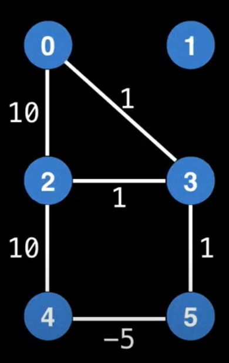
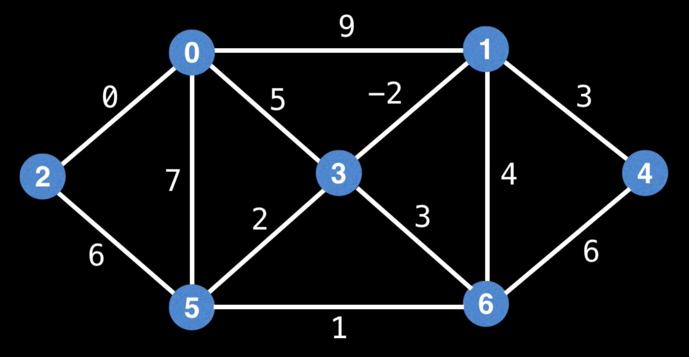
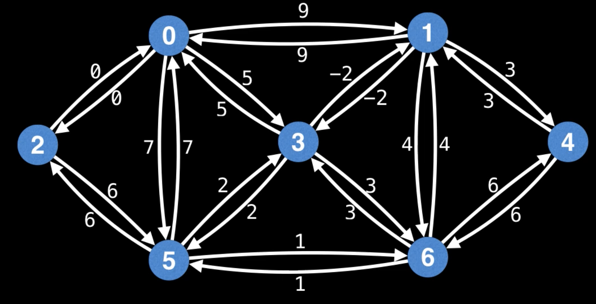

# Minimum Spanning Tree (MST)  
**Spanning Tree** _(остовное дерево)_ - это дерево, подграф данного графа, с тем же числом вершин, что и у исходного 
графа. Неформально говоря, остовное дерево получается из исходного графа удалением максимального числа рёбер, входящих 
в циклы, но без нарушения связности графа. Остовное дерево включает в себя все `n` вершин исходного графа и содержит 
`n-1` ребро.  
**Minimum Spanning Tree** (_минимальное остовное дерево_ или _минимальное покрывающее дерево_) в связанном взвешенном 
неориентированном графе - это остовное дерево этого графа, имеющее минимальный возможный вес, где под весом дерева 
понимается сумма весов входящих в него рёбер.  

Может существовать больше одно MST графа.  

Обратим внимание, что этот граф не имеет MST, тк всё узлы должны образовывать single component (здесь **1** отдельно).  
  

### Пример
Задача о нахождении минимального остовного дерева часто встречается в подобной постановке: допустим, есть n городов, 
которые необходимо соединить дорогами, так, чтобы можно было добраться из любого города в любой другой (напрямую или 
через другие города). Разрешается строить дороги между заданными парами городов и известна стоимость строительства 
каждой такой дороги. Требуется решить, какие именно дороги нужно строить, чтобы минимизировать общую стоимость 
строительства.  

Эта задача может быть сформулирована в терминах теории графов как задача о нахождении минимального остовного дерева в 
графе, вершины которого представляют города, рёбра — это пары городов, между которыми можно проложить прямую дорогу, 
а вес ребра равен стоимости строительства соответствующей дороги.  

Существует 2 популярных алгоритма нахождения MST графа - **_Kruskal's algorithm_** и **_Prim's algorithm_**.  
Оба алгоритма имеют `O(ElogE)` time complexity, где `E` - кол-во рёбер в изначальном графе.  

## Kruskal's Algorithm  
Особенность алгоритма в том, что он использует _Union-Find data structure_.
1. Сортируем рёбра по весу по возрастанию.  
2. Идём по отсортированному массиву с рёбрами, смотрим на 2 вершины, которые соединяет ребро. Если эти 2 вершины уже 
состоят в одном множестве, то мы идём дальше (иначе в графе будет цикл). Если нет, мы добавляем в MST и объединяем 
множества (делаем union).  
3. Алгоритм завершается когда все рёбра были обработаны или когда все вершины были объединены.  
  

### Псевдокод
```
class Edge:
    int u, v, cost;

# edges - массив с 
# n - кол-во вершин в графе
function kruskals(Edge[] edges, int n):
    # с помощью Priority Queue нам не придётся сортировать весь массив в рёбрами
    # это нам даст преимущество, если мы построим MST раньше, чем перерём весь массив с рёбрами
    # тк не придётся сортировать все оставшиеся рёбра
    pq = PriorityQueue(edges) # priority queue с рёбрами (в начале идут рёбра с маленьким весом)
    uf = new UnionFind(n) # Union-Find data structure с n вершинами
    mst = Edge[] # массив с результатом (рёбрами MST)

    while !pq.isEmpty():
        edge = pq.poll()
        # проверяем не принадлжедат ли эти 2 вершины уже одному множеству 
        if (uf.connected(edge.u, edge.v)) continue;
        
        uf.union(edge.u, edge.v)
        mst.add(edge)

        # заканчиваем цикл, если в нашем MST есть уже все вершины
        if (uf.size(0) == n) break
    return mst
```
> java реализацию алгоритма можно увидеть [здесь](https://github.com/williamfiset/Algorithms/blob/master/src/main/java/com/williamfiset/algorithms/graphtheory/KruskalsEdgeListPartialSortSolver.java)

## Prim's Algorithm  
Алгоритм Прима - это жадный алгоритм нахождения MST, который хорошо работает на плотных графах (dense graphs).  
На плотных графах, алгоритм Прима работает с той же скоростью или чуть быстрее чем его конкурентные алгоритмы 
(Kruskal's и Boruvka's).  
Однако когда нам надо найти _minimum spanning forest_ на несвязном графе, алгоритм Прима не так хорош (он должен 
запускаться на каждом связном компоненте отдельно).  

**Lazy version** алгоритма Прима работает за **_O(E\*log(E)) time complexity_**.  
Но **eager version** имеют лучшею скорость: **_O(E\*log(V)) time complexity_**.

На вход алгоритма подаётся связанный неориентированный граф. Для каждого ребра задаётся его стоимость.  
Сначала берётся произвольная вершина и находится ребро, инцидентное данной вершине и обладающее наименьшей стоимостью.  
Найденное ребро и соединяемые им две вершины образуют дерево.  
Затем, рассматриваются рёбра графа, один конец которых — уже принадлежащая дереву вершина, а другой — нет; из этих 
рёбер выбирается ребро наименьшей стоимости.  
Выбираемое на каждом шаге ребро присоединяется к дереву.  
Рост дерева происходит до тех пор, пока не будут исчерпаны все вершины исходного графа.  
Результатом работы алгоритма является остовное дерево минимальной стоимости.  
Алгоритм Прима не предусматривает предварительную сортировку всех вершин. Вместо этого он использует Priority Queue 
для поддержания порядка следующих возможных вершин.  
  

### Lazy Prim's pseudocode  
```
n = ... # Number of nodes in the graph
pq = ... # PQ data structure: storesedge objects consisting of {start_node, end_node, edge_cost}
         # The PQ sorts edges based on min edge cost.
g = ... # Graph representing an adjecency list of weighted edges.
        # Each undirected edge is represented as two directed
        # edges in g. For especially dense (плотный) graphs, prefer using 
        # an adjecency matrix instead of adjecency list to improve performace.
visited = [false, ..., false] # visited[i] tracks whether node i has been 
                              # visited; size n

# s - the index of the starting node (0 <= s < n) 
function lazyPrims(s = 0):
    m = n - 1 # number of edges in MST
    edgeCount, mstCost = 0, 0
    mstEdges = [null, ..., null] # size m
    addEdges(s)
    
    while (!pq.isEmpty() and edgeCount != m):
        edge = pq.dequeue()
        nodeIndex = edge.to
        if visited[nodeIndex]:
            continue
        mstEdges[edgeCount++] = edge
        mstCost += edge.cost
        addEdges(nodeIndex)
    if edgeCount != m:
        return (null, null) # No MST exists!
    return (mstCost, mstEdges)

function addEdges(nodeIndex):
    # Mark the current node as visited
    visited[nodeIndex] = true
    # Iterate over all edges going outwards from the current node.
    # Add edges to the PQ which point to unvisited nodes.
    edges = g[nodeIndex]
    for (edge : edges):
        if !visited[edge.to]:
            pq.enqueue(edge)
```

### Eager Prim's algorithm  
Если мы обратим внимание, то заметим, что в каждую вершину входит только одно ребро (выходить может 0 или несколько), 
кроме стартового (в него не входит ни одно ребро). Учитывая это, мы можем сделать оптимизацию: она заключается в том, 
что мы не будет добавлять каждый раз новые рёбра в Priority Queue, а будет обновлять значения рёбер в pq, которые там 
уже есть.  
То есть в качестве элемента pq мы будем хранить 3 значения: исходящая вершина, входящая вершина, вес ребра.  
Если в pq уже есть элемент с текущей исходящей вершиной, то мы не будем добавлять новое значение, а изменим имеющееся.  
Чтобы мы могли изменять значения элементов pq, нам придётся использовать структуру данных _Indexed Priority Queue_.  
Таким образом в IPQ у нас будет не больше элементов, чем кол-во вершин.  
А значит **time complexity** будет **_O(E\*log(V))_**, что лучше чем _O(E\*log(E))_, тк кол-во вершин меньше, чем 
кол-во рёбер.  
#### Пример
Мы можем рассматривать ненаправленный граф как направленный граф, у которого рёбра идут в обе стороны:  
**Было:**  

**Стало:**  
  
Если мы начнём с узла **0** и добавим в IPQ соседние вершины, то получим следующие пары ключ-значение в IPQ (где ключ - 
id входящий вершины, значение - массив из id исх.вершины, id вх.вершины и вес ребра):
```
2 -> (0, 2, 0)
5 -> (0, 5, 7)
3 -> (0, 3, 5)
1 -> (0, 1, 9)
``` 
Далее достаём самое верхнее значение из ipq (это будет 2, тк у него вес самый маленький и равен 0).  
Далее обрабатываем соседние узлы вершины 2. Если мы уже посещали соседнюю вершину, то пропускаем её. Если ещё не 
посещали, но она есть в IPQ и вес её ребра меньше, то обновляем значение в IPQ (ослабеваем (relax) значение).  
Так из вершины `2` есть ребро до вершины `5` с весом 6, то меньше 7 (которое в очереди).  
Обновляем очередь и получаем:  
```
5 -> (0, 5, !6!)
3 -> (0, 3, 5)
1 -> (0, 1, 9)
``` 
Так делаем до тех пор пока не обработаем все вершины (пока в очереди не закончатся элементы).  

### Eager Prim's pseudocode
```
n = ... # Number of nodes in the graph.
ipq = ... # IPQ data structure; stores (node index, edge object) pairs.
          # The edge objects consist of {start node, end node, edge cost} tuples.
          # The IPQ sorts (node index, edge object) pairs based on min edge cost.
g = ... # Graph representing an adjecency list of weighted edges.
        # Each undirected edge is represented as two directed
        # edges in g. For especially dense (плотный) graphs, prefer using 
        # an adjecency matrix instead of adjecency list to improve performace.
visited = [false, ..., false] # visited[i] tracks whether node i has been 
                              # visited; size n

# s - the index of the starting node (0 <= s < n) 
function eagerPrims(s = 0):
    m = n - 1 # number of edges in MST
    edgeCount, mstCost = 0, 0
    mstEdges = [null, ..., null] # size m

    relaxEdgesAtNode(s)

    while (!ipq.isEmpty() and edgeCount != m):
        # Extract the next best (node index, edge object)
        # pair from the IPQ
        destNodeIndex, edge = ipq.dequeue()
        mstEdges[edgeCount++] = edge
        mstCost += edge.cost
        relaxEdgesAtNode(destNodeIndex)
    if edgeCount != m:
        return (null, null) # No MST exists!
    return (mstCost, mstEdges)

func relaxEdgesAtNode(currentNodeIndex):
    # Mark the current node as visited.
    visited[currentNodeIndex] = true
    # Get all the edges going outwards from the current node.
    edges = g[currentNodeIndex]
    for (edge : edges):
        destNodeIndex = edge.to
        # Skip edges pointing to already visited nodes
        if visited[destNodeIndex]:
            continue
        if !ipq.contains(destNodeIndex):
            # Insert edge for the first time.
            ipq.insert(destNodeIndex, edge)
        else:
            # Try and improve the cheapest edge at destNodeIndex with
            # the current edge in the IPQ.
            ipq.decreaseKey(destNodeIndex, edge)
```

## Список источников  
Конспект составлял по:
* [Youtube \[WilliamFiset\] Prim's Minimum Spanning Tree Algorithm | Graph Theory](https://www.youtube.com/watch?v=jsmMtJpPnhU&list=PLDV1Zeh2NRsDGO4--qE8yH72HFL1Km93P&index=30)
* [Youtube \[WilliamFiset\] Eager Prim's Minimum Spanning Tree Algorithm | Graph Theory](https://www.youtube.com/watch?v=xq3ABa-px_g&list=PLDV1Zeh2NRsDGO4--qE8yH72HFL1Km93P&index=31)
* [Github \[raywenderlich\] Minimum Spanning Tree (Weighted Graph)](https://github.com/raywenderlich/swift-algorithm-club/tree/master/Minimum%20Spanning%20Tree)