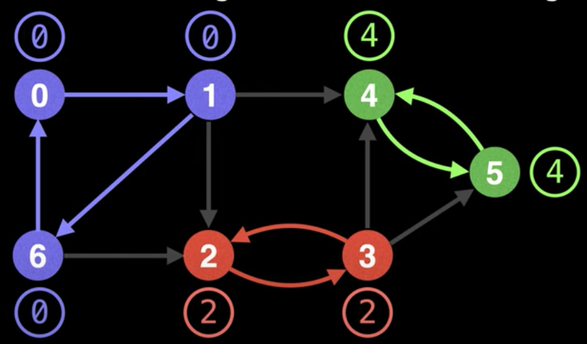

# Tarjan's Strongly Connected Component (SCC) algorithm  
**Компоненты сильной связности* могут быть рассмотрены как внутренние циклы в направленном графе, где каждая вершина 
в цикле графа может достигнуть любую другую вершину в данном цикле.  
  
В графе выше 4 компонента сильно связности (4 цикла). То есть нет такого пути, что мы вышли из какого-то цикла и 
вернулись обратно в тот же цикл.  Благодаря этому свойству, мы можем быть уверены, что SCCs в графе уникальны.  

### Low-Link Values  
Чтобы понять алгоритм Тарьяна, нам сначала надо понять что такое *low-link value*.  
Low-link значение узла - это самый маленький id узла, достигаемый из текущего при DFS проходе (включая самого себя).  

Для примера, возьмём какой-нибудь граф и пронумеруем его узлы.  
  
Так, low-link value узла 1 является узел 0, тк узел 0 - это узел с наименьшим id достигаемый из узла 1.  
  

Таким образом может получиться так, что все узлы с одинаковым Low-link value будут образовывать SCC.  
  
**Но такой расклад зависит от случая, то есть случайный.** Такой результат напрямую зависит от последовательности, 
с которой мы делали DFS.  

Давайте поменяем нумерацию узлов у этого графа:  
  
Представим, что мы начали искать Low-long values, начиная с узла с id=0 (самого правого). Его LLV будет равно 0 
(ему же).  Далее будем искать LLV для узла 2 (оно будет равно 0), далее для 3 (равно 0), далее для 4, далее для 6.  
Получим такой результат:  
  
Все эти пройденные узлы будут иметь llw = 0, а частности и узел с id=6, что должно показывать, что 6 является частью 
SCC со значением 0, но это не так!  
**Более того**, при таком раскладе все узлы здесь будут иметь LLW=0.  

**_todo: ниже плохо сформулировал, переделать._**  
`Важно: зависимо от того, откуда мы начинаем делать DFS и последовательность, с которой делаем DFS, мы можем получить 
неправильные low-link values для определения SCCs. С точки зрения SCC алгоритма Тарьяна, мы поддерживаем неизменным то,
что предотвращаем SCCs вмешиваться в маленькие значения других SCCs.`

Чтобы бороться со случайным порядком прохода по узлам через DFS, алгоритм Тарьяна предусматривает множество (часто в 
виде стека) валидных узлов, из которых можно брать значение для обновления LLV.  
Узлы добавляются в stack (set), валидных узлов как только мы на них перешли (через проход DFS).  
Узла удаляются из стека каждый раз, когда полный SCC был найден.  

Если `u` и `v` - узлы графа и сейчас мы находимся на узле `u`, тогда условие для обновления его low-link значения 
следующее:  
_чтобы обновить LLV `u` на LLV `v`, должен быть путь из узла `u` в `v` и узел `v` должен быть в стеке._  

**Time complexity:**  O(V+E)

## Алгоритм Тарьяна  
Помечаем id каждого узла как непосещённый.  
Начинаем DFS. При посещении узла назначаем ему id и low-link value. Также помечаем текущий узел как помещённый 
и добавляем его в стек.  
В конце рекурсивной функции DFS, если предыдущий узел находится в стеке, то обновляем значение LLV текущего узла 
на минимальное (оставляем старое или ставим значение предыдущего).  
После посещения всех соседей, если текущий узел является началом SCC (если его LLV равно его id), тогда удаляем 
элементы из стека до тех пор, пока не дойдём до текущего узла в стеке. 

### Пример  
Представим, что у нас есть такой граф:  
  
Создадим `stack`.  
Выберем произвольный узел и начнём DFS. Как только мы будем переходить к новому узлу, будем назначать ему уникальный 
id и LLV, равный этому id.  
  
Сейчас мы находимся на узле 2 и единсвтенынй вариант куда дальше пойти - это узел 0.  
Тк узел 0 уже отмечен как посещённый, то мы не будем не будем продолжать посещения от него. Теперь мы будем делать 
backtrack.  
Поскольку узел 0 находится в стеке, то мы обновляем LLV узла 2:  
```lowlink[2] = min(lowlink[2], lowlink[0]) = 0```  
Далее аналогично для узла 1:  
```lowlink[1] = min(lowlink[1], lowlink[2]) = 0```  
И аналогично для узла 0:  
```lowlink[0] = min(lowlink[0], lowlink[1]) = 0```

Теперь, когда полный SCC найден (текущий узел посетил всех своих соседей и его LLV равен его id), удаляем из стека 
предшествующие узлы.  
Теперь мы должны иметь такую картинку:  
  
Тк мы не посетили ещё все вершины графа, продолжаем.  
Если мы выберём узел 3 для нового DFS, потом перейдём направо, потом вниз, потом снова направо, то увидим что узел 0 
уже отмечен как посещённый. Выполняя callback мы увидим, что узел 0 не находится в стеке, поэтому мы не будем 
обновлять значение текущего узла.  
Тогда мы идём вверх-направо, затем если пойдём направо, то попадём в 2. Ситуация аналогична предыдущей - ничего 
не обновляем.  
Будем иметь следующую картину:  
  
Тогда перейдём из узла 6 налево (в узел 4). Узел 4 лежит в стеке, поэтому мы можем обновить LLV значение узла 6.  
Далее идём из 6-ого узла в нулевой, он уже посещён и не в стеке - игнорируем.  
Тк все соседи узлы 6 уже посещены - делаем callbak.  Обновляем LLV значение узла 5 на значение 4.  
Попав в узел 4 и обновив его LLV, мы понимаем что его LLV равно его id. Значит мы нашли SSC.  
Теперь нам надо удалить из стека все узла, пока не дойдём до узла c id = 4. (на рисунку текущий SSC помечен 
фиолетовым).  
  
После проведения аналогичных шагов для остальных вершин, мы получим следующую картину:  
  

## Псевдокод  
```
UNVISITED = -1
n = number of nodes in graph
g = adjacency list with directed edges

id = 0 # Used to give each node an id
sccCount = 0 # Used to count number of SCCs found

# Index i in these arrays represents node i
ids = [0,0,...,0,0] # Length n
low = [0,0,...,0,0] # Length n
onStack = [false,false,...,false,false] # Length n
stack = an empty stack data structure

function findSccs():
    for (i = 0; i < n; i++) ids[i] = UNVISITED
    for (i = 0; i < n; i++):
        if (ids[i] == UNVISITED):
            dfs(i)
    return low

function dfs(at):
    stack.push(at)
    onStack[at] = true
    ids[at] = low[at] = id++
    
    # Visit all neighbours & min low-link on callback
    for (to: g[at]):
        if (ids[to] == UNVISITED): dfs(to)
        if (onStack[to]): low[at] = min(low[at], low[to])
    # After having visited all the neighbours of 'at'
    # if we're at the start of a SCC empty the seen
    # stack until we're back to the start of the SCC.
    if (ids[at] == low[at]):
        for (now = stack.pop(); ; node = stack.pop()):
            onStack[node] = false
            low[node] = ids[at]
            if (node == at): break
        sccCount++
```

## Список источников  
Конспект составлял по:
* [Youtube \[WilliamFiset\] Tarjan's Strongly Connected Component (SCC) Algorithm (UPDATED) | Graph Theory](https://www.youtube.com/watch?v=wUgWX0nc4NY&list=PLDV1Zeh2NRsDGO4--qE8yH72HFL1Km93P&index=23&t=765s)
