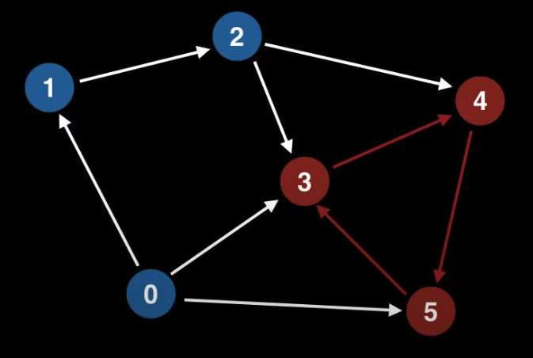
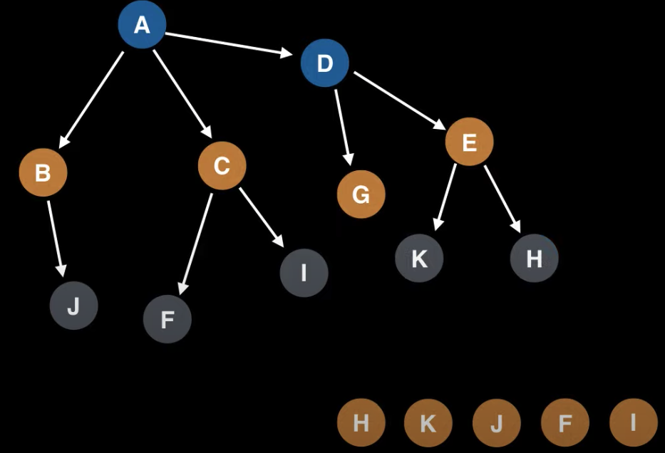
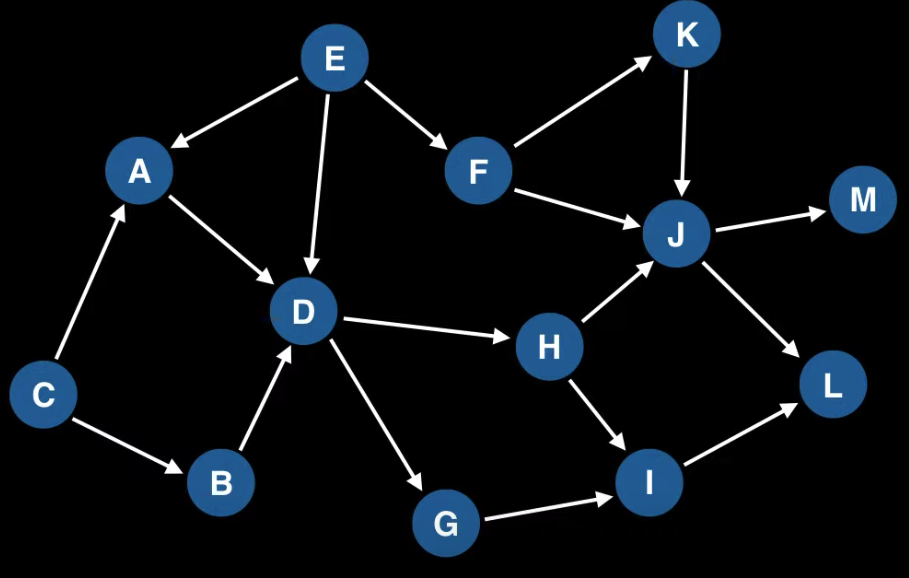
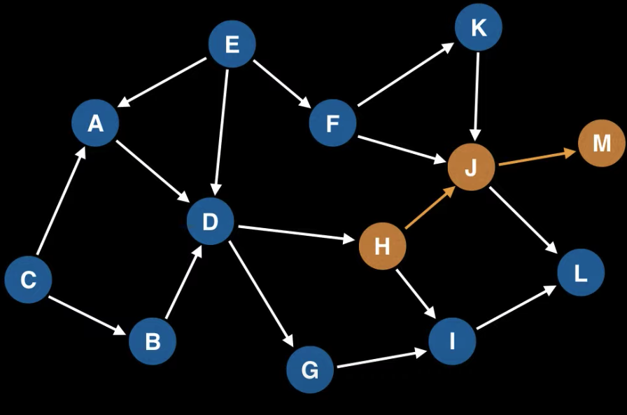

# Topological sort  
**_Топологический порядок (topological ordering)_** - это последовательность узлов в направленном графе, где для 
каждого ребра из вершины A до вершины B, вершина A появляется раньше вершины B в последовательности.  
Алгоритм топологической сортировки может найти топологический порядок за **O(N+V) time complexity**.  

То есть такая последовательность может быть полезна в решении задач с зависимостями, прохождениями курсов (где перед 
тем как приступить к какому-то курсе, надо пройти сначала все предыдущие) и т.д.  

Обратим внимание, что топологическая последовательность не всегда уникальная.  

Не каждый граф может иметь topological ordering. Граф, который содержит цикл не может содержать валидную 
последовательность.  
  

### Directed Acyclic Graph (DAG)  
Только граф типа Directed Acyclic Graph (DAG) может содержать topological ordering.  
Это направленный граф, у которого нет циклов.  

Чтобы определить, что граф не содержит направленных циклов, есть алгоритм **_Tarjan's strongly connected component 
algorithm_**, который умеет находить такие циклы.  

По определению все _rooted trees_ имеют топологический порядок поскольку они направленные и не имеют циклов.  
Чтобы найти в дереве топологическую последовательность узлов, достаточно начать с листов и потом переходить на их 
родителей.  
  

## Topological sort algorithm  
Выбираем произвольную непосещённую  вершину.  
Делаем DFS от этой вершины, переходя к только к непосещённым вершинам. После посещения каждой вершины помечаем её 
как посещённую.  
В конце рекурсивного вызова DFS добавляем текущий узел в массив `order` в обратном направлении (в самое начало).  

### Пример  
Допустим у нас есть такой граф:  
  
И мы хотим получить его топологическую последовательность узлов.  
Для этого мы создадим `call_stack`, в который будем складывать наши вершины, в порядке прохода по DFS.  
И создадим массив `topological_order`, это будем с искомой топологической последовательностью.  

Начнём с произвольной вершины, например **H**. Делаем DFS от этой вершины по непосещённым узлам.  
Наш путь может быть следующим:  
  
Соотвественно наши массивы будут выглядеть так:  
`call_stack = [H, J, M]`
`topological_order = []`
Тк на вершине M мы дошли до тупика, то добавляем её в `topological_order`. 
Далее от J переходим до L. Добавляем L в `topological_order` и т.д.  
В результате `topological_order` может выглядеть следующим образом:  
`topological_order = [C, B, E, F, K, A, D, G, H, I, J, L, M]`  

## Topsort pseudocode  
```
# Assumption: graph is stored as adjacency list
function topsort(graph):
    N = graph.numberOfNodes()
    V = [false, ..., false] # Length N
    ordering = [0, ..., 0] # Length N
    i = N - 1 # Index for ordering array
    
    for (at = 0; at < N; at++):
        if V[at] == false:
            visitedNodes = []
            dfs(at, V, visitedNodes, graph)
            for nodeId in visitedNodes:
                ordering[i] = nodeId
                i -= 1
    return ordering

function dfs(at, V, visitedNodes, graph):
    V[at] = true
    edges = graph.getEdgesOutFromNode(at)
    for edge in edges:
        if V[edge.to] == false:
            dfs(edge.to, V, visitedNodes, graph)
    visitedNodes.add(at)
```
### Оптимизированная версия  
```
# Assumption: graph is stored as adjacency list
function topsort(graph):
    N = graph.numberOfNodes()
    V = [false, ..., false] # Length N
    ordering = [0, ..., 0] # Length N
    i = N - 1 # Index for ordering array

    for (at = 0; at < N; at++):
        if V[at] == false:
            i = dfs(i, at, V, ordering, graph)
    return ordering

function dfs(i, at, V, ordering, graph):
    V[at] = true
    edges = graph.getEdgesOutFromNode(at)
    for edge in edges:
        if V[edge.to] == false:
            i = dfs(i, edge.to, V, ordering, graph)
    ordering[i] = at
    return i - 1
```

## Список источников  
Конспект составлял по:
* [Youtube \[WilliamFiset\] Topological Sort Algorithm | Graph Theory](https://www.youtube.com/watch?v=eL-KzMXSXXI&list=PLDV1Zeh2NRsDGO4--qE8yH72HFL1Km93P&index=15)
---
Также норм источники:  
* [Github \[raywenderlich\] Topological Sort](https://github.com/raywenderlich/swift-algorithm-club/tree/master/Topological%20Sort)