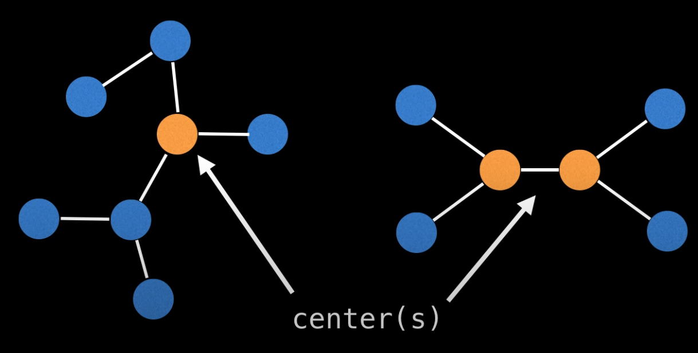
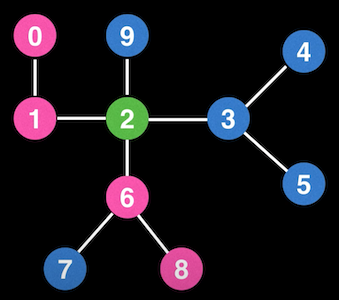
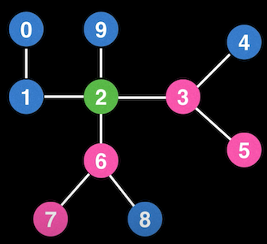
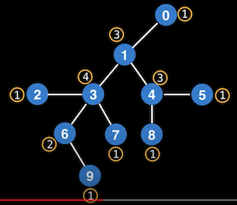
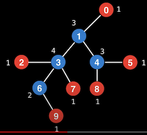
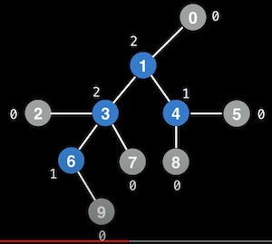
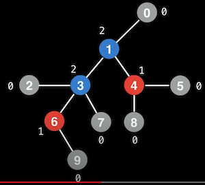
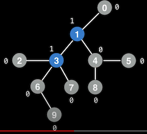
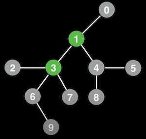
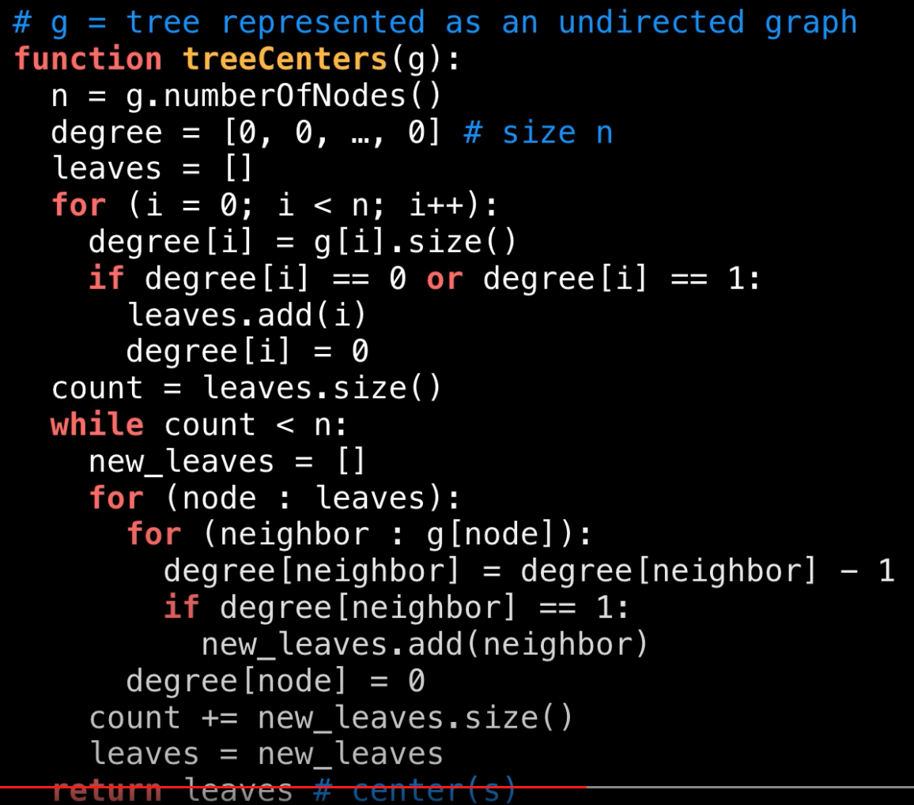

# Нахождение центра графа  
Может использоваться когда у нас есть ненаправленный граф, чтобы найти его центр(ы).  
Алгоритм может быть полезен, например, когда нам надо выбрать корневой узел в нашем дереве.  
__*У нас не может быть больше двух центров*__  


Можно заметить, что центр - это всегда центральный узел (или центральные 2 узла) 
любого из самых длинных путей в графе.  
   
Здесь розовым выделен один из самых длинных путей, а зелёным - его центра.

**Другой способ найти центр:**  
Итеративно каждый раз убирать листья (то есть узлы, у которых только одно соединение).  
Алгоритм:  
 - Подсчитать степерь (degree) каждого узла. То есть выяснить сколько есть соединений у каждого узла.  
 - После этого мы обрезаем все узлы, у которых степень 1. И соответственно у их соседей понижаем степень на 1.
 - Делаем этот процесс до тех пор, пока у нас не окажется 1 или 2 узла, они и окажутся центром.  
 
### Алгоритм в картинках  







### Псевдокод


### Код алгоритма
```java
import java.util.ArrayList;
import java.util.LinkedList;
import java.util.List;

public class TreeCenter {

  public static List<Integer> findTreeCenters(List<List<Integer>> tree) {
    final int n = tree.size();
    int[] degree = new int[n];

    // Find all leaf nodes
    List<Integer> leaves = new ArrayList<>();
    for (int i = 0; i < n; i++) {
      List<Integer> edges = tree.get(i);
      degree[i] = edges.size();
      if (degree[i] <= 1) {
        leaves.add(i);
        degree[i] = 0;
      }
    }

    int processedLeafs = leaves.size();

    // Remove leaf nodes and decrease the degree of each node adding new leaf nodes progressively
    // until only the centers remain.
    while (processedLeafs < n) {
      List<Integer> newLeaves = new ArrayList<>();
      for (int node : leaves) {
        for (int neighbor : tree.get(node)) {
          if (--degree[neighbor] == 1) {
            newLeaves.add(neighbor);
          }
        }
        degree[node] = 0;
      }
      processedLeafs += newLeaves.size();
      leaves = newLeaves;
    }

    return leaves;
  }
}
```