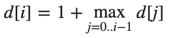

# Longest Increasing Subsequence (LIS)  
> **Определение.** _Подпоследовательностью_ {x<sub>n<sub>k</sub></sub>} называется числовая последовательность, которая 
> составлена из членов последовательности x<sub>n</sub> и в которой порядок следования её элементов совпадает с их 
> порядком следования в исходной последовательности x<sub>n</sub>.  

Подпоследовательность можно получить из некоторой конечной последовательности, если удалить из последней некоторое 
множество её элементов (возможно пустое). Например, BCDB является подпоследовательностью последовательности ABCDBAB.  

Будем говорить, что последовательность Z является общей подпоследовательностью последовательностей X и Y, если Z 
является подпоследовательностью как X, так и Y. Требуется для двух последовательностей X и Y найти общую 
подпоследовательность наибольшей длины. Заметим, что НОП может быть несколько.  

**Обратим внимание!** Подпоследовательность отличается от подстроки. Например, если есть исходная последовательность 
«ABCDEF», то «ACE» будет подпоследовательностью, но не подстрокой, а «ABC» будет как подпоследовательностью, так и 
подстрокой.  

Далее мы рассмотрим задачу, когда дана последовательность чисел и нам надо будет найти возрастающую 
подпоследовательность (LIS) наибольшей длины.  

## Решение за время O(n^2) (dynamic programming)  
Построим массив `d`, где `d[i]` - длина наибольшей возрастающей подпоследовательности, оканчивающейся в элементе, с 
индексом `i`. Массив будем заполнять постепенно — сначала `d[0]`, потом `d[1]` и т.д.  
Ответом на нашу задачу будет максимум из всех элементов массива `d`.  
Заполнение массива будет следующим: если `d[i]=1`, то искомая последовательность состоит только из числа `a[i]`. Если 
`d[i]>1`, то перед числом `a[i]` в подпоследовательности стоит какое-то другое число. Переберем его: это может быть 
любой элемент `a[j](j=0...i−1)`, но такой, что `a[j]<a[i]`.  
Пусть на каком-то шаге нам надо посчитать очередное `d[i]`. Все элементы массива `d` до него уже посчитаны. Значит наше 
`d[i]` мы можем посчитать следующим образом:  
  
при условии, что `a[j]<a[i]`.

Пока что мы нашли лишь максимальную длину наибольшей возрастающей подпоследовательности, но саму ее мы вывести не можем. 
Для восстановления ответа заведем массив `prev[0...n−1]`, где `prev[i]` будет означать индекс в массиве `a[]`, при 
котором достигалось наибольшее значение `d[i]`. Для вывода ответа будем идти от элемента с максимальным значениям `d[i]` 
по его предкам.  

### Псевдокод алгоритма
```
vector<int> findLIS(vector<int> a):
   int n = a.size //размер исходной последовательности
   int prev[0..n - 1]
   int d[0..n - 1]
 
   for i = 0 to n - 1
       d[i] = 1
       prev[i] = -1
       for j = 0 to i - 1
           if (a[j] < a[i] and d[j] + 1 > d[i])
               d[i] = d[j] + 1
               prev[i] = j
 
   pos = 0       // индекс последнего элемента НВП
   length = d[0] // длина НВП
   for i = 0 to n - 1
       if d[i] > length
           pos = i
           length = d[i]
   
   // восстановление ответа
   vector<int> answer
   while pos != -1
       answer.push_back(a[pos])
       pos = prev[pos]
   reverse(answer)
 
   return answer
```
**Time complexity: O(n^2)**  
**Space complexity: O(n)**  

Источник: [ИТМО | Задача о наибольшей возрастающей подпоследовательности](https://neerc.ifmo.ru/wiki/index.php?title=%D0%97%D0%B0%D0%B4%D0%B0%D1%87%D0%B0_%D0%BE_%D0%BD%D0%B0%D0%B8%D0%B1%D0%BE%D0%BB%D1%8C%D1%88%D0%B5%D0%B9_%D0%B2%D0%BE%D0%B7%D1%80%D0%B0%D1%81%D1%82%D0%B0%D1%8E%D1%89%D0%B5%D0%B9_%D0%BF%D0%BE%D0%B4%D0%BF%D0%BE%D1%81%D0%BB%D0%B5%D0%B4%D0%BE%D0%B2%D0%B0%D1%82%D0%B5%D0%BB%D1%8C%D0%BD%D0%BE%D1%81%D1%82%D0%B8)

## Решение за время O(n*logn)  
Для более быстрого решения данной задачи построим следующую динамику: пусть `d[i](i=0...n)` - число, на которое 
оканчивается возрастающая последовательность длины `i`, а если таких чисел несколько - то наименьшее из них.  
Изначально мы предполагаем, что `d[0]=-INF`, а все остальные элементы `d[i]=INF`.  
Заметим два важных свойства этой динамики: `d[i−1]⩽d[i]`, для всех i=1...n и каждый элемент `a[i]` обновляет максимум 
один элемент `d[j]`.  
Это означает, что при обработке очередного `a[i]`, мы можем за O(logn) c помощью двоичного поиска в массиве `d` найти 
первое число, которое больше либо равно текущего `a[i]` и обновить его.  

Для восстановления ответа будем поддерживать заполнение двух массивов: `pos` и `prev`.  
В `pos[i]` будем хранить индекс элемента, на который заканчивается оптимальная подпоследовательность длины `i`, а в 
`prev[i]` — позицию предыдущего элемента для `a[i]`.  

_Свой комментарий:_  
По сути мы создаём несколько переменных:  
- int n = a.size.  
- int d[0..n] // ключ - длина подпоследовательности, значение - наименьшее число, на которое она заканчивается.  
- int pos[0..n] // ключ - длина подпоследовательности, значение - индекс числа в исходной последовательности, на 
  который заканчивается оптимальная подпоследовательность длины i (d[i] = a[pos[i]]).  
- int prev[0..n - 1] // ключ - индекс в исходной последовательности, значение - индекс предыдущего числа 
  подпоследовательности в исходной последовательности.  
- int length // наибольшая длина подпоследовательности  

Далее перебираем исходную последовательность, ищем в массиве d подходящую позицию для текущего числа при помощи 
бинарного поиска. Если мы нашли место, в котором предыдущее число меньше текущего и старое число на этой позиции меньше 
текущего, то добавляем его: обновляем его в массиве `d`, обновляет `pos`, в `prev[индекс_числа_в_последовательости]` 
записываем индекс предыдущего числа подпоследовательности.  
Затем восстанавливаем искомую LIS.

### Псевдокод алгоритма  
```
vector<int> findLIS(vector<int> a):
   int n = a.size
   int d[0..n] // len=n+1
   int pos[0..n] // len=n+1
   int prev[0..n - 1] // len=n
   int length = 0
   
   pos[0] = -1
   d[0] = INF
   for i = 1 to n
       d[i] = -INF
   for i = 0 to n - 1
       j = binary_search(d, a[i])
       if (d[j - 1] < a[i] and a[i] < d[j])
           d[j] = a[i]
           pos[j] = i
           prev[i] = pos[j - 1]
           length = max(length, j)
   
   // восстановление ответа
   vector<int> answer
   p = pos[length]
   while p != -1
       answer.push_back(a[p])
       p = prev[p]
   reverse(answer)
 
   return answer
```

**Time complexity: O(n\*logn)**  
**Space complexity: O(n)**

Источник: [ИТМО | Задача о наибольшей возрастающей подпоследовательности](https://neerc.ifmo.ru/wiki/index.php?title=%D0%97%D0%B0%D0%B4%D0%B0%D1%87%D0%B0_%D0%BE_%D0%BD%D0%B0%D0%B8%D0%B1%D0%BE%D0%BB%D1%8C%D1%88%D0%B5%D0%B9_%D0%B2%D0%BE%D0%B7%D1%80%D0%B0%D1%81%D1%82%D0%B0%D1%8E%D1%89%D0%B5%D0%B9_%D0%BF%D0%BE%D0%B4%D0%BF%D0%BE%D1%81%D0%BB%D0%B5%D0%B4%D0%BE%D0%B2%D0%B0%D1%82%D0%B5%D0%BB%D1%8C%D0%BD%D0%BE%D1%81%D1%82%D0%B8)  
Наглядный разбор подобного алгоритма ещё можно найти [здесь](https://www.geeksforgeeks.org/longest-monotonically-increasing-subsequence-size-n-log-n/).  


## Patience sorting  
**Терпеливая сортировка** _(patience sorting)_ - алгоритм сортировки с худшей сложностью **_O(n\*log n)_**. Позволяет 
также вычислить длину наибольшей возрастающей подпоследовательности данного массива. Алгоритм назван по одному из 
названий карточной игры "Солитёр" — "Patience".  

Его суть заключается в том, что мы создаём несколько стеков (колод кард), изначально их 0.  
В каждую колоду карты добавляются по убыванию (или невозрастанию, зависит от требований).  
Мы берём очередную карту и размещаем её в самую левую колоду, которая подходит для данной карты. Если нет подходящих 
колод, то мы создаём новую справа.  
После добавления новой карты в колоду, мы запоминаем указатель на самую последнюю карту в колоде левее (если текущая 
колода самая левая, не запоминаем).
Поиск подходящей колоды осуществляем при помощи бинарного поиска.  

В конечном итоге мы получим несколько колод карт. Длина _longest increasing subsequence_ (LIS) будет равна кол-ву колод.  
Если у нас получилась одна колода, то это значит, что все числа в изначальном массиве были расположены по убыванию, 
соответственно и длинна LIS будет равна 1.
Чтобы получить LIS, нам надо взять самую последнюю карту из правой колоды (эта карта будет самое большой), дальше взять 
карту на которую эта колода ссылается (карта из колоды левее), и выполнять этот шаг пока указатель не будет null (он 
будет null в самой левой колоде).

Чтобы сформировать отсортированный массив, надо из вершин (самых последних карт) всех колод доставать по одной самой 
маленькой карте. Этот этап займёт O(n) time, предыдущие занимают O(n*logn), поэтому в итоге получим всё равно O(n*logn).  

## Код терпеливой сортировки
```java
import java.util.*;

class Main {
  public static void main(String[] args) {
    long[] arr = {5, 2, 2, 1, 5, 3, 6, 8, 2, 10, 11, 2, 6, 2, 6, 3, 1, 3, 5, 5, 5, 8, 10, 1, 2};
    sort(arr);
    System.out.println(Arrays.toString(arr));
    // [1, 1, 1, 2, 2, 2, 2, 2, 2, 3, 3, 3, 5, 5, 5, 5, 5, 6, 6, 6, 8, 8, 10, 10, 11]
  }


  public static void sort(long[] arr) {
    List<Deque<Long>> piles = buildPiles(arr);
    kWayMerge(piles, arr);
  }

  private static final Comparator<Deque<Long>> PILE_COMPARATOR = (i, j) -> {
    if (i.isEmpty()) return 1; // null is last
    if (j.isEmpty()) return -1; // null is last
    return Long.compare(i.peek(), j.peek());
  };

  private static List<Deque<Long>> buildPiles(long[] elements) {
    List<Deque<Long>> piles = new ArrayList<>();
    for (long v : elements) {
      Deque<Long> pile = new LinkedList<>();
      pile.push(v);
      int index = Collections.binarySearch(piles, pile, PILE_COMPARATOR);

      if (index < 0) index = -index - 1;

      if (index >= piles.size()) piles.add(pile);
      else piles.get(index).push(v);
    }
    return piles;
  }

  private static void kWayMerge(List<Deque<Long>> piles, long[] into) {
    if (piles.isEmpty()) return;

    Queue<Deque<Long>> pq = new PriorityQueue<>(PILE_COMPARATOR);
    pq.addAll(piles);

    for (int i = 0; !pq.peek().isEmpty(); i++) {
      Deque<Long> pile = pq.remove();
      into[i] = pile.pop();
      pq.add(pile); // actually should Re-heapify, but this is not possible with this implementation
    }
  }
}
```
**Time complexity: O(n\*logn)**  
**Space complexity: O(n)**

Код выше описывает только саму сортировку, чтобы получить LIS, нам надо немного изменить алгоритм: каждый раз, когда мы 
кладём новую карту в колоду, нам надо запоминать последнюю карту в колоде левее на данный момент.  
Когда у нас будут готовы все колоды, мы возьмём самую новую карту из последней колоды, затем возьмём карту из колоды 
левее, на которую ссылается та карта. Так будем идти левее пока не дайдём до самой первой колод. Эти карты и будут 
образовывать LIS.  

## Count number of increasing subsequences  
Нам дан массив чисел. Задача состоит в том, чтобы подсчитать все возможные подпоследовательности в массиве так, чтобы в 
каждой подпоследовательности каждая цифра была больше, чем ее предыдущие цифры в подпоследовательности.  

Пример:  
```
Input : arr[] = {1, 2, 3, 4}
Output: 15
There are total increasing subsequences
{1}, {2}, {3}, {4}, {1,2}, {1,3}, {1,4}, 
{2,3}, {2,4}, {3,4}, {1,2,3}, {1,2,4}, 
{1,3,4}, {2,3,4}, {1,2,3,4}

Input : arr[] = {4, 3, 6, 5}
Output: 8
Sub-sequences are {4}, {3}, {6}, {5}, 
{4,6}, {4,5}, {3,6}, {3,5}
```

### Метод с dynamic programming O(n^2)  
Для такой проблемы можно использовать решение, аналогичное решению подсчёту LIS через dynamic programming.  
Мы сначала посчитаем кол-во возрастающих подпоследоватльностей, которые заканчиваются на каждом индексе исходного 
массива. Затем просто вернём сумму результатов (в LIS проблеме мы бы вернули максимальный результат).

**Пример:**
```
arr[] = {3, 2, 4, 5, 4}  
subCount(0) = 1 // тк левее нулвого элемента нет элементов меньше его
subCount(1) = 1 // тк левее первого элемента нет элементов меньше его
subCount(2) = 1 + subCount(0) + subCount(1)  = 3 // тк левее третьего элемента элементы под номерами 0 и 1
subCount(3) = 1 + subCount(0) + subCount(1) + subCount(2) 
            = 1 + 1 + 1 + 3
            = 6
subCount(4) = 1 + subCount(0) + subCount(1)
            = 1 + 1 + 1
            = 3
Result = subCount(0) + subCount(1) + subCount(2) + subCount(3)
       = 1 + 1 + 3 + 6 + 3
       = 14.
```
**Time Complexity: _O(n2)_**  
**Auxiliary Space: _O(n)_**

### Метод с Segment Tree O(n*logn)
В одном из предыдущих методов использовалось следующее рекуррентное соотношение:  
> dp[i] = 1 + summation(dp[j]), where i <jarr[i]  

В таком подходе мы делали цикл по всеми массиву, внутри которого имели ещё цикл, котоырй итерировал по всем элементам 
левее. В итоге мы имели O(n^2) time complexity.  
В новом подходе мы избавимся от внутреннего цикла, сократив время с O(n) до O(logn) time.  
Здесь мы создадим массив `dp`, в котором под индексом `i` будет кол-во подпоследовательностей, которые начинаются с 
элемента `arr[i]` (в предыдущем алгоритме было кол-во элементов, которые заканчиваются на это число).  
Мы будем перебирать массив справа налево.  
Таким образом, мы сможем найти кол-во возрастающих подпоследовательностей начинающихся с индекса `i` за O(logn) time.  
Когда мы будем считать кол-во возрастающих последовательностей начинающихся с индекса `i`, то нам надо просуммировать 
все элементы `dp`, которые правее `i`, при условии, что их значение в `arr` больше `arr[i]`. Тк мы будем перебирать 
массив справа налево, то у нас уже будут высчитаны `dp`-элементы правее. Мы могли быть при помощи Segment tree делать 
запрос на сумму интервала (за O(logn) time), но нам нужна именно элементы больше текущего `arr[i]`. В таком случае 
можно добавить маппинг элементов на их ранг (величину).  
Мы создадим копию `arr_sorted` исходного массива `arr` (именно новую копию) и отсортируем его.  
Затем создадим HashMap, в котором ключом будет значение `arr_sorted[i]`, а значением - его индекс `i`. То есть так мы 
будем делать маппинг значения на его ранг.  
В Segment tree мы будем класть в качестве ключа именно ранг элемента, а в качестве значения - кол-во возрастающих 
подпоследовательностей.  
Поэтому, чтобы узнать кол-во IS (increasing subsequence) начинающихся с индекса `i`, мы сделаем запрос в Segment tree 
с интервалом [ранг_числа:]. Тк мы будем обрабатывать исходный массив справа налево, то норм что мы будем делать запрос 
до конца в Segment tree, тк элементы левее в него ещё просто не успеют попасть.  
Когда мы посчитаем результат `dp[i]`, то добавим его в Segment tree.  

В результате ответом будет сумма всех значений `dp`.  

#### Код алгоритма  
```java
import java.util.Arrays;
import java.util.HashMap;
import java.util.Map;

class Scratch {

    // возвращает кол-во строго возрастающих подпоследовательностей
    public static int countIS(int[] arr) {
        int n = arr.length;

        int[] sortedArr = Arrays.copyOf(arr, n);
        Arrays.sort(sortedArr);

        // ключ - значение элемента, значение - его ранг (его индекс в отсортированном массиве)
        Map<Integer, Integer> valToRankMap = new HashMap<>();
        for (int i = 0; i < n; i++) {
            valToRankMap.put(sortedArr[i], i);
        }

        int[] dp = new int[n];

        SumSegmentTree segmentTree = new SumSegmentTree(n);

        // идём справа налево
        for (int i = n-1; i >= 0; i--) {
            int rank = valToRankMap.get(arr[i]); // ранг текущего элемента
            dp[i] = 1 + segmentTree.query(rank+1, n);
            // дополняем segment tree кол-вом IS, начинающихся с arr[i]
            segmentTree.modify(rank, dp[i] + segmentTree.query(rank, rank+1));
            // выше к dp[i] прибавляем segmentTree.query(rank, rank+1), чтобы
            // правильно считать, когда в arr встречаются несколько раз
            // одинаковые значения.
        }

        int res = 0;
        for (int v : dp) res += v;
        return res;
    }

    // Compact Sum Segment tree, которое рассматривалось в другом разделе
    public static class SumSegmentTree {
        int N; // кол-во элементов в исходном массиве
        int[] tree; // массив с деревом (heap)
        public SumSegmentTree(int n) {
            this.N = n;
            this.tree = new int[N * 2];
        }

        // комбинаторная функция
        private int function(int i, int j) {
            return i + j;
        }

        // изменяет значение конкретного элемента и все его родительские в том числе
        public void modify(int idx, int val) {
            tree[idx+N] = val;
            for (int i = N + idx; i > 1; i >>= 1) {
                tree[i>>1] = tree[i] + tree[i^1];
            }
        }

        // делает запрос на интервал [left:right)
        public int query(int left, int right) {
            int res = 0;
            for (left += N, right += N; left < right; left >>= 1, right >>= 1) {
                if ((left & 1) != 0) res = function(res, tree[left++]);
                if ((right & 1) != 0) res = function(res, tree[--right]);
            }
            return res;
        }
    }

    public static void main(String[] args) {
        int[] arr = new int[]{3, 2, 4, 5, 4};
        // {3}, {3,4}, {3,4,5}, {3,5}, {3,4}
        // {2}, {2,4}, {2,4,5}, {2,5}, {2,4}
        // {4}, {4,5}
        // {5}
        // {4}
        // result = 14 штук
        // здесь некоторые подпоследовательности повторяются,
        // это норм, тк мы считаем не кол-во уникальным IS,
        // а просто сколько их всего. Некоторые элементы
        // повторяются в исходном массиве, поэтому и есть дубли в ответах.
        System.out.println(countIS(arr)); // 14

        arr = new int[]{4, 4};
        System.out.println(countIS(arr)); // 2
    }
}
```
**Time complexity: _O(n\*logn)_**  
**Space complexity: _O(n)_**

## Список источников
Конспект составлял по:
* [ИТМО | Задача о наибольшей возрастающей подпоследовательности](https://neerc.ifmo.ru/wiki/index.php?title=%D0%97%D0%B0%D0%B4%D0%B0%D1%87%D0%B0_%D0%BE_%D0%BD%D0%B0%D0%B8%D0%B1%D0%BE%D0%BB%D1%8C%D1%88%D0%B5%D0%B9_%D0%B2%D0%BE%D0%B7%D1%80%D0%B0%D1%81%D1%82%D0%B0%D1%8E%D1%89%D0%B5%D0%B9_%D0%BF%D0%BE%D0%B4%D0%BF%D0%BE%D1%81%D0%BB%D0%B5%D0%B4%D0%BE%D0%B2%D0%B0%D1%82%D0%B5%D0%BB%D1%8C%D0%BD%D0%BE%D1%81%D1%82%D0%B8)
* [ИТМО | Терпеливая сортировка](https://neerc.ifmo.ru/wiki/index.php?title=%D0%A2%D0%B5%D1%80%D0%BF%D0%B5%D0%BB%D0%B8%D0%B2%D0%B0%D1%8F_%D1%81%D0%BE%D1%80%D1%82%D0%B8%D1%80%D0%BE%D0%B2%D0%BA%D0%B0)
* [PDF | Longest increasing subsequence](https://www.cs.princeton.edu/courses/archive/spring13/cos423/lectures/LongestIncreasingSubsequence.pdf)
* [Github | Patience sort java algorithm](https://github.com/bxt/Ludus/blob/master/unilectures/src/bxt/unilectures/algorithmenunddatenstrukturen/fun/sorting/PatienceSort.java)
* [Числовая подпоследовательность](https://ru.wikiversity.org/wiki/%D0%A7%D0%B8%D1%81%D0%BB%D0%BE%D0%B2%D0%B0%D1%8F_%D0%BF%D0%BE%D0%B4%D0%BF%D0%BE%D1%81%D0%BB%D0%B5%D0%B4%D0%BE%D0%B2%D0%B0%D1%82%D0%B5%D0%BB%D1%8C%D0%BD%D0%BE%D1%81%D1%82%D1%8C)
* [Count number of increasing sub-sequences : O(NlogN)](https://www.geeksforgeeks.org/count-number-of-increasing-sub-sequences-onlogn/?ref=rp)
* [Count all increasing subsequences](https://www.geeksforgeeks.org/count-all-increasing-subsequences/)
* [Longest Increasing Subsequence | DP-3](https://www.geeksforgeeks.org/longest-increasing-subsequence-dp-3/)
* [Longest Increasing Subsequence Size (N log N)](https://www.geeksforgeeks.org/longest-monotonically-increasing-subsequence-size-n-log-n/)